# Vue

- 组件中data只有在被创建时存在才是响应式的， `Object.freeze()`，这会阻止修改现有的 property，
- `v-show` 就简单得多——不管初始条件是什么，元素总是会被渲染，
- .native 监听原生事件
- vue是单向数据流

## Vue之虚拟dom

- 解析HTML（构建DOM树） ——解析CSS（生成页面的样式表）——构建render树（关联DOM树和样式表）
- DOM树的创建是边解析边创建的，三个过程实际是有交叉的，一边加载一边解析一边渲染。
- 虚拟DOM不会立即操作DOM，而是将更新的diff内容保存到本地的js对象中，再由js对象attch到DOM树上

## Vue响应式原理

- 当把普通的JavaScript对象传入Vue实例时，会遍历此对象的所有属性，并使用object.definePeoperty把这些属性全部转为getter/setter。
- 由于JavaScript的限制，Vue**不能检测**数组和对象的变化，但是Vue还是有一些方法来回避这些限制并保证他们的响应性
- Vue在更新DOM时是异步执行的

## AST（抽象语法树）

代表着一种数据结构，把结构样式抽象成语法树的形式， 树形结构标识编程语言的语法结构

### 数据转换

eslint、pretiier把源代码转换AST,转换成为正确代码格式的输出（**源代码结构的一种抽象表示**）

- AST的解析过程分为两个步骤：
  
  - 分词：将整个代码字符串分割成最⼩语法单元数组
  - 语法分析：在分词基础上建⽴分析语法单元之间的关系

# JavaScript

## Javascript知识

**类数组和数组的区别**

- 没有数组方法
- toString返回 ： [object Array]     [object Object]
- instanceof： Array   Object
- constructor： [Function: Array]  [Function: Object]
- Array.isArray：true false 

```javascript
// try catch 注意事项
const num = 10 
try {
    return num
} catch {} 
finally {
 num += 10    
}
// 输出10， return会把值缓存起来，然后
```

```javascript
// async await 原理
```

### 词法作用域 [参考](https://time.geekbang.org/column/article/127495)


JavaScript 作用域链是由词法作用域决定的，所以整个词法作用域链的顺序是：foo 函数作用域—>bar 函数作用域—>main 函数作用域—> 全局作用域。

**词法作用域是代码编译阶段就决定好的，和函数是怎么调用的没有关系。**

### 闭包 [参考](https://juejin.cn/post/6957913856488243237)

会在父函数销毁时，把子函数引用到的变量打成 Closure 包放到函数的 [[Scopes]] 上，让它计算父函数销毁了也随时随地能访问外部环境。


## JavaScript手写代码

### 1. 函数的call() / apply() / bind()

```js
/* 
自定义函数对象的call方法
*/
function call (fn, obj, ...args) {
  // 如果传入的是null/undefined, this指定为window
  if (obj===null || obj===undefined) {
    // obj = window
    return fn(...args)
  }
  // 给obj添加一个方法: 属性名任意, 属性值必须当前调用call的函数对象
  obj.tempFn = fn
  // 通过obj调用这个方法
  const result = obj.tempFn(...args)
  // 删除新添加的方法
  delete obj.tempFn
  // 返回函数调用的结果
  return result
}

/* 
自定义函数对象的apply方法
*/
function apply (fn, obj, args) {
  // 如果传入的是null/undefined, this指定为window
  if (obj===null || obj===undefined) {
    obj = window
  }
  // 给obj添加一个方法: 属性名任意, 属性值必须当前调用call的函数对象
  obj.tempFn = fn
  // 通过obj调用这个方法
  const result = obj.tempFn(...args)
  // 删除新添加的方法
  delete obj.tempFn
  // 返回函数调用的结果
  return result
}

/* 
  自定义函数对象的bind方法
  重要技术:
    高阶函数
    闭包
    call()
    三点运算符
*/
function bind (fn, obj, ...args) {
  return function (...args2) {
    return call(fn, obj, ...args, ...args2)
  }
}
```

### 2. 函数的节流(throttle)与防抖(debounce)

```js
/* 
用于产生节流函数的工具函数
*/
function throttle (callback, delay) {
  // 用于保存处理事件的时间, 初始值为0, 保证第一次会执行
  let start = 0
  // 返回事件监听函数 ==> 每次事件发生都会执行
  return function (event) {
    console.log('---throttle')
    // 发生事件的当前时间
    const current = Date.now()
    // 与上一次处理事件的时差大于delay的时间
    if (current-start>delay) {
      // 执行处理事件的函数
      callback.call(event.target, event)
      // 保证当前时间
      start = current
    }
  }
}

/* 
用于产生防抖函数的工具函数
*/
function debounce (callback, delay) {
  // 返回事件监听函数 ==> 每次事件发生都会执行
  return function (event) {
    console.log('---debounce')
    // 如果还有未执行的定时器, 清除它
    if (callback.timeoutId) {
      clearTimeout(callback.timeoutId)
    }
    // 启动延时delay的定时器, 并保证定时器id
    callback.timeoutId = setTimeout(() => {
      // 执行处理事件的函数
      callback.call(event.target, event)
      // 删除保存的定时器id
      delete callback.timeoutId
    }, delay);
  }
}
```

### 3. 数组去重(unique)

```js
/*
方法1: 利用forEach()和indexOf()
  说明: 本质是双重遍历, 效率差些
*/
function unique1 (array) {
  const arr = []
  array.forEach(item => {
    if (arr.indexOf(item)===-1) { // 内部在遍历判断出来的    includes(item)
      arr.push(item)
    }
  })
  return arr
}

/*
方法2: 利用forEach() + 对象容器
  说明: 只需一重遍历, 效率高些
  [1, 3, 5, 3]
*/
function unique2 (array) {    
  const arr = []
  const obj = {}
  array.forEach(item => {
    if (!obj.hasOwnProperty(item)) {// 不用遍历就能判断出是否已经有了
      obj[item] = true
      arr.push(item)
    }
  })
  return arr
}

/*
方法3: 利用ES6语法
    1). from + Set
    2). ... + Set
    说明: 编码简洁
*/
function unique3 (array) {
  // return Array.from(new Set(array))
  return [...new Set(array)]
}
```

### 4. 数组扁平化(flatten)

```js
/* 
数组扁平化: 取出嵌套数组(多维)中的所有元素放到一个新数组(一维)中
  如: [1, [3, [2, 4]]]  ==>  [1, 3, 2, 4]
*/

/*
方法一: 递归 + reduce() + concat() + some()
*/
function flatten1 (array) {

  return array.reduce((pre, item) => {
    if (Array.isArray(item) && item.some((cItem => Array.isArray(cItem)))) {
      return pre.concat(flatten1(item))
    } else {
      return pre.concat(item)
    }
  }, [])
}

/*
方法二: ... + some() + concat()
*/
function flatten2 (arr) {
  // 只要arr是一个多维数组(有元素是数组)
  while (arr.some(item => Array.isArray(item))) {
    // 对arr进行降维
    arr = [].concat(...arr)
  }
  return arr
}
```

### 5. 深拷贝

```js
/* 
深度克隆
1). 大众乞丐版
    问题1: 函数属性会丢失
    问题2: 循环引用会出错
2). 面试基础版本
    解决问题1: 函数属性还没丢失
3). 面试加强版本
    解决问题2: 循环引用正常
4). 面试加强版本2(优化遍历性能)
    数组: while | for | forEach() 优于 for-in | keys()&forEach() 
    对象: for-in 与 keys()&forEach() 差不多

    cloneDeep()
*/

const obj = {
    a: {
       m: 1 
    },
    b: [3, 4],
    fn: function (){}
    d: 'abc'
}
obj.a.c = obj.b
obj.b[2] = obj.a

/* 
1). 大众乞丐版
  问题1: 函数属性会丢失
  问题2: 循环引用会出错
*/
export function deepClone1(target) { // 从后台获取的数据都可以用
  return JSON.parse(JSON.stringify(target))
}

/* 
获取数据的类型字符串名
*/
function getType(data) {
  return Object.prototype.toString.call(data).slice(8, -1)  // -1代表最后一位
    // [object Array]  ===> Array  [object Object] ==> Object
}

/*
2). 面试基础版本
  解决问题1: 函数属性还没丢失
*/
function deepClone2(target) {
  const type = getType(target)

  if (type==='Object' || type==='Array') {
    const cloneTarget = type === 'Array' ? [] : {}
    for (const key in target) {
      if (target.hasOwnProperty(key)) {
        cloneTarget[key] = deepClone2(target[key])
      }
    }
    return cloneTarget
  } else {
    return target
  }
}

/* 
3). 面试加强版本
  解决问题2: 循环引用正常
*/
function deepClone3(target, map = new Map()) {
  const type = getType(target)
  if (type==='Object' || type==='Array') {
     // 从map容器取对应的clone对象
    let cloneTarget = map.get(target)
    // 如果有, 直接返回这个clone对象
    if (cloneTarget) {
      return cloneTarget
    }
    cloneTarget = type==='Array' ? [] : {}
    // 将clone产生的对象保存到map容器
    map.set(target, cloneTarget)
    for (const key in target) {
      if (target.hasOwnProperty(key)) {
        cloneTarget[key] = deepClone3(target[key], map)
      }
    }
    return cloneTarget
  } else {
    return target
  }
}

/* 
4). 面试加强版本2(优化遍历性能)
    数组: while | for | forEach() 优于 for-in | keys()&forEach() 
    对象: for-in 与 keys()&forEach() 差不多
*/
function deepClone4(target, map = new Map()) {
  const type = getType(target)
  if (type==='Object' || type==='Array') {
    let cloneTarget = map.get(target)
    if (cloneTarget) {
      return cloneTarget
    }

    if (type==='Array') {
      cloneTarget = []
      map.set(target, cloneTarget)
      target.forEach((item, index) => {
        cloneTarget[index] = deepClone4(item, map)
      })
    } else {
      cloneTarget = {}
      map.set(target, cloneTarget)
      Object.keys(target).forEach(key => {
        cloneTarget[key] = deepClone4(target[key], map)
      })
    }

    return cloneTarget
  } else {
    return target
  }
}
```

### 6. 自定义new和instanceof工具函数

```js
/* 
自定义new工具函数
  语法: newInstance(Fn, ...args)
  功能: 创建Fn构造函数的实例对象
  实现: 创建空对象obj, 调用Fn指定this为obj, 返回obj
*/
function newInstance(Fn, ...args) {
  // 创建一个新的对象
  const obj = {}
  // 执行构造函数
  const result = Fn.apply(obj, args) // 相当于: obj.Fn()
  // 如果构造函数执行的结果是对象, 返回这个对象
  if (result instanceof Object) {
    return result
  }

  // 给obj指定__proto__为Fn的prototype
  obj.__proto__ = Fn.prototype
  // 如果不是, 返回新创建的对象
  return obj
}

function Fn () {
    this.name = 'tom'
    return []
}
new Fn()

/* 
自定义instanceof工具函数: 
  语法: myInstanceOf(obj, Type)
  功能: 判断obj是否是Type类型的实例
  实现: Type的原型对象是否是obj的原型链上的某个对象, 如果是返回true, 否则返回false
*/
function myInstanceOf(obj, Type) {
  // 得到原型对象
  let protoObj = obj.__proto__

  // 只要原型对象存在
  while(protoObj) {
    // 如果原型对象是Type的原型对象, 返回true
    if (protoObj === Type.prototype) {
      return true
    }
    // 指定原型对象的原型对象
    protoObj = protoObj.__proto__
  }

  return false
}
```

### 7. 字符串处理

```js
/* 
1. 字符串倒序: reverseString(str)  生成一个倒序的字符串
2. 字符串是否是回文: palindrome(str) 如果给定的字符串是回文，则返回 true ；否则返回 false
3. 截取字符串: truncate(str, num) 如果字符串的长度超过了num, 截取前面num长度部分, 并以...结束
*/

/* 
1. 字符串倒序: reverseString(str)  生成一个倒序的字符串
*/
function reverseString(str) {  // abc
  // return str.split('').reverse().join('')
  // return [...str].reverse().join('')
  return Array.from(str).reverse().join('')
}

/* 
2. 字符串是否是回文: palindrome(str) 如果给定的字符串是回文，则返回 true ；否则返回 false
    abcba  abccba
*/
function palindrome(str) {
  return str === reverseString(str)
}

/* 
3. 截取字符串: truncate(str, num) 如果字符串的长度超过了num, 截取前面num长度部分, 并以...结束
abcde...
*/
function truncate(str, num) {
  return str.length > num ? str.slice(0, num) + '...' : str
}

abcdd...
```

### 8. 简单排序: 冒泡 / 选择 / 插入

```js
/* 
冒泡排序的方法
*/
function bubbleSort (array) {
  // 1.获取数组的长度
  var length = array.length;

  // 2.反向循环, 因此次数越来越少
  for (var i = length - 1; i >= 0; i--) {
    // 3.根据i的次数, 比较循环到i位置
    for (var j = 0; j < i; j++) {
      // 4.如果j位置比j+1位置的数据大, 那么就交换
      if (array[j] > array[j + 1]) {
        // 交换
        // const temp = array[j+1]
        // array[j+1] = array[j]
        // array[j] = temp
        [array[j + 1], array[j]] = [array[j], array[j + 1]];
      }
    }
  }

  return arr;
}

/* 
选择排序的方法
*/
function selectSort (array) {
  // 1.获取数组的长度
  var length = array.length

  // 2.外层循环: 从0位置开始取出数据, 直到length-2位置
  for (var i = 0; i < length - 1; i++) {
    // 3.内层循环: 从i+1位置开始, 和后面的内容比较
    var min = i
    for (var j = min + 1; j < length; j++) {
      // 4.如果i位置的数据大于j位置的数据, 记录最小的位置
      if (array[min] > array[j]) {
        min = j
      }
    }
    if (min !== i) {
      // 交换
      [array[min], array[i]] = [array[i], array[min]];
    }
  }

  return arr;
}

/* 
插入排序的方法
*/
function insertSort (array) {
  // 1.获取数组的长度
  var length = array.length

  // 2.外层循环: 外层循环是从1位置开始, 依次遍历到最后
  for (var i = 1; i < length; i++) {
    // 3.记录选出的元素, 放在变量temp中
    var j = i
    var temp = array[i]

    // 4.内层循环: 内层循环不确定循环的次数, 最好使用while循环
    while (j > 0 && array[j - 1] > temp) {
      array[j] = array[j - 1]
      j--
    }

    // 5.将选出的j位置, 放入temp元素
    array[j] = temp
  }

  return array
}


products.sort((item1, item2) => {  
    // 返回正数, item2在右边, 返回负数, item1在右边, 返回0为原本顺序
    return item1.price - item2.price
})
```

### 9、继承

```javascript
 //封装一个父类
        function Person(name, age, sex) {
            this.name = name;
            this.age = age;
            this.sex = sex;
        }
        Person.prototype.eat = function () {
            console.log("螺蛳粉");
        }


        //封装一个子类
        function Student(classRoom, score, name, age, sex) {
            this.classRoom = classRoom;
            this.score = score;
            //构造函数继承调用父类，并把父类的this指向自己的this
            Person.call(this, name, age, sex)
        }
        //以下方法缺点：1.eat共享了  2.如果继承多个属性或方法 需要一个个添加
        // Student.prototype.eat = Person.prototype.eat;

        //以下方法的缺点：1.赋值是地址的赋值，子类和父类的原型对象共享了  2.构造器属性也是不对的
        // Student.prototype = Person.prototype;

        //原型对象继承:把父类的实例化对象 当做自己的原型对象
        Student.prototype = new Person;
        //修正构造器属性(添加constructor属性)
        Student.prototype.constructor = Student;
        Student.prototype.study = function () {
            console.log("面向对象");
        }


        var s1 = new Student(405, 100, "张三", 18, "男");
        console.log(s1);
        console.log(s1.eat);
        console.log(s1.study);
        console.log(s1.constructor);
```

### 10、js调度器（并发编程）

````javascript
  class Scheduler {
    constructor(max) {
      // 最大可并发任务数
      this.max = max;
      // 当前并发任务数
      this.count = 0;
      // 阻塞的任务队列
      this.queue = [];
    }

    async add(fn) {
      if (this.count >= this.max) {
        // 若当前正在执行的任务，达到最大容量max
        // 阻塞在此处，等待前面的任务执行完毕后将resolve弹出并执行
        await new Promise((resolve) => this.queue.push(resolve));
      }
      // 当前并发任务数++
      this.count++;
      // 使用await执行此函数
      const res = await fn();
      let a = 0
      a++
      console.log(res, a)
      // 执行完毕，当前并发任务数--
      this.count--;
      // 若队列中有值，将其resolve弹出，并执行
      // 以便阻塞的任务，可以正常执行
      this.queue.length && this.queue.shift()();
      // 返回函数执行的结果
      return res;
    }
    }

    const sleep = (time) =>
    new Promise((resolve) => {
      setTimeout(resolve, time);
    });

    const scheduler = new Scheduler(2);

    const addTask = (time, val) => {
    scheduler.add(() => {
      return sleep(time).then(() => {
        console.log(val);
      });
    });
    };

    addTask(1000, "1");
    addTask(200, "5");
    addTask(500, "2");
    addTask(300, "3");
    addTask(400, "4");
````


## 函数柯里化

### 精简版柯里化

```javascript
const curring = (protocol) => {
  return function (hostname, pathname) {
    return `${protocol}${hostname}${pathname}`;
  };
};
const https = curring("https://");
const uri = https('www.baidu.com', '/picture')
console.log(uri) // https://www.baidu.com/picture

// 2、如何通过数组解耦获取属性值
const list = [
  {mid:'123', per:'123'},
  {mid: 'qqq', per: '2222'}
]
const curring = key => item => item[key]
const mid = curring('mid')
const per = curring('per')
console.log(list.map(mid))    // [ '123', 'qqq' ]
console.log(list.map(per))    // [ '123', '2222' ]
```

### 柯里化 (隐式调用)

```javascript
function num(...args) {
  console.log(...args) // 1 2 3·
  return args
}

num(1,2,3)

// 此方法无法无限输入参数链式调用
function add(a) {
  // arguments是一个类数组对象，
  // 可通过Array.prototype.slice.call 转换成数组
  // Array.prototype.slice.call(arguments)能将具有length属性的对象转成数组
  let args = Array.prototype.slice.call(arguments);
  let inner = function () {
    args.push(...arguments)
    let sum = args.reduce(function (perv, cur) {
      return prev + cur
    })
    return sum
  }
  return inner
}

console.log(add(1)(2))

// 通过修改toString 隐式调用来达到柯里化的目的，但是输出的是一个函数类型
function add(a) {
  // arguments是一个类数组对象，
  // 可通过Array.prototype.slice.call 转换成数组
  // Array.prototype.slice.call(arguments)能将具有length属性的对象转成数组
  let args = Array.prototype.slice.call(arguments);
  let inner = function () {
    args.push(...arguments)
    return inner
  }
  inner.toString = function () {
    return args.reduce(function (prev, cur) {
      return prev + cur
    })
  }
  return inner
}
```

### 柯里化

```javascript
const curring = (func) => {
    const args = [];
    return function result(...rest) {
        if(rest.lenght === 0) {
            return func(...args)
        } else {
            args.push(...rest);
            return result;
        }
    }
}    
```

### 定制柯里化

```JavaScript
// 求和函数
const sumFn = (...args) => {
  return args.reduce((a, b) => {
    return a + b;
  });
};
// 对参数进行排序
const sortFn = (...args) => {
  return args.sort((a, b) => {
    a - b;
  });
};
const curring = (func) => {
  const args = [];
  return function result(...rest) {
    if (rest.length === 0) {
      return func(...args);
    } else {
      args.push(...rest);
      return result;
    }
  };
};

console.log(curring(sumFn)(1, 2, 3, 4, 5)(6)() )  // 21
console.log(curring(sortFn)(1)(3)(2)(5, 4)() )    //  [1,2,3,4,5]
```

# Node

## Node应用

### 负载均衡


当一个网站架设多台服务器时，以ip的形式重定向进行访问。如果其中一台服务器挂了，前端是无法提前感知的，结果就是连接到了这台挂掉的服务器上。所以此时就需要再服务前面多加一层架构，这就是``LB（Load Balance 负载均衡）``,由LB统一接受前端请求，之后确定与哪个服务器进行通信。一般是用nginx。


但如果有大量的人来访问这个网站时，服务器不管就很难支撑住。这个时候就需要再服务器前面加一层``网关``。访问服务器前需要经过网关这一层，网关起到一个筛选的作用，主要是筛选访问用户中的木马或者肉鸡，筛选通过后才转发到服务器中。除此之后网关还有防爬、限流的作用，网关是以集群的方式存在。

``Nginx是七层负载均衡器,Nginx的负载能力还与机器的IO、cpu内存有关。当连接非常多的时候，Nginx的抗负载能力就会急速下降。此时就有新需求了，能不能不建立连接就做负载均衡呢？此时LVS就出来了``


``LVS是四层负载均衡器``转发包不需要和网站还有服务器建立连接,和Nginx相比，它的抗负载能力更强，性能更高,对内存和cpu的消耗比较低,但是LVS在流量很大的情况下也会存在问题，虽然可以多加几台LVS，但是怎么让加的这几个机器能被访问到呢，这个时候就会用到``DNS``来做域名解析的负载均衡


#### Nodejs网络层负载均衡

##### Nginx、LVS、DNS、网关

TCP和UDP的区别？

- TCP是面向连接的，通过三次握手建立客户端和服务端之间的可靠连接，而UDP是面向无连接的，可以直接给多台机器发送数据。
- TCP是面向字节流的协议，字节流没有头尾，但是流通过报文段发送出去，UDP是面向报文的协议，通过数据报发送数据。
- TCP有流量控制，拥塞控制等机制，而UDP只受数据生成的速率等影响，跟网络状况无关。
- TCP保证可靠传输，超时重传。UDP使用尽最大努力交付。

UDP适合：直播，实时游戏，http3.0等场景。

- 不需要建立连接，一对一沟通，可以广播，
- 对于丢包不敏感，网络较好的内网，即使网络不畅也不能降低数据发送的速度。

**Nginx**：做负载均衡，在第七层应用层，面向的是HTTP流量，duiHTTP流量进行负载均衡

**LVS**：做负载均衡，在第四层传输层，面向的是TCP流量，对TCP流量进行负载均衡，效率非常高，但是它就无法做到基于HTTP的分流，因为它无法拿到HTTP的一些信息。如Cookie等 

**DNS**：类似于电话号码本，DNS存储一个很大的域名和IP对用关系，当你输入网站时，地址会发送给DNS服务器，DNS服务器将解析后的IP地址返回给你，你实际上访问的时IP地址。不仅能够解决IP难记的问题，还可以通过负载均衡让一个域名对应多个IP。（小技巧：为什么QQ可以聊天但是无法上网，就是因为DNS服务挂了。）

**网关**：不管是什么端，HTTP请求（API）都会经过一个网关。网关支持高并发高流量，负责第一层流量的防护，还可以做身份认证、安全、监控、日志、流量控制等策略。这是比较通用的。除了这些，还可以做服务的发现和注册（这个要看不同网关的支持程度）、接口的版本控制，路由重定向等。

#### Node.js应用层负载均衡和RPC负载均衡

负载均衡是指将一组任务分配到一组资源（计算单元）上的过程，目的是使他们的整体处理更加高效。负载均衡可以优化响应时间，避免将一些任务的计算节点不均匀过载（单点问题）而其他计算节点空闲

##### 服务负载均衡-集群（cluster）

Nodejs是单线程的。使用Nodejs做服务端应用时，通常回创建多个实例来处理客户端请求，以此提升系统的吞吐率，更好的利用CPU（多核）。这样的实例，称之为cluster（集群）   

正常情况下，listen（）方法监听同一个端口回报错（端口占用）

Master进程：在该端口上正常监听请求

Worker进程：创建server实例。通过IPC通信，想Master进程发送消息，让Master进程也创建server实例，并在该端口上监听请求，请求到达时，Master进程将请求转发给Worker进程的server实例。转发也有两种方法：

- （除Windows外所有平台的默认方法）是round-robin，由主进程负责监听端口，接受新连接后再将连接循环分发给工作进程，在分发中使用了一些内置技巧防止工作进程任务过载
- 主进程创建监听socket后发送给感兴趣的工作进程，由工作进程负责直接接收连接。理论上第二种方法应该效率最佳。但在实际情况下，由于操作系统调度机制的难以琢磨，会使分发变得不稳定

**Worker之间并不共享内存！每个进程都有自己的内存空间**

##### RPC负载均衡

RPC-远程过程调用，通过网络从远程计算机程序上请求服务。RPC只是一种概念，解决**不同服务之间的调用问题**，包含**传输协议**和**序列化协议**两部分。HTTP就是一种协议，RPC可以使用HTTP协议作为传输协议或者直接使用TCP作为传输协议

##### 负载均衡算法介绍：Round Robin

实现非常简单，依次轮询服务队列的节点列表，每次选择一个。调用非常均衡，一般的实现是通过当前下表+1对数据池长度数取模（模为机器数量），获取到下一个节点的下标

缺点是无法考虑服务器的真实情况，容易在某台服务器负载比较大的时候让服务器承压

添加权重判断，但是还是会有问题。

**平滑权重算法**

### Node应用优雅退出（Graceful exit）

 旧的请求未处理完，如果服务端进程直接退出，会造成客户端连接中断。通常情况下，优雅退出会导致一个问题：错误被掩盖，未及时处理，这种情况可能会导致更严重的问题，调试起来更加困难，因此一旦出现需要优雅退出的场景，需要做一些额外处理，比如关闭正在打开的连接等，以便现场不会受到"污染"。

#### 信号的概念

信号是一种用域Unix、类Unix和其他posix兼容的操作系统上的一种有限的进程间通信方式。一个信号是一个异步的通知，他会发送到一个进程，或进程内的一个特定的线程来通知某个事件发生了。

大部分的信号适用于中断某个操作，比如：

- 进程退出，或者子进程终止时
- 进程越界，或企图写一个只读的内存区域
- 终端交互相关的信号。如用户关闭一个终端，按下ctrl+c
- 手动杀死进程，比如kill kill-9

SIGTERM用于终止程序

SIGKILL用于立刻终止程序

SIGINT在用户输入INTR字符（通常是ctrl+c）时发出，用于通知进程终止进程

#### 如何优雅处理HTTP请求

对http服务来说，一般的思路就是停止监听端口，确保不会由新的请求进来的情况下处理完已经进入的请求，然后退出。 （Http模块带有一个close方法，可以在处理完所有请求后停止响应新的连接，并触发回调函数。）

**最优雅的退出的流程：监听用户的退出信号，之后手动关闭http连接**

```javascript
// 监听信号
process.on('SIGTERM', function() {
	// 关闭http连接
    server.close(function() {
        // 退出noode进程
        process.exit(0)
    })
})
```

#### 集群方式下的优雅退出

**refork**

监听master退出信号

```JavaScript
['SIGINT','SIGQUIT','SIGTERM'].forEach(signal => {
    process.once(signal, onMasterSignal);
})

1.监听三个信号
2.process.once来监听
3.process.kill来杀进程
4.promise.all 处理所有进程
```

**Worker如何close一个连接？**

1、Worker进程中的代码

2、监听SIGTERM即可，因为我们使用的process.kill，发送SIGTERM信号

3、直接使用net.close()方法，可以确保http连接关闭后不接受新连接

4、worker.disconnect让worker不在接受master的连接。当所有连接关闭后，worker就自己挂掉了

**总结：**

- Worker异常退出后需要refork
- 监听Master退出信号
- Master退出前kill所有Worker
- Worker退出前close server和worker的子进程

### Node的灰度发布机制与健康检查

**金丝雀发布/灰度发布**

发布过程：从负载均衡列表中移除金丝雀服务器。在这台服务器部署金丝雀应用，对应用进行测试验证。将金丝雀服务器重新添加到负载均衡列表中。如果金丝雀在服务器线上环境测试成功，升级剩余的其他服务器（否则就回滚）

优点：用户体验影响小，灰度发布过程中出现问题只影响少量用户。风险很小

缺点：发布过程比较复杂，发布速度缓慢，验证流程比较长。

**蓝绿发布**

初始状态：准备两套环境，其中一套环境在线上已经服务，所有流量的100%在此环境上

发布过程：部署另一套环境，此套环境部署的是另一套代码。

生效过程：验证新环境的代码可用性，验证通过后吧流量直接切换到这套环境，原有环境仍存在，但不继续服务。一段时间如果没有问题，就回收这套已经不服务的环境。如果出现问题可以随时回滚到这套环境

优点：不需要暂停服务，由于两套环境不影响，风险比较小

缺点：准备两套环境，两倍机器资源。一旦新环境有隐藏的问题，受影响面100%

**功能开关发布**

需要配置中心或者开关中心这样的服务支持

新功能和老功能住在同一套代码里面，新功能隐藏在开关后面。if/else 逻辑

应用上线后，开关先不打开，然后运维或者研发人员通过开关中心打开新功能，经过流量验证新功能没有问题，则发布完成。若有问题，则切回老功能逻辑

优点：升级切换和回退速度非常快，实施成本简单，发布逻辑很容易定制

缺点：切换时全量的，如果功能有问题，对用户体验有直接影响。对代码有侵入，代码逻辑会变复杂，需要定期清理老版本逻辑，维护成本变高

**金丝雀滚动发布**

需要一个自动化的平台控制发布过程，也需要智能的负载均衡

每次发布时，先将老版本流量从负载均衡上去掉，然后清理机器，发新版本v2，再将LB流量接入新版本。这样可以尽量保证用户体验不受影响

一次滚动式发布由多个发布批次组成，每批的数量是可配的。一般1批1台金丝雀，2批10%、三批50%。每批次留观察间隔或手动控制发布，通过手工验证或监控反馈确保没有问题再发下一批次，所以总体上滚动式发布过程是比较缓慢的。（金丝雀时间一般会比后续批次更长）

**LB发布**

#### Nginx实现一个Node.js金丝雀发布

#### 健康检查

```javascript
const Kardia = require('kardia') // kardia是一个单例模式，启动一次，全局就可以使用了
```

### pm2管理node应用

实现node的服务负载均衡，最大限度的利用我们的机器资源

实现node的优雅退出，同时服务不要因为一些错误永久挂掉   

- 社区中使用最广泛的node进程管理工具，支持进程负载均衡
- 当一个进程宕机，pm2会自动重启该服务，保证Node应用的高可用性
- 提供一部分APM能力，如进程监控等
- 由于pm2也是Node写的，所以可以方便的跟随应用去部署

```javascript
pm2 start app.js
pm2 stop app.jsd
pm2 monit
```

PM2会启动一个守护Client进程，之后会将启动业务进程所需要的配置，通过rpc传递给守护进程，由守护进程去启动程序。

PM2 start命令执行完后业务进程会在后台开始运行，当后续想再针对业务进程一些操作时，就可以通过列表查看进程对应的pid、name来进行操作，同样是通过Client触发rpc请求到守护进程，实现逻辑。

**守护进程（deamon process）的概念**

Daemon（守护进程）是运行在后台的一种特殊进程。它独立于控制终端并且周期性的执行某种任务或等待处理某些发生的事件，它不需要用户输入就能运行而且提供某种服务，不是对整个系统就是对某个用户程序提供服务。Linux系统的大多数服务器就是通过守护进程实现的。守护进程一般在系统/软件启动时开始运行，除非强行终止，否则直到系统关机都保持运行。守护进程经常以超级用户（root）权 限运行，因为他们要使用特殊的端口（1-1024）或访问某些特殊的资源系统提供服务来实现一些功能，成为service。达到这个service的程序称为Daemon

```javascript
const { spawn } = require("child_process")
const subprocess = spawn(process.argv[0], ['child_program.js'], {
	detached: true,
	stdio: 'ignore'
});
subprogress.unref();
```

设置options.detached为true可以让子进程在父进程推出后继续运行。PM2有了这个进程，就可以通过这个进程来启动和停止你的Node.js服务。即使是Client退出了，守护进程依然是可以独立运行在后台的

使用PM2实现多进程管理主要的目的是为了能够让node程序可以运行在多个CPU上，比如四核机器，我们就希望能够存在四个进程在运行，提升系统的吞吐率，更好的利用CPU（多核），以便更高效的支持服务。这样的管理方式，称之为cluster（集群）。具体的逻辑实现在lib/internal/cluster。其实PM2使用了node官方提供的cluster模块来运行程序。

获取CPU的内核数量。根据CPU核数来确定进程数。Node.js时单线程的，使用Node做服务端应用时，通常会创建多个实例来处理客户端的请求，以此提升系统的吞吐率，更好的利用CPU（多核）。这样的实例。称之为cluster（集群） 

**日志**

- 使用pm2启动的应用，不会把日志打印到控制台上，
- 应用打印的日志，其实打印到了process.stderr和process.stdout


### Node应用安全

#### 常见安全问题

##### CSRF

**核心知识：** 跨站点请求伪造请求。

**简单理解：** 攻击者盗用你的身份，以你的名义发送恶意请求。

常见场景：以你名义发送邮件，发消息，盗取你的账号，甚至于购买商品，虚拟货币转账等等。

造成影响：个人隐私泄露以及财产安全。

##### XSS

反射性XSS :一般是前端没有做好防护导致的，不安全输入 

存储型XSS： 提交带有恶意脚本的内容     

是一种代码注入攻击。攻击者通过在目标网站上注入恶意脚本，使之在用户的浏览器上运行。利用这些恶意脚本，攻击者可获取用户的敏感信息如 Cookie、SessionID 等，进而危害数据安全。

##### 越权

可能出现越权的场景： 任何存在id的场景，如论坛、商品、帖子。爬虫的基本原理是构造越权。网站没有即使清除用户信息

##### SSRF

大部分公司的内外网是隔离的。通过暴露的接口可以访问到内网，从而获取到员工敏感信息、内部资料、账号密码等

##### HPP

http参数污染，通过猜测代码里存在的问题，构造可能让服务器挂掉的代码

##### 不安全的跳转（钓鱼）

伪造假网站，引诱用户点击

假的iframe覆盖，点击之后进行跳转

##### 不安全的NPM包

- 随着应用重启，NPM包内的的脚本会主动运行，
- 大量的包存在性能问题d

##### 目标遍历攻击

许多Web的应用程序一般会有对服务器的文件读取查看的功能，大多数回用到提交的参数来指定文件名，通过url构造相对路径，范围跟服务器上的文件，便可以查看到服务器上的敏感数据，如etc/passwd

- 网盘 99% 存在此问题
- 带有文件上传和预览的服务
- 一些云服务厂商的后台代码托管服务

##### ISP劫持

多由运行商造成

##### 计时攻击

cpu的运行时间与字符匹配度是有正关系的，字符串匹配度越高，cpu运行时间越长，因此便可以通过对比时间差的方式逐一猜测破解。通过设备的反馈去间接的猜测你的密码

##### XST

客户端发TRACE请求至服务器，如果服务器按照标准实现了TRACE响应，则在response body里会返回此处请求的完整头信息，以此客户端可以获取http信息

##### 哈希表碰撞

通过构造特殊的字符，可以让哈希表退化成链表

存在于各种语言，低版本Node尤其严重。

#### Node应用安全防范

##### CSRF基本防范措施

POST请求的时候，不仅带上cookie，还带上Token即可

措施： 

- 服务端强token验证
- Double Cookie Submit

- Custom Header
- 验证码 

```javascript
// csrf方法那种渐渐
const csrf = require('csurf')
```

##### XSS基本防范措施

添加XSS过滤

**使用CSP1.1**

CSP 通过告诉浏览器一系列规则，严格规定页面中哪些资源允许有哪些来源， 不在指定范围内的统统拒绝。相比同源策略，CSP 可以说是很严格了。

- 使用CSP1.1（资源加载的限制、来源url限制）
- 使用CSP2.0

##### 越权

- 不用到危险的url： /admin、/manage

- id的原则：不规则、尽量短、无规则

- 登录态有过期时间，过期了重新登

##### SSRF

- 识别危险跳转
- 危险跳转的类型：内网域名、IP、短链接网站
- 直接获取URL对应的IP，域名则返回对用IP，然后在对IP进行判断是否为内网IP，即可防御内网探测

##### 如何避免安装不安全的NPM包

使用检测工具： 

- NSP
- NPM DEPENDENCIES check

##### 安全编码规则

- 不要关闭任何安全配置
- 不要相信任何用户输入

- 跟进最新的社区版本的Node

### 限流算法介绍

#### Fixed Window Counter（固定窗口统计）

假设对一个API限制一分钟请求1000次，那可以把每一分钟都叫做固定窗口。固定窗口内，任何用户访问一次，访问数+1。过了这个窗口期，访问数清0

优点： 实现很简单

缺点： 对用户不公平，先到先得。 访问可能不均匀。 第一秒请求1次，最后一秒请求99次

#### Sliding Window Counter（滑动窗口统计）

一分钟把窗口分成60份，解决了不均匀的问题，广泛应用各类限流场景，如TCP流量控制

缺点： 在一个最小的时间内，并没有解决并发问题（同时带来的很多请求），时间片的维护也有内存占用的成本

#### Leaky Bucket（漏桶）

算法内部有一个漏斗，不管上面的流量多大，地下的出口时固定的流量

优点：将流量平滑化，防止服务器过载 

缺点： 不能充足使用网络资源，另外即使服务器没有压力，由于做了限制服务的负载也很难跑满

#### Token Bucket（令牌桶）

很短的时间生成一个令牌放入桶中，每次请求拿走一个令牌，令牌满了不增加令牌。用户没有令牌，访问就会被拒绝

优点：平均传输速度，适合具有突发性的流量

```javascript
// 限流的插件
express-rate-limit

```

#### 其他限流措施

- 数据库连接池、线程池
- Nginx的limit——conn等模块
- 按照网络流量进行限流（迅雷、百度网盘）

#### 高可用三大利器：限流、缓存、降级的关系

缓存：提升系统访问速度、增大系统处理容量

降级：当服务出现问题或者影响核心流程时，暂时屏蔽，待合适的时间再打开

限流：通过对并发访问/请求进行限速来保护系统

### Node测试

 测试用例原则：

- 快
- 测试用例不要相互依赖
- 在任何环境都是可重复的 ，每次的测试结果都应该相同
- 可验证，是否符合预期
- 及时完整、提升覆盖率

### Node性能测试

通过Artullery进行性能测试 

**什么叫性能、负载、压力测试？**

模拟真实环境的高并发和网络情况，对应用进行测试  ---配合APM

**性能测试需要关注的指标？**

访问量相关：每秒请求数、用于计算机其数量、峰值每秒请求数

吞吐量、事务相关： 每秒处理事务数量、事务平均响应时间、最大响应时间。

服务器APM包含CPU利用率、内存，磁盘I/O，特别是内存泄漏

前端监控，如接口响应时间、页面打开时间等

**什么场景需要做性能测试？**

- 新应用上线、
- 高频次长时间访问的核心应用，如页面渲染服务等、
- 常见的短时间极大流量的服务，如秒杀，加购物车等、
- 容易被攻击的业务或者服务，如网关、商品详情等

##### Artillery 实施负载测试

 https://github.com/koajs/examples.git

- 峰值内存过高，可降低机器的负载、降低单台机器的负载或启动nodecluster
- 长时间运行，内存逐渐增大最终报错（OOM）：出现内存泄漏
- Econnreset？调整最大socket连接数

- 错误信息、排查业务逻辑

### 内存管理

内存的引用

```javascript
cosnt a = {a:'1'}
a = undefined 
// a还是会保存到堆中，只是把栈的指针改成了undefined,删除了对内存中对象的引用。此时内存中的a不会内其他对象使用。当垃圾回收运行的时候，Mater对象会被回收，其占据的内存会被释放 
// V8引擎会自动的去做垃圾回收
```

#### V8内存管理

**新生代-Scavenge算法**

适合少量内存的垃圾回收，但他有很大的空间开销，对于新生代的少量内存是可以接受的。

**老生代-Mark compack算法**

垃圾回收算法都避免不了在垃圾回收时暂停应用程序，带垃圾回收完成之后再回复应用逻辑。

V8又新增加了增量标记的方式减少停顿时间。

#### 内存泄漏

**Chrome Devtools的使用**

**识别内存溢出：Core与Core Dump的概念**

内存是用线圈做的，称之为Core

Core Dump是在程序运行异常终止的时候，操作系统会将内存的状态记录下来，保存到某个文件里，这个行为就叫Core dump，也叫内存快照，（Heap snapshot）等

排查内存泄漏只能通过core dump，单纯看内存监控只能发现内存泄漏问题

#### 什么样的情况下的代码没法回收

- 全局变量
  - 没有使用var/let/const声明的变量会直接绑定再Global对象上（Node中）或者Windows对象上（浏览器中），哪怕不在使用，仍不会被自动回收

- 闭包引用
- 事件绑定
  - window.addEventListener('resize', )  ----> 事件监听

- 缓存超出
  - 通过Object/Map的内存缓存可以极大的提升程序性能，但是很有可能未控制好缓存的大小和过期事件，导致失效的数据仍缓存在内存中，导致内存泄漏


## Node笔记

Windows二进制文件与linux的不兼容，所以是不能直接使用Windows下的环境变量的。于是，便需要自己手动在linux中下载node。

 node是一个运行环境，基于谷歌的v8引擎，是c++开发出来的。

node是一个单线程程序

`Node`是基于`Chrome V8`引擎开发的能使`JavaScript`在服务器端运行的运行时环境

异步非阻塞、事件驱动、io是指的浏览器读写操作

node借助JavaScript的事件驱动机制加浏览器v8高性能引擎。使得编写高性能web服务轻而易举

缺点：回调函数嵌套太多、太深（俗称回调地狱）

单线程，处理不好CPU密集型任务，最好处理数据密集型

node有一个单独得线程池（处理高并发），作为中间层可以对数据进行增删改

browser得全局对象是window，node得全局对象是global，node里面完全没有DOM，保留少量BOM（setImediate异步中得立即调用）

node使用第三方库libuv做到非阻塞。libuv会开启不同得线程去处理这些异步操作，处理完之后，会把异步操作得回调函数放到node得轮询队列中，node会在适当得时候处理轮询队列中得回调函数，从而实现非阻塞

 **node事件轮询分为六个阶段（宏任务的处理），每个阶段都会有一个队列来执行回调**。

* timer阶段：处理settimeout和setinterval得回调函数（虽然是第一个阶段但是不一定第一个执行）

* pending calbacks阶段：处理系统操作得回调函数

* idle prepare阶l段：仅供node内部操作

* poll阶段：处理IO操作，网络请求等异步操作。1：当进入此阶段是如果存在回调函数，执行完此回调之后就会进入下一个阶段。2：如果没有回调就会一直等待，除非第一个阶段中出现了定时器函数或者说还设置有setImmediate还没有执行

* check阶段：这个阶段用来处理setImmediate得回调函数，当处理完成之后会进入下一个阶段。如果pol阶段为空，check阶段存在回调函数，则立即跳出poll阶段执行check阶段

* close callback阶段：用来处理socket得close事件

commonJs是一套规范

node的外层函数，一个node模块的外层包裹着一层函数。这个函数有五个形参

JavaScript语言是没有读取或者操作二进制数据流的机制，Buffer类被引入作为Node的一部分，使其可以在文件系统操作等场景中处理二进制数据流。Buffer是一个和数组类似的对象，不同的是Buffer是专门用来保存二进制数据的（数据储存为二进制，性能是最好的），Buffer是在global全局作用域中。

process（进程）对象是一个全局变量，它提供有关当前 Node.js 进程的信息并对其进行控制。

path用于处理路径的工具

fs文件，同步方法（带sync）和异步方法（不带sync）

promiseify解决回调地狱问题

A往B写入文件，流失写入关闭开头

浏览器地址栏的请求都是get请求

webpack对comonjs可以解析，comonjs可以运行在node环境及webpack环境下，但不能在浏览器中直接使用。commonjs为动态加载

Abstract Syntax Tree（AST 抽象语法树） 很多工具和库的核心都是通过JavaScript Parse把代码转换为AST。AST定义了代码的结构，通过操作这棵树，我们可以精准的定位到声明语句、赋值语句、运算语句等，实现对代码的分析优化变更等操作。

## 事件循环模型（Event Loop）

以事件为基础的循环机制 

调用栈（内存空间的运行）只接受有限的调用

Libuv专为Node.js而设计，异步io库，跨平台能力

栈指针（Stack Pointer），函数执行完毕之后有的会出栈有的就放在栈里面。

v8是JavaScript运行时的引擎，node是基于v8运行在操作系统上（node包含v8）

node和浏览器的事件循环是一致的

两个任务队列，一个是宏任务队列一个是微任务队列

node天生有处理异步的机制

 同步代码和微任务

主任务代码执行完毕才会执行微任务和宏任务

## Node爬虫

发出的请求是从客服端还是从服务端发出的，服务端是分辨不出来的

广告推荐依靠的就是cookie

cheerio是nodejs的抓取页面模块，为服务器定制的jquery核心实现。适合各种web各种爬虫程序

防盗链？？？？

防爬？？？

npm link？？？

## Node异常中间件

- 异常中间件只包含一个
- 异常中间件可以传递给普通中中间件
- 一场中间件需要放在所有中间件的最后
- 异常中间件只能捕获回调函数zhong

## Koa洋葱模型


```javascript
const app = new Koa();
app.use((ctx, next) => {
    console.log(1);
    next();
    console.log(2);
});

app.use((ctx, next) => {
    console.log(3);
    next();
    console.log(4);
});

app.listen(8000, '0.0.0.0', () => {
    console.log(`Server is starting`);
});
// 输出
Server is starting
1
3
4
2
```

- 每一层相当于一个中间件，用来处理特定的功能
- 先执行next()前请求,再执行next()函数，最后执行next()后响应
- 利用洋葱模型可以计算操作耗时


# 计算机基础

## [计算机操作系统](**https://www.bilibili.com/video/BV1YE411D7nH?p=2&vd_source=ad69edc9a457e7180dde2d7baf02ad26**)

软件控制硬件

操作系统与运行操作系统的内核硬件关系密切。操作系统扩展了计算机指令集并管理计算机的资源

 进程是一个程序的执行过程，执行前需要将该程序放到内存中，才能被CPU（处理机）处理

### 操作系统的功能和目标

命令接口： 允许用户直接使用

程序接口：允许用户通过程序间接使用

GUI：现在操作系统中最流行的图形用户接口

#### 操作系统的特征

**并发：指两个或者多个事件在同一个事件间隔内发生。这些事件在宏观上是同时发生的，但在微观上是交替发生的。**

**并行：指两个或者多个事件在同一时刻同时发生。**

操作系统的并发性指计算机系统中同时存在着多个运行着的程序

一个单核处理器（CPU）同一时刻只能执行一个程序，因此操作系统会负责协调多个程序交替执行（微观上交替执行，宏观上同时执行），操作系统和程序并发是一起诞生的。

共享；资源共享，系统中的资源可供内存中的多个并发执行的进程共同使用 

一个程序需要放入内存，并给他分配cpu才能执行。

虚拟处理器技术，实际上只有一个单核cpu，但是在用户看来似乎有6个cpu在同时自己服务

#### 操作系统的发展和分类

硬实时操作系统（导弹发射），软实时操作系统（12306订票系统）

#### 操作系统的运行机制和体系结构

大内核和小内核

#### 中断和异常

发生中断就意味着需要操作系统介入，开展管理工作，不同的中断信号，会进行不同的处理。

内中断和外中断

执行完每次指令后，cpu都会检查是否又外部中断信号，如果检测到外部中断信号，则需要保护被中断的cpu环境，根据中断类型转入相应的中断处理程序。然后恢复原进程的cpu环境并退出中断，返回原进程继续往下执行。

#### 系统调用

操作系统向上提供系统调用，编程语言，向上提供库函数。

### 进程

单道程序、多道程序。操作系统所需的数据都在pcb中。

 运行态（占有cpu并在cpu上运行）、就绪态（没有空闲cpu而暂时不能运行）、阻塞态（因等待某一事件而暂时不能运行）。

#### 进程控制

 原语

#### 进程通信

进程是分配系统i资源的的单位（包括内存地址空间），因此各进程拥有的内存地址空间相互独立

为了保证安全，一个进程不能直接访问另外一个进程的地址空间。要使用操作系统提供的方法，操作系统提供一个共享空间，两个进程对共享空间的访问必须是互斥的（互斥访问通过操作系统提供的工具实现）。

**共享存储**

- 基于数据结构的共享
- 基于存储区的共享：在内存中画出一块共享存储区，数据的形式和存放位置都由进程控制，而不是操作系统。这种共享方式速度更快，是一种高级通信方式。

**管道通信**

- 管道只能采用半双工通信，某一时间只能实现单项的传输，如果要实现双向通信，则要设置两个管道
- 各进程要互斥的访问管道
- 数据以字符流的形式写入管道， 读写进程系统将会依据读写情况决定是否阻塞
- 没写满不允许读，没读空不允许写
- 数据一旦被读出，就被抛弃，读进程最多只有一个，否则可能有读错数据的情况

**消息传递**

以格式化的消息为单位。

#### 线程概念和多线程模型

线程是程序执行流的最小单位。

线程是处理机调度的单位，多cpu计算机中，各个进程可占用不同的cpu

 用户级线程和内核级线程。 内核级线程才是处理线程的单位

多对一模型

一对一模型

多对多模型

#### 处理机调度

从就绪队列中按照一定的算法选择一个进程并将处理机分配给它运行，以实现进程的并发执行

引入了虚拟内存技术之后，可将暂时不能运行的进程调至外存等待。提高内存利用率和系统吞吐量

 #### 进程同步 进程互斥

进程具有异步性的特征。 

#### 死锁

死锁： 各进程互相等待对方手里的资源，导致各进程被阻塞，无法向前推进的现象

饥饿：由于长期得不到想要的资源，某进程无法向前推进的现象

死循环： 某进程执行过程中一直跳不出某个循环的现象。有时是程序逻辑bug导致的，有时是程序员故意设计的。

### 内存

操作系统负责内存空间的分配和回收

**覆盖技术**解决程序大小超过物理内存总和的问题，将程序分为多个段，常用的段常驻内存，不常用的在需要时调入内存

**交换技术**，某些进程暂时换出外存，外存中已具备运行条件的进程换入内存。（进程在内存与磁盘间动态调度） 

交换通常在许多进程运行且内存吃紧时进行，而系统负荷降低就暂停

PCB会常驻内存，不会被换出内存。

#### 连续分配管理方式

内存空间的分配和回收：分为连续分配管理方式、非连续分配管理方式。

连续分配指为用户进程分配的必须是一个连续的内存空间

在**单一连续分配内存**中，内存被分为系统区和用户区。系统区通常位于内存的低地址部分，用于存放操作系统相关数据；用户区用于存放用户进程相关数据。内存中只能有一道用户程序，用户程序独占整个用户区内存空间。

分配给某进程的内存区域中，如果有些部分没有用上，就是内部碎片。

内存中的某些空闲分区由于太小而难以利用就是外部碎片。

数据结构：分区说明表

动态分区分配没有内部碎片，但是又外部碎片

紧凑技术解决外部碎片。但是紧凑技术的时间代价很高。

#### 虚拟内存

很多暂时用不到的数据也会长期占用内存，导致内存利用率不高。

若内存空间不够，由操作系统负责将内存中暂时用不到的信息换出到外存。

### 文件管理


## [计算机组成原 理](https://www.bilibili.com/video/BV1BE411D7ii?p=2&vd_source=ad69edc9a457e7180dde2d7baf02ad26)

计算机硬件唯一能识别的数据-二进制 0/1

用高电平和低电平表示0/1（电压）

电路传递多个二进制数，每个二进制数位称为1bit

字节 Byte 和比特 bit 的换算关系是 1 Byte = 8 bit 。

### 计算机系统

计算机系统由硬件和软件（分为**系统软件**（操作系统、数据库管理系统）、**应用软件**（qq、微信））组成

逻辑元件用来处理电信号最小的逻辑单元   bug： 小虫子

机器字长：计算机一次整数运算所能处理的二进制位数。（32位、64位）

#### 软件的发展

汇编语言会把机器语言转换成人类更方便阅读。

#### 计算机硬件的基本组成


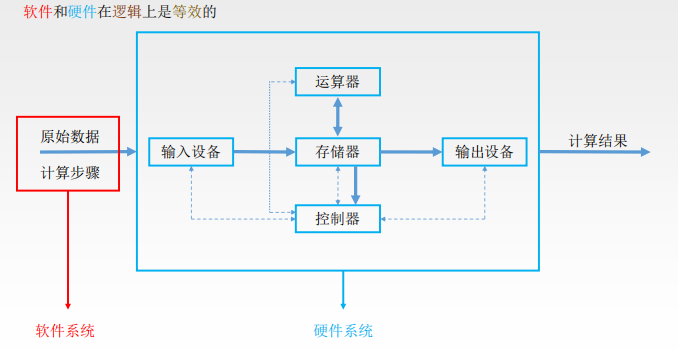

存储器分为主存（运行内存8G）和辅存（机身存储128G）

#### 各个硬件的工作原理

##### 主存储器的基本组成

主存储器分为存储体、MAR（存储地址寄存器）、MDR（存储数据寄存器）->取数据的地方

CPU获取数据的地址，在存储体中找到后放在MDR中，CPU从MDR中把数据取走。CPU写入数据的例子也差不多 

MAR=4位 总共有2的四次方个存储单元
MDR=16位，每个存储单元可存放16bit，一个字（word）=16bit

一个字节（Byte） = 8bit

1B = 1个字节， 1b = 1个bit

宽带100M**b**ps, 迅雷下载10M**B**/s, 所以需要100 / 8， 注意区分**B** 和 **b**

##### 运算器的基本组成

用于实现算术运算、如加减乘除、逻辑运算

##### 控制器的基本组成

CU：控制单元，分析指令、给出控制信号

IR：指令寄存器，存放当前执行的指令

PC：程序计数器、存放下一条指令地址，有自动加一功能

##### 计算机的工作过程


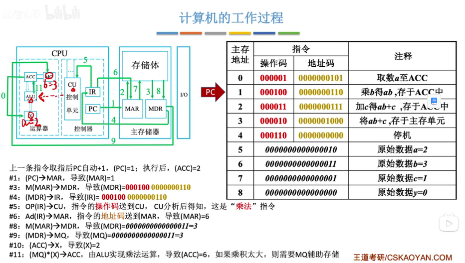

 

冯诺依曼机以运算器为核心，现在计算机以内存为核心。

#### 计算机系统的层次结构

 用编译程序翻译成汇编语言，再用汇编程序翻译成机器语言程序

编译程序只要翻译一次， 解释程序每次执行都要翻译

#### 计算机的性能指标

##### 存储器的性能指标

二进制有多少种组合方式？

 2^10: K 、2^20: M、 2^30: G、 2^40: T

##### CPU的性能指标

##### 系统整体的性能指标

数据通路带宽：各硬件部件通过数据总线传输数据

吞吐量：系统在单位时间处理请求的数量

响应时间

**基准程序**： 跑分软件

### 数据的表示和运算

#### 字符和字符串

ASCII码

#### 强制类型转化

长整数变短整数，高位截断，保留低位。

#### 电路的基本原理、加法器的设计


## 数据结构与算法

链式存储结构存储下一位的地址值

逻辑结构 存储结构 算法 

稀疏多项式

KMP算法?? 比较指针回溯。

位运算符替代加减乘除可以提高效率

### 单链表

头节点：head

归并排序

### 刷题顺序

数组-> 链表-> 哈希表->字符串->栈与队列->树->回溯->贪心->动态规划->图论->高级数据结构

数组、字符串 链表 双指针 BFS\DFS 二叉树 二分法 分治法 回溯法 数学 栈 堆 队列

# 计算机网络

## 什么是计算机网络？ [参考](https://www.bilibili.com/video/BV124411k7uV/?spm_id_from=333.337.search-card.all.click&vd_source=ad69edc9a457e7180dde2d7baf02ad26)

计算机网络是实现计算机之间的通信的。

### 集线器


为了是多台计算机设备能互相通信，就想到了转发，但是用转发的话计算机就要有标识	--->但是太麻烦了

所以设计出了 一个中转站（也叫HUB集线器）集线器来做消息的转发，计算机1的消息会同时的发送到计算机2345。这个时候就会对标识来进行比较

，成功则读取，对比失败则将数据包丢弃。但是2同时也要发数据的话，就会将消息糅合到一起。同时发送给计算机345，针对这个就出了一个CS/MA/CD的协议，载波监听，通过载波监听的方式。检测链路有没有人正在发送数据，没有人发送的话，在进行数据的发送。

**集线器只适用于小规模网络工作在物理层**

**缺点**： 

- 进行数据的广播会导致带宽利用率较低
- 链路上只能同时又一台设备发送数据


### 交换机（简称SW）

 交换机是可以记录地址（mac地址）的，记录的地址主要是记录端口和这个地址的映射关系。mac地址（**局域网地址**）是在出厂的时候就已经写死了，但是是可以修改的，交换机存储着一张表，不同的mac地址对应着不同的端口。交换机是全双工的，使用的是我们的网线。网线下是有八根线的，正常情况下至少有四根线在工作。交换机所在的这一层叫做数据链路层。 数据链路层的头存储的就是mac地址，尾部保存数据。交换机能存储几千个mac地址。数据链路层有时也叫mac层

缺点： 

- 只能在比较小的局域网内达到一个高效的传输
- 但是如果网络变大就不行。

#### 桥接

交换机的两个端口连接就叫桥接，桥接之后 ，多个mac地址是可以对应同一个物理端口的。

### 路由器（也叫网关）

交换机通过路由器连接。IP地址：标识网络、标识设备，路由器也是有一台路由表的。路由器经过算法是会自动的计算出路由表的。 ip地址是一个抽象地址，只能使用mac地址进行通信，因为mac是一个真实的地址。根据ip地址去查mac地址(根据ARP协议去查)


## HTTP

* **超文本传输协议**

* **http:**
  * http是明文传输
  * https是以安全为目标的http协议（http的安全版本）
  * https是在http下加入了一个ssl层对http进行加密
  * 一般来说http的默认端口是80，https的端口号是443
  * http不需要证书，https需要证书
  
* 报文首行，报文头，报文空行，报文体

* get请求没有报文体，他是放在url地址上的

* GET和POST区别
  
  - 参数位置：GET是在url里，POST是在请求报文体中
  - 参数长度：GET受限制，POST不受限制
  - 参数安全性：GET较差，POST较好
  - 浏览器访问直接都是GET请求
  - 缓存：GET默认读取缓存，POST不读取缓存

* 响应状态码：
  
  - 1XX: 临时响应，还需要请求者继续操作，一般表示正在处理
    
    - 100：请求正常，请继续请求
    - 101：需要服务器切换协议，服务器正在切换协议
  
  - 2XX: 成功，表示成功处理了请求
    
    - 200：成功，服务器处理成功
    
    - 201：成功，并且创建了新的资源（一般是POST请求）
  
  - 3XX: 代表需要后续操作才能完成
    
    - 301：永久重定向，自动将请求者转移到新的位置
    - 302：临时重定向
    - 304：缓存，上次请求到现在资源没有发生修改，直接读取浏览器缓存即可
  
  - 4XX：客户端错误
    
    - 400：请求错误，服务器不认识发送的语法
    - 401：未授权，需要身份验证
    - 403：服务器拒绝请求
    - 404：服务器找不到你请求的网页
  
  - 5XX：服务端错误
    
    - 500：服务端错误，无法完成请求
    - 503：服务器超载或者宕机，无法使用

### TCP三次握手四次挥手

#### TCP三次握手：

        - 三次握手的作用是：客户端和服务端都可以确定对方的接收和发送能力正常

1. 客户端向服务端发送请求，服务端接收到请求（服务端可以确定：客户端的发送能力正常）
   
   - 客户端发送的是一个syn的字段，syn是建立新连接的数据包

2. 服务端接收到请求并向客户端发送数据包，客户端接收(客户端确认：服务端的接收和发送能力正常)
   
   - 先发送一个ack数据包，应答刚才的syn的请求连接，并又发送了syn数据包，要求建立新连接
     
         3. 客户端向服务端发送应答字段，服务端接收（服务端可以确认：客户端的接收能力正常）
   
   - 客户端发送的是一个ack应答包

#### TCP四次挥手：

        - TCP是双向的，需要两个方向分别关闭，每个方向的关闭又需要请求和确认，总共4次，被称作为四次挥手
                - 客户客户端给服务端发送释放信号(一次挥手)
            - Fin数据包：释放字段
                - 服务端接收到了客户端的释放信号，并给出了回应信号（二次挥手），但是此时可能还有数据没有处理完成，等待传输
            - ack数据包：确认客户端的释放信号
                - 服务端给客户端发送释放信号，并表示数据也已经发送完毕了（三次挥手）
            - Fin数据包：释放字段
                - 客户端给服务端发送确认信号，表示收到了服务端的释放信号（四次挥手）
            - ack数据包：确认客户端的释放信号

### 网络编程

 网络模型理论上分为七层（OSI七层模型）：物理层、数据链路层、网络层、传输层、会话层、表示层、应用层。 

实际上tcpi协议分为四层：物理层+数据链路层（以太网、无线LAN）、网络层（ARP、ipv4、ipv6）、传输层（TCP、udp、sctp）、应用层(ssh、http、pop)

## [计算机网络-通俗易懂讲解每个知识点](https://www.bilibili.com/video/BV1EU4y1v7ju/?spm_id_from=333.999.0.0&vd_source=ad69edc9a457e7180dde2d7baf02ad26)

### 互联网数据传输原理 ｜OSI七层网络参考模型

TCP/IP四层网络模型，实际划分为五层更符合实际（应用层、传输层、网络层、数据链路层、物理层）

用浏览器访问网站，两个应用如何进行交互就是应用层的事情了。

网卡具有全球唯一的MAC地址

ip地址实现端到端的基础

假设用火狐和谷歌同时登录网站。

如何让数据去到指定的软件服务上，这就需要端口号来作为地址来定位了。传输层，端到端实现了服务进程到服务进程的传输。

传输层（**可靠传输（TCP）**， **不可靠传输（UDP）**），其中TCP允许把字节流分为多个段，而不是整个字节数据，完整的发送出去。传输层还有流量控制来确保传输速度。

登录了某个网站，网站服务可以保持登录状态，不用每次输入登录账号和密码，（**会话层**）

给文件瘦身、压缩（**表示层**）

应用层--报文，传输层--段--端口号--服务进程到服务进程，网络层--包--IP地址--端到端，数据链路层--帧-MAC地址--跳到跳，物理层--比特。


**地址解析协议**，**ARP协议**是根据IP地址获取物理地址的一个TCP/IP协议，主机发送信息时将包含目标IP地址的ARP请求广播到局域网络上的所有主机，并接收返回消息，以此确定目标的物理地址；收到返回消息后将该IP地址和物理地址存入本机ARP缓存中并保留一定时间，下次请求时直接查询ARP缓存以节约资源


ARP协议进行广播，找到网关IP对应的MAC地址，把包封装成帧，源MAC填自己的，目标MAC地址填广播地址。假设当前网络是二层交换机，这个交换机只需要记录下不同的接口对应的MAC地址就好了，交换机收到广播后就发送出去，默认网关收到消息后，查看了帧，发现了发送端的MAC地址，在解封发现IP地址，就会把客户端MAC地址和IP地址关联为一台主机。同时默认网关会把自己的IP地址放入包里，再结合自己的默认地址封装成帧。

### IPv4和子网掩码

每一组十进制的数字范围就是0到255

IP地址由两个**网络号**+**主机号**组成

为了解决简单分类导致的IP分配不合理就诞生了子网掩码

### IPv6和IPv4的主要区别

IPv4用二进制表示，IPv6用16进制表示。

### 数据是如何漂洋过海的？BGP的原理是什么？

由路由器传送到指定的设备，**a向c发送数据，需要经过b，但是b挂了**

**自治系统**都使用BGP规则来进行数据的流通，用了编号就可以宏观的看待整个互联网，有了这个表示一群路由的编号，路由器或者服务器就不需要把全世界的路由信息都记录下来。而是把自治系统编号记录下来。

边界网关协议（BGP）试运行在TCP上的一种自治系统的路由协议，BGP 是唯一一个用来处理像因特网大小的网络的协议，也是唯一能够妥善处理好不相关路由域间的多路连接的协议。

BGP分为**eBGP**和**iBGP**，e表示external外部类似于外交部，i表示internal内部类似于国际媒体，

BGP使用的TCP协议进行传输，使用了179端口。

### TCP三次握手和四次挥手

客户端到服务端就是端到端。客户端和服务端都是有各自的ip地址，在访问软件服务的时候会自动添加上端口号。这样进行连接就会用特定的管道进行传输。

为什么需要三次握手? 因为TCP/IP不可靠,为了在不可靠建立起一种可靠传输,必须要有握手确认机制, 为啥是3次? 因为TCP是全双工协议,需要通信双方同时通信.   所以再次基础上的双向确认最少需要3次, 实际上你100次确认都行,  但最少需要3次.  

### HTTPS

代理服务器就是在客户端和源服务器之间的服务器，代理服务器备份源服务器的资源作为缓存。客户端有需求的时候就可以直接从中间的代理服务器中索取。

SSL是TLS的前身，都是加密安全协议，现在绝大部分浏览器都不支持SSL，而是支持TLS

非对称加密，用两个密钥来进行加密和解密，公开密钥是所有人都知道的密钥，私有密钥仅仅是持有方才有的密钥。一般来说私钥放在服务器里。数据经过公钥加密就只能被私钥解密。数据经过私钥解密就只能被公钥解密。

服务端拥有成对的私钥和公钥，公布自己的公钥让客户端知道，客户端用公钥把自己的数据来进行加密。加密后用公钥反而无法解密这段数据。一定要用服务端的私钥才能解密。这样的非对称加密也叫公钥加密。 

对称加密只是用私钥进行加密。

HTTPS的默认端口443

客户端把自己支持的TLS版本，加密套件发给服务端，同时还生成一个随机数（第一个随机数）给服务端，接着服务端打招呼。服务端确认支持的TLS版本以及选择的加密套件，并且服务器也生成了一个随机数发给客户端（第二个随机数），接着服务端还把证书和公钥发给客户端，服务端都发送完毕就轮到客户端，现在客户端生成随机数（第三个随机数，预主密钥），预主密钥不会发送出去，而是用刚刚收到的公钥进行加密后在发送出去。然后客户端这边的TLS协商已经没问题了，加密开始。。服务端收到加密后的预主密钥后，会用自己的私钥进行解密，这样服务器就知道了预主密钥。而且只有客户端和服务端知道预主密钥。最后客户端用预主密钥，第一随机数和第二随机数计算出会话密钥，服务端也参照这种方式计算出会话密钥。各自得到的会话密钥是相同的。**会话密钥只应用在当前密钥**

### HTTP/1.1，HTTP/2和HTTP/3的区别

浏览器会限制同一个连接的请求数，其实是限制每个域的连接数。chrome默认同时有六个连接，会造成阻塞，网站就可以弄出多个域，使得浏览器可以同时下载这些资源。比如说有五个图片，就可以同时设置五个图片域名，这样浏览器就可以同时进行下载了。（域名分片）

HTTP1.1默认持久连接， HTTP1.1有个叫做管线化的技术，意思是单个连接可以发送多个请求。响应的时候必须按照发送的顺序接收。

TCP除了三次握手的固定开销以外，还会有个慢启动。为了拥塞控制，也就是为了不造成网络堵塞。一开始只会发送较小量的TCP数据段，到了后面再慢慢增加，因此会导致新访问网页刷新速度较慢。

HTTP1.1

- HTTP本身就会产生各种开销，请求和响应都是有首部的，而且大部分首部都是重复的。发完一次，大部分还得重发。首部明文传输，报文压缩，首部不压缩

HTTP2

- 多路复用，主要就是解决HTTP1.1的队头阻塞问题，可以交错进行请求和响应，而且请求和响应之间不影响。HTTP并不是单个文件直接响应过去，而是请求和响应报文都被划分为各个不同的帧，帧分为首部帧和数据帧。帧有个流标识符，即使没有顺序，按照流标识符就可以按照顺序进行组合。还可以设置权重（优先级）。

- 首部，报文都压缩

- HTTP2也只是在应用层进行传输，实际上还是得要到传输层，依靠TCP来进行传输，会造成TCP层面的队头阻塞
- TCP协议是由操作系统内核实现的

HTTP3

- HTTP3把TCP和TLS的过程**整合**到一起了，直接减少了来回带来的开销，如果是恢复的会话，还可以不用握手，实现0-RTT。

- 但是TCP和TLS是两个协议，实际上为了让HTTP3能进行部署，只能选择传输层的UDP协议了，并且在UDP协议上新增一个协议，也就是QUIC，这个QUIC整合了整个TCP和TLS。使得HTTP3默认就是要使用加密传输的。
- QUIC也是加了流标识符，但是HTTP3的应用层上并没有所谓帧的概念，把数据帧移到了QUIC里面，相当于在传输层就有了数据帧，从源头解决了队头阻塞的问题，实现多路复用，QUIC帧又再次被封装为QUIC数据包，QUIC数据包会加上一些信息，这里最重要的是加了Connection ID连接ID，如果网络发生全面改变，比如从wifi转到4G网络，虽然IP地址发生改变，但是因为客户端和服务端都协商好了连接ID，因此可以用连接ID来识别为同一个连接，避免再次握手，这是QUIC快的原因，而且QUIC数据包会把里面的QUIC帧给加密了。QUIC数据包会被UDP封装成数据段，UDP就会加上端口号，当选择HTTP3来进行通信的时候，QUIC就会像TCP那样开启连接。

### CDN

内容分发网络，边缘服务器就是接近用户的这些服务器。cdn就是帮服务器近距离给用户分发网页内容的。

cdn没有网站的源内容，源服务器就会把静态内容提前备份给cdn也叫push，这样在世界各地用户需要访问网页的时候，就近的cdn服务器就会把静态内容提供给用户，不需要每次都麻烦源服务器了。

如果某台cdn服务器超载了，就会把用户那边的请求转移到没有超载的cdn服务器那边，为的就是平均分配网络流量，也叫负载均衡。采用的任播的通信技术，服务器对外都有同样一个ip地址，如果这个ip地址收到用户的请求以后，请求就会由距离用户最近的服务器来响应。

### DNS域名解析过程

任播。

输入url地址，浏览器查看浏览器缓存中有没有对应的IP记录，同时还要查询主机本地文件里有没有对应记录，如果有记录就没必要进行后面的步骤了。浏览器为了域名解析是为了调动解析器的，解析器可以帮助浏览器调用系统的网络功能，解析器就相当于dns客户端，dns客户端需要向dns服务器查询ip地址，解析器就会向dns服务器发送请求，本地dns服务器在收到请求后会查看自己的缓存，如果有就直接返回ip地址，会标注非权威non-authoritative，

### 在浏览器输入URL回车之后发生了什么？

其实dns就是一个数据库，记录着很多url地址和对应的ip地址。

### 黑客是如何找到漏洞，并发起DDoS攻击的？

大规模的网络流量，使得正常流量不能访问网站。

### VPN概念，技术原理和误区

http明文，并没有对数据进行加密。

### SSH协议握手核心过程

 SSH是一种加密的通信方式，

哈希运算，同种哈希值。ssh三次握手


# 前端工程化

## 脚手架搭建

什么是脚手架？

操作系统的可执行文件，可以通过c、c++、Java、Javascript（Node）等各种语言编写

### 脚手架搭建（cli）

downlaod-git-repo    下载模板

ora    显示加载中的效果，类似前端页面的loading效果

handlebare     前端模板引擎

figlet    输出文字

clear    清屏

chalk    修改终端字符

open    打开

**commaner**    插件生成基础命令

约定路由功能？？？ 

### 脚手架执行原理

1. 在终端输入‘vue create vue-test-app'
2. 终端解析出‘vue’命令 
3. 终端在环境变量中找到‘vue’命令
4. 终端根据‘vue’命令链接到实际文件‘vue。js’
5. 终端根据node 执行vue。js
6. vue。js解析command/options
7. vue.js执行command 
8. 执行完毕，退出执行

### 脚手架开发流程

- 创建npm项目
- 创建脚手架入口文件，最上方添加：#！/usr/bin/env node
- 配置package.json ，添加bin属性
- 编写脚手架代码
- 将脚手架发布到npm

## Webpack

- **Entry**：入口起点(entry point)指示 webpack 应该使用哪个模块，来作为构建其内部依赖图的开始。
- **Output**：output 属性告诉 webpack 在哪里输出它所创建的 bundles，以及如何命名这些文件，默认值为 ./dist。
- **Loader**：loader 让 webpack 能够去处理那些非 JavaScript 文件（webpack 自身只能解析 JavaScript）。
- **Plugins**：插件则可以用于执行范围更广的任务。插件的范围包括，从打包优化和压缩，一直到重新定义环境中的变量等。
- **Mode**：模式，有生产模式 production 和开发模式 development
- **chunk**：中间文件

### webpack知识

npx webpack 启动

webpack的适用场景非常大

wepack默认为一个入口（单页面应用），可以创建多个入口

webpack.config.js为默认配置名（名称是可以换的）

webpack占位符【name】来根据入口文件名输出与入口文件相同的文件名，避免了同一个输出文件名然后报错。

字符串和数组是对应的单页面应用，只有对象才可以单页面应用或者多页面应用。

chunk是打包后的代码块的意思

webpack默认支支持js、json

postcss？处理编译css

babel？处理编译js

浏览器本身就有一个降级的处理

loader 本质上是一个函数 不可以是箭头函数，必须有返回值，返回值为string buffer

[name][ext]

dataURl 将图片转换成base64编码的字符串形式

sourcemap：源代码打包后代码的关系映射，定位到打包前的源代码中。

线上监控系统搜索报错信息就是sourcemap的信息

web-dev-serve ?

babel：     JavaScript 编译器

polyfill： 垫片（包含ecma新特性的库）

由于运行在nodejs上的webpack是单线程模型的，所以webpack需要处理的事情需要一件一件的做，需要webpack处理多个任务，需要发挥多核cpu电脑的威力

什么是chunk？？ chunk是一堆module的集合

HRM机制？

- 需要客户端和服务端同时实现（HotModuleReplacementPlugin和webpack-hot-middleware联动使用）
- 客户端和服务端双向通讯机制复杂

### webpack优化

#### 图片优化

- 转换成base64注入到包里
- dataUrlCondition： {maxSize：4*1024}  

#### js分离

#### js/css 压缩

- uglifyjs-webpack-plugin 压缩js
- css-minimizer-webpack-plugin 压缩css 

#### treeshaking

- 必须通过解构的方式获取方法，才可以触发treeshaking
- 调用的npm包必须使用ESM  ==》 export function a() {}

#### splitChunk(代码分割)

- 项目包含第三方依赖以及自己写的代码，代码分割后值返回此页面相关的chunk，再加上**浏览器的并行请求策略**，加快系统响应
- 代码分割以后，将比较大的第三方依赖库分离到chunk中，以后即使用户修改业务代码，只要不改变此库的版本或者库代码，在浏览器端的此chunk的缓存会一直有效

#### ejs实现公共代码复用

#### CleanWebpackPlugin清空dist目录

### 构建性能优化

性能优化常用方法：

- 通过多进程加快构建速度
- 通过分包减小构建目标容量
- 减少构建目标加快构建速度

多进程thread-loader构建

分包策略  

利用缓存提高构建性能  

webpack实现图片五倍压缩 

css 体积优化 

### webpack4和webpack5区别

- tree shaking能力上 
- 构建性能和打包体积  
- webpack5支持在请求中处理协议 
- webpack5副作用处理的差异
- 模块联邦

## Vite

 使用Rollup打包代码，使用EsBuild构建编译成本地代码

SWC类似于babel的构建器

优点： 

- go开发，多线程打包，并且线程之间共享内容，直接编译成机器码。大大节省了程序运行时间
- 多核并行：多线程共享内存的优势，内部打包利用多核cpu的优势
- 没有第三方库的黑盒逻辑，保证极致的代码性能
- 高效利用内存：Esbuild中从头到尾尽可能的复用一份AST节点数据，从而大大提高了内存的利用效率，提升编译性能

缺点： 

- 没有TS类型检查
- 不能操作AST
- 不支持装饰器语法
- 产物target无法降级到ES5以下


## babel

babel的三个处理步骤： 解析、转换、生成。

分为**词法解析**和**语法解析**

词法解析阶段把字符串形式的代码转换为tokens流  

# 前端性能优化


## 性能优化方式

1. 加速或减少HTTP请求损耗：使⽤CDN加载公⽤库，使⽤强缓存和协商缓存，⼩图⽚使⽤Base64 代替，⻚⾯内跳转其他域名或请求其他域名的资源时使⽤浏览器prefetch预解析等； 
2. 延迟加载：⾮重要的库、⾮⾸屏图⽚延迟加载在window.onload得时候进行处理，SPA的组件懒加载等； 
3. 减少请求内容的体积：开启服务器Gzip压缩，JS、CSS⽂件压缩合并，减少cookies⼤⼩，SSR直 接输出渲染后的HTML等； 
4. 浏览器渲染原理：优化关键渲染路径，尽可能减少阻塞渲染的JS、CSS； 
5. 优化⽤⼾等待体验：⽩屏使⽤加载进度条、菊花图、⻣架屏代替等； 
6. polyfill 兼容浏览器，但是体积大，动态polyfill
6. 网络请求优化：

- 减少请求次数
- 加快请求速度（HTTP请求：强缓存和协商缓存）
- DNS缓存
- 提升TCP连接速度（服务器带宽和性能、客户端网络带宽和性能、中间件服务器和优化）
- 请求优化（请求头内精简）
- 响应优化（gzip压缩）
- DOM优化（script优化、style放前）
- 异步请求js（defer、async）

## 性能优化

- 开发环境的优化
  - 提示更多信息，方式调试
  - 优化打包事件
- 生产环境的优化
  - 输出文件的优化
  - HTML CSS JS图片文件的压缩
  - 去掉冗余代码
- 项目的优化
  - 解构
  - 配置文件的拆分

## 性能的计算方式

### 确认自己需要关注的指标

常见的指标有：

1. 页面总加载时间 load （window.addEventListener('load')）

2. 首屏时间 用户第一次进入页面（白屏）->开始渲染->第一屏最后一个元素展现出来

3. 白屏时间  用户第一次进入页面（白屏） -> 页面上第一个元素出现（比如loading）
- 代码 尝试用一个指令, 挂载在重要元素上, 当此元素inserted就上报
- 比较关注得通用指标一般是页面总加载时间和白屏时间

**前端性能监控： window.performance**

### 各个属性所代表的含义

1. connectStart, connectEnd
   分别代表TCP建立连接和连接成功的时间节点。如果浏览器没有进行TCP连接（比如使用持久化连接webscoket），则两者都等于domainLookupEnd；

2. domComplete
   Html文档完全解析完毕的时间节点；

3. domContentLoadedEventEnd
   代表DOMContentLoaded事件触发的时间节点：页面文档完全加载并解析完毕之后,会触发DOMContentLoaded事件，HTML文档不会等待样式文件,图片文件,子框架页面的加载(load事件可以用来检测HTML页面是否完全加载完毕(fully-loaded))。

4. domContentLoadedEventStart
   代表DOMContentLoaded事件完成的时间节点，此刻用户可以对页面进行操作，也就是jQuery中的domready时间；

5. domInteractive
   代表浏览器解析html文档的状态为interactive时的时间节点。domInteractive并非DOMReady，它早于DOMReady触发，代表html文档解析完毕（即dom tree创建完成）但是内嵌资源（比如外链css、js等）还未加载的时间点；

6. domLoading
   代表浏览器开始解析html文档的时间节点。我们知道IE浏览器下的document有readyState属性，domLoading的值就等于readyState改变为loading的时间节点；

7. domainLookupStart domainLookupEnd
   分别代表DNS查询的开始和结束时间节点。如果浏览器没有进行DNS查询（比如使用了cache），则两者的值都等于fetchStart；

8. fetchStart
   是指在浏览器发起任何请求之前的时间值。在fetchStart和domainLookupStart之间，浏览器会检查当前文档的缓存；

9. loadEventStart, loadEventEnd
   分别代表onload事件触发和结束的时间节点

10. navigationStart

浏览器最初加载页面得时间，所有时间指标都以此为基准

8. redirectStart, redirectEnd
   如果页面是由redirect而来，则redirectStart和redirectEnd分别代表redirect开始和结束的时间节点；
9. requestStart
   代表浏览器发起请求的时间节点，请求的方式可以是请求服务器、缓存、本地资源等；
10. responseStart, responseEnd
    分别代表浏览器收到从服务器端（或缓存、本地资源）响应回的第一个字节和最后一个字节数据的时刻；
11. ecureConnectionStart
    可选。如果页面使用HTTPS，它的值是安全连接握手之前的时刻。如果该属性不可用，则返回undefined。如果该属性可用，但没有使用HTTPS，则返回0；
12. unloadEventStart, unloadEventEnd
    如果前一个文档和请求的文档是同一个域的，则unloadEventStart和unloadEventEnd分别代表浏览器unload前一个文档的开始和结束时间节点。否则两者都等于0；

### performance具体计算

代码：performance.ts

**window.performance.getEntries()**

### 首屏渲染计算方法

```javascript
// 自定义指令监听页面得第一个元素出现得时间，监听页面的最后一个元素出现的时间
Vue.directive('analysis', {
    inserted(el, options) {
        console.log(`${options.value} = ${Date.now() - window.performance.timing.navigationStart}`)
    }
})
v-analysis="firstPaint"
v-analysis="firstScreen"
```

# 前端监控

## 应用监控（APM）

- 终端用户体验-反应用户的真实体验
- 应用架构映射-从监控逆向分析出真实链路
- 应用事务分析-能从一个唯一的线索找出整条事务或者操作
- 深度应用诊断-精准定位问题N
- 分析与报告-提供实时精准的大数据查询和可视化  

### APM的形态-服务器性能指标监控

- 对服务依赖的硬件性能进行监控如cpu内存、硬盘容量
- 监控服务器性能指标的实时值，用于出紧急问题时及时报警
- 监控历史趋势，可以观察每天的访问情况以及对异常点进行分析

### APM的形态-服务监控

- 对提供的服务进行监控
- 检测服务的情况，如请求数、响应数成功率

### APM的形态-错误/异常监控

- 对报错或异常进行监控
- 一般需要主动上报

### APM的形态-日志收集

- 对服务的所有情况进行记录
- 不管是业务本身、还是访问记录、都需要尽可能记录日志
- 日志的查询分析都很困难、所以APM一般都有日志收集和分析的能力
- 日志会占用大量的硬盘空间，所以需要定期清除，清楚掉就很难查到问题了

### APM的形态-依赖监控

- 对服务的依赖进行监控、如数据库、缓存、外部服务
- 几乎所有的响应缓慢问题均由依赖导致
- 依赖监控也是比较大范围的监控，只能发现问题，很难跟服务本身关联起来

### APM的形态-分布式事务追踪

- 还原真实场景，一个服务从发起到完成，要经历很多的节点 
- 传统的APM工具只能监测一个或者多个节点的情况，无法串起来
- 分布是十五追踪可以通过一个ID就可以查询到一次请求的全链路情况

### APM的形态-代码级监控分析

- 一般利用自动化的代码茶庄技术，获取nodejs进程内方法的调用链路
- 可以查看调用栈上的总执行时间和占的百分比
- 结合v8 Profiling，查看可能出现的内存泄露问题

### 三种统计指标类型

- Gauges ：指定要发送到指标数据库的值。比如CPU利用率，内存等等
- Counter: 当通过时间区间定义的时间过去后，StatsD将最终累计值发送到指标后端，并将计数器重置为0。StatsD之后会为当前指标创建.count和.rate两个附属指标。‘count'是总值，而'rate'是每秒平均值。一般用于统计访问量，错误率等。
- Sets: 系统会自动计算指标类型数。

## 搭建Node.jsAPM监控平台

### 利用docker-compose 搭建APM

```shell
version: "3"
services:
    grafana:
        image: grafana/grafana
        ports:
            - 3000:3000

    graphite-statsd:
        image: graphiteapp/graphite-statsd
        ports:
            - 2003-2004:2003-2004
            - 2023-2024:2023-2024
            - 8125:8125/udp
            - 8126:8126
            - 8080:80
```

### Alinode的架构和部署

**Alinode**改造后的Node.js runtime,基本等于原生node,只是阿里添加了aump数据的能力，能够远程收集性能数据（无需关心有什么后门）

**agenthub**。安装在应用服务器上的agent，负责与云端alinode服务进行通讯。云端管理系统进行命令下发、机器进行数据上报都要经过这个agent来执行，是node进程与云端管理平台的桥梁

[自助式部署 runtime](https://help.aliyun.com/document_detail/60902.html)

- 文档采用的linux命令，windows可安装wsl子系统
- **agenthub start config.json** 需要在linux启动 

[Node.js性能平台](https://node.console.aliyun.com/dashboard/apps/91529/setting)


## 数据埋点方案、监控方案

### 代码埋点

优点： 

1. 灵活，因为是代码埋点，所以可以手动写到代码里得任何位置，上报任何数据

缺点：

1. 每一次埋点得修改，都需要耗费研发得人力
2. 产品 -> 文档 -> 研发 ，比较低效 -> 发布上线

一般大厂内部会封装自己的一套埋点上报的npm包, track.ts, npm , script 提供给各业务线使用。

一般我们需要上报什么信息呢？

1. 埋点的标识信息, 按钮， '/click/report/buy',click, event
   
   eventId: 唯一得，可以用来唯一标识一个埋点，比如'/click/report/buy' 
   
   eventType：一个枚举，列举出所有埋点得类型，比如click点击事件，event曝光事件

2. 业务自定义的信息, 比如教育行业, 点击一个按钮, 我们要上报用户点击的是哪个年级

3. 通用的设备信息, 比如用户的userId, useragent, deviceId,浏览器版本，安卓/ios，系统版本，手机型号， timestamp, locationUrl等等

一般怎么上报？

1. 实时上报, 业务方调用发送埋点的api后, 立即发出上报请求
2. 延时上报, sdk内部收集业务方要上报的信息, 在浏览器空闲时间或者页面卸载前统一上报，上报失败会做补偿措施。
3. 使用gif上报得原因，防止跨域，不会阻塞代码得运行，节约流量

#### 实现

代码

### 无埋点

#### 概念

无埋点并不是真正的字面意思，其真实含义其实是，不需要研发去手动埋点。

一般会有一个 sdk 封装好各种逻辑, 然后业务方直接引用即可。

sdk中做的事情一般是监听所有页面事件, 上报所有点击事件以及对应的事件所在的元素，然后通过后台去分析这些数据。

业界有GrowingIO, 神策, 诸葛IO, Heap, Mixpanel等等商业产品

#### 实现

1. 监听window元素

```js
window.addEventListener("click", function(event){
    let e = window.event || event;
    let target = e.srcElement || e.target;
}, false);
```

2. 获取元素唯一标识 xPath

```js
function getXPath(element) {
    // 如果元素有id属性，直接返回//*[@id="xPath"]
    if (element.id) {
        return '//*[@id=\"' + element.id + '\"]';
    }
    // 向上查找到body，结束查找, 返回结果
    if (element == document.body) {
        return '/html/' + element.tagName.toLowerCase();
    }
    let currentIndex = 1, // 默认第一个元素的索引为1
        siblings = element.parentNode.childNodes;


    for (let sibling of siblings) {
        if (sibling == element) {
            // 确定了当前元素在兄弟节点中的索引后, 向上查找
            return getXPath(element.parentNode) + '/' + element.tagName.toLowerCase() + '[' + (currentIndex) +
                ']';
        } else if (sibling.nodeType == 1 && sibling.tagName == element.tagName) {
            // 继续寻找当前元素在兄弟节点中的索引
            currentIndex++;
        }
    }
};
```

### 获取元素的位置

```js
function getOffset(event) {
    const rect = getBoundingClientRect(event.target);
    if (rect.width == 0 || rect.height == 0) {
        return;
    }
    let doc = document.documentElement || document.body.parentNode;
    const scrollX = doc.scrollLeft;
    const scrollY = doc.scrollTop;
    const pageX = event.pageX || event.clientX + scrollX;
    const pageY = event.pageY || event.clientY + scrollY;

    const data = {
        offsetX: ((pageX - rect.left - scrollX) / rect.width).toFixed(4),
        offsetY: ((pageY - rect.top - scrollY) / rect.height).toFixed(4),
    };

    return data;
}
```

### 上报

```js
window.addEventListener("click", function(event){
    const e = window.event || event;
    const target = e.srcElement || e.target;
    const xPath = getXPath(target);
    const offsetData = getOffset(event);

    report({ xPath,  ...offsetData});
}, false);
```

## 日志服务sls

WebTracking采集日志数据到日志服务中，并对采集到的日志数据进行查询和分析。

调用PutWebTracking接口将多条日志合并进行采集。

服务端的日志，主要用于监控、风控、推荐等

### Node日志

当我们打印console的时候，发生了什么

```javascript
console.log('hello')
Console.prototype.log = function() {
    this._stdout.write(until.format.apply(this, arguments) + '\n');
}
```

Console的底层其实是调用process.stdout.write,stdin,stdout,stderr 称之为“标准输入”、标准输出和标准错误输出

fs.readFile 每次写入都会打开一个文件，将所有文件数据加载到内存中，然后再次打开同一个文件并写入数据，在大文件的情况下会占用很多内存

目录也是文件，文件里保存着文件名和对用的inode编号。通过inode编号可以查到文件的元数据和文件内容。文件的元数据由引用计数、操作权限、拥有者ID、创建时间、最后修改时间等。文件名并不在元数据里而是在目录文件中。因此文件改名、移动、都不会修改文件，而是修改目录文件。

日志怎么打到文件里？

通过createWriteStream创建一个可写流。优点：不会将整个文件加载到内存中、每次写入文件时，不会创建新的文件描述符，避免EMFILE错误  

日志级别：

- INFO
- DEBUG
- WARN
- ERROR

好的日志

1、时间戳。2、计算机/服务器IP。3、进程ID。4、消息。5、堆栈跟踪。6、上下文。

**日志切割技术**

日志文件大小增加，占内存。需要限制日志文件个数、删除旧的日志文件。1、定时器切割，2、按大小切割 

**日志切割方式的区别:create/copytruncate**

### ELK

收集全量日志

ELK 是三个产品的首字母缩写，分别是ElasticSearch、Logstash 和 Kibana。ElasticSearch简称ES，它是一个实时的分布式搜索和分析引擎，它可以用于全文搜索，结构化搜索以及分析。Logstash是一个具有实时传输能力的数据收集引擎，用来进行数据收集（如：读取文本文件）、解析，并将数据发送给ES。Kibana为 Elasticsearch 提供了分析和可视化的 Web 平台。它可以在 Elasticsearch 的索引中查找，交互数据，并生成各种维度表格、图形。

ELK？？

elastic？

### Sentry

主动上报的时候进行收集处理，分为服务端和客户端

**分析类使用ELK，预警类使用sentry**

提供了对多种主流语言和框架的支持，包括react、angular、RoR、php、.net、java等，同时还提供了和其他流行服务集成的方案，例如github、gitlab、bitbuck等

git clone https://github.com/getsentry/self-hosted.git

```shell
# 查看wsl版本
wsl -l -v

# 更新wsl版本
wsl --set-version Ubuntu-20.04 2 

# Docker Desktop 
setting > resources > Ubuntu  
Apply & Restart
```

```shell
sudo groupadd docker     #添加docker用户组
sudo gpasswd -a $USER docker     #将登陆用户加入到docker用户组中
newgrp docker     #更新用户组
docker ps    #测试docker命令是否可以使用sudo正常使用
```


# 浏览器

 cookie：本质工作就是维持状态

4kb 50个左右，按照域名存储、明文传输

sessionStorage: 存放在服务端中

## 浏览器缓存

**强制缓存**：强制浏览器使用当前缓存

**协商缓存**： 强制缓存失效之后，由服务器缓存表示决定是否使用缓存的实现。

## 浏览器工作原理与实践 [参考](https://time.geekbang.org/column/article/117637)

### Chrome架构

Chrome、微软的 Edge 以及国内的大部分主流浏览器，都是基于 Chromium 二次开发而来。

线程是不能单独存在的，它是由进程来启动和管理的

启动一个程序的时候，操作系统会为该程序创建一块内存，用来存放代码、运行中的数据和执行任务的主线程，我们把这样的一个运行环境叫进程。

##### 进程和线程间的关系

1. 进程中的任意一线程执行出错，都会导致整个进程的崩溃。

```javascript
A = 1+2
B = 20/0
C = 7*8
```

当线程执行到b的时候，会导致整个进程的崩溃，当然另外两个线程的执行的结果也没有了 

2. 线程之间共享进程中的数据。
3. 当一个进程关闭之后，操作系统会回收进程所占用的内存。

当一个进程退出时，操作系统会回收该进程所申请的所有资源；即使其中任意线程因为操作不当导致内存泄漏，当进程退出时，这些内存也会被正确回收。比如之前的 IE 浏览器，支持很多插件，而这些插件很容易导致内存泄漏，这意味着只要浏览器开着，内存占用就有可能会越来越多，但是当关闭浏览器进程时，这些内存就都会被系统回收掉。

4. 进程之间的内容相互隔离。

进程隔离是为保护操作系统中进程互不干扰的技术，每一个进程只能访问自己占有的数据，也就避免出现进程 A 写入数据到进程 B 的情况。正是因为进程之间的数据是严格隔离的，所以一个进程如果崩溃了，或者挂起了，是不会影响到其他进程的。如果进程之间需要进行数据的通信，这时候，就需要使用用于进程间通信（IPC）的机制了。

**做个简单的比喻：进程=火车，线程=车厢**

- 线程在进程下行进（单纯的车厢无法运行）
- 一个进程可以包含多个线程（一辆火车可以有多个车厢）
- 不同进程间数据**很难**共享（一辆火车上的乘客很难换到另外一辆火车，比如站点换乘）
- 同一进程下不同线程间数据很易共享（A车厢换到B车厢很容易）
- 进程要比线程消耗更多的计算机资源（采用多列火车相比多个车厢更耗资源）
- 进程间不会相互影响，一个线程挂掉将导致整个进程挂掉（一列火车不会影响到另外一列火车，但是如果一列火车上中间的一节车厢着火了，将影响到所有车厢）
- 进程可以拓展到多机，进程最多适合多核（不同火车可以开在多个轨道上，同一火车的车厢不能在行进的不同的轨道上）
- 进程使用的内存地址可以上锁，即一个线程使用某些[共享内存](https://www.zhihu.com/search?q=共享内存&search_source=Entity&hybrid_search_source=Entity&hybrid_search_extra={"sourceType"%3A"answer"%2C"sourceId"%3A"411179772"})时，其他线程必须等它结束，才能使用这一块内存。（比如火车上的洗手间）－"互斥锁"
- 进程使用的内存地址可以限定使用量（比如火车上的餐厅，最多只允许多少人进入，如果满了需要在门口等，等有人出来了才能进去）－“信号量”

##### 早期多进程架构


Chrome 的页面是运行在单独的渲染进程中的，同时页面里的插件也是运行在单独的插件进程之中，而进程之间是通过 IPC 机制进行通信

###### 多进程架构优点

- 进程是相互隔离的，所以当一个页面或者插件崩溃时，影响的仅仅是当前页面进程或者插件进程，并不会影响浏览器和其他页面。这就完美的解决了页面或插件崩溃就会导致整个浏览器崩溃也就是不稳定的问题
- Javascript运行在渲染进程中，所以即使Javascript阻塞了渲染进程，影响的也只是当前的渲染页面。而并不会影响浏览器和其他页面，因为其他页面的脚本是运行在它们自己的渲染进程中的。所以当我们再在 Chrome 中运行上面那个死循环的脚本时，没有响应的仅仅是当前的页面。
- 对于内存泄漏的解决方法那就更简单了，因为当关闭一个页面时，整个渲染进程也会被关闭，之后该进程所占用的内存都会被系统回收，这样就轻松解决了浏览器页面的内存泄漏问题。
- 采用多进程架构的额外好处是可以使用**安全沙箱（按照安全策略限制程序行为的执行环境，保护互联网安全的一种手段）**，你可以把沙箱看成是操作系统给进程上了一把锁，沙箱里面的程序可以运行，但是不能在你的硬盘上写入任何数据，也不能在敏感位置读取任何数据，例如你的文档和桌面。Chrome 把插件进程和渲染进程锁在沙箱里面，这样即使在渲染进程或者插件进程里面执行了恶意程序，恶意程序也无法突破沙箱去获取系统权限。

打开浏览器至少需要四个进程（1 个网络进程、1 个浏览器进程、1 个 GPU 进程以及 1 个渲染进程，共 4 个）

###### 多进程架构缺点：

- 更高的资源占用。因为每个进程都会包含公共基础结构的副本（如 JavaScript 运行环境），这就意味着浏览器会消耗更多的内存资源。
- 更复杂的体系架构。浏览器各模块之间耦合性高、扩展性差等问题，会导致现在的架构已经很难适应新的需求了

### 在浏览器里，从输入 URL 到页面展示，这中间发生了什么

#### 从输入 URL 到页面展示完整流程示意图：

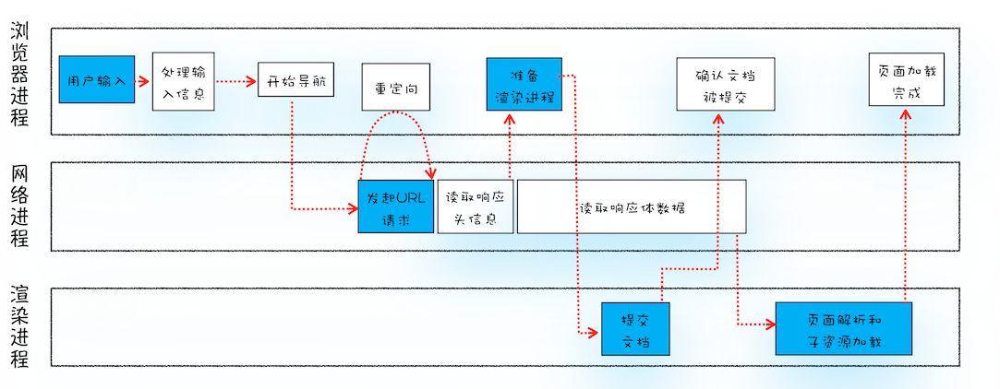

#### 浏览器进程、渲染进程和网络进程的主要职责。

- 浏览器进程主要负责用户交互、子进程管理和文件储存等功能。
- 网络进程是面向渲染进程和浏览器进程等提供网络下载功能。
- 渲染进程的主要职责是把从网络下载的 HTML、JavaScript、CSS、图片等资源解析为可以显示和交互的页面。因为渲染进程所有的内容都是通过网络获取的，会存在一些恶意代码利用浏览器漏洞对系统进行攻击，所以运行在渲染进程里面的代码是不被信任的。这也是为什么 Chrome 会让渲染进程运行在安全沙箱里，就是为了保证系统的安全。

#### 主要流程的核心节点

- 首先，浏览器进程接收到用户输入的 URL 请求，浏览器进程便将该 URL 转发给网络进程。
- 然后，在网络进程中发起真正的 URL 请求。
- 接着网络进程接收到了响应头数据，便解析响应头数据，并将数据转发给浏览器进程。
- 浏览器进程接收到网络进程的响应头数据之后，发送“提交导航 (CommitNavigation)”消息到渲染进程；
- 渲染进程接收到“提交导航”的消息之后，便开始准备接收 HTML 数据，接收数据的方式是直接和网络进程建立数据管道

- 最后渲染进程会向浏览器进程“确认提交”，这是告诉浏览器进程：“已经准备好接受和解析页面数据了”
- 浏览器进程接收到渲染进程“提交文档”的消息之后，便开始移除之前旧的文档，然后更新浏览器进程中的页面状态。

这其中，用户发出 URL 请求到页面开始解析的这个过程，就叫做导航

#### 从输入 URL **到页面展示**

##### 1.用户输入

当用户在地址栏中输入一个查询关键字时，地址栏会判断输入的关键字是搜索内容，还是请求的 URL。

- 如果是搜索内容，地址栏会使用浏览器默认的搜索引擎，来合成新的带搜索关键字的 URL。
- 如果判断输入内容符合 URL 规则，比如输入的是 time.geekbang.org，那么地址栏会根据规则，把这段内容加上协议，合成为完整的 URL。

当用户输入关键字并键入回车之后，这意味着当前页面即将要被替换成新的页面，不过在这个流程继续之前，浏览器还给了当前页面一次执行 beforeunload 事件的机会，beforeunload 事件允许页面在退出之前执行一些数据清理操作，还可以询问用户是否要离开当前页面，比如当前页面可能有未提交完成的表单等情况，因此用户可以通过 beforeunload 事件来取消导航，让浏览器不再执行任何后续工作。

当浏览器刚开始加载一个地址之后，标签页上的图标便进入了加载状态（loading）。但此时图中页面显示的依然是之前打开的页面内容，并没立即替换为极客时间的页面。因为需要等待提交文档阶段，页面内容才会被替换。

##### 2.URL请求过程

接下来，便进入了页面资源请求过程。这时，浏览器进程会通过进程间通信（IPC）把 URL 请求发送至网络进程，网络进程接收到 URL 请求后，会在这里发起真正的 URL 请求流程。那具体流程是怎样的呢？

首先，网络进程会查找本地缓存是否缓存了该资源。如果有缓存资源，那么直接返回资源给浏览器进程；如果在缓存中没有查找到资源，那么直接进入网络请求流程。这请求前的第一步是要进行 DNS 解析，以获取请求域名的服务器 IP 地址。如果请求协议是 HTTPS，那么还需要建立 TLS 连接。

接下来就是利用 IP 地址和服务器建立 TCP 连接。连接建立之后，浏览器端会构建请求行、请求头等信息，并把和该域名相关的 Cookie 等数据附加到请求头中，然后向服务器发送构建的请求信息。

服务器接收到请求信息后，会根据请求信息生成响应数据（包括响应行、响应头和响应体等信息），并发给网络进程。等网络进程接收了响应行和响应头之后，就开始解析响应头的内容了。（为了方便讲述，下面我将服务器返回的响应头和响应行统称为响应头。）

###### 重定向

在接收到服务器返回的响应头后，网络进程开始解析响应头，如果发现返回的状态码是 301 或者 302，那么说明服务器需要浏览器重定向到其他 URL。这时网络进程会从响应头的 Location 字段里面读取重定向的地址，然后再发起新的 HTTP 或者 HTTPS 请求，一切又重头开始了。

**在导航过程中，如果服务器响应行的状态码包含了 301、302 一类的跳转信息，浏览器会跳转到新的地址继续导航；如果响应行是 200，那么表示浏览器可以继续处理该请求。**

###### 响应数据处理

在处理了跳转信息之后，我们继续导航流程的分析。URL 请求的数据类型，有时候是一个下载类型，有时候是正常的 HTML 页面，那么浏览器是如何区分它们呢？

答案是 Content-Type。**Content-Type 是 HTTP 头中一个非常重要的字段， 它告诉浏览器服务器返回的响应体数据是什么类型**，然后浏览器会根据 Content-Type 的值来决定如何显示响应体的内容。

不同 Content-Type 的后续处理流程也截然不同。如果 Content-Type 字段的值被浏览器判断为下载类型，那么该请求会被提交给浏览器的下载管理器，同时该 URL 请求的导航流程就此结束。但如果是 HTML，那么浏览器则会继续进行导航流程。由于 Chrome 的页面渲染是运行在渲染进程中的，所以接下来就需要准备渲染进程了。

###### 准备渲染进程

默认情况下，Chrome 会为每个页面分配一个渲染进程，也就是说，每打开一个新页面就会配套创建一个新的渲染进程。但是，也有一些例外，在某些情况下，浏览器会让多个页面直接运行在同一个渲染进程中。

**那什么情况下多个页面会同时运行在一个渲染进程中呢？**

要解决这个问题，我们就需要先了解下什么是同一站点（same-site）。具体地讲，我们将“同一站点”定义为根域名（例如，geekbang.org）加上协议（例如，https:// 或者 http://），还包含了该根域名下的所有子域名和不同的端口，比如下面这三个：

```javascript

https://time.geekbang.org
https://www.geekbang.org
https://www.geekbang.org:8080
```

Chrome 的默认策略是，每个标签对应一个渲染进程。但如果从一个页面打开了另一个新页面，而新页面和当前页面属于同一站点的话，那么新页面会复用父页面的渲染进程。官方把这个默认策略叫 process-per-site-instance。

总结来说，打开一个新页面采用的渲染进程策略就是：

- 通常情况下，打开新的页面都会使用单独的渲染进程；
- 如果从 A 页面打开 B 页面，且 A 和 B 都属于同一站点的话，那么 B 页面复用 A 页面的渲染进程；如果是其他情况，浏览器进程则会为 B 创建一个新的渲染进程。

渲染进程准备好之后，还不能立即进入文档解析状态，因为此时的文档数据还在网络进程中，并没有提交给渲染进程，所以下一步就进入了提交文档阶段。

###### 提交文档

所谓提交文档，就是指浏览器进程将网络进程接收到的 HTML 数据提交给渲染进程，具体流程是这样的：

- 首先当浏览器进程接收到网络进程的响应头数据之后，便向渲染进程发起“提交文档”的消息；
- 渲染进程接收到“提交文档”的消息后，会和网络进程建立传输数据的“管道”；
- 等文档数据传输完成之后，渲染进程会返回“确认提交”的消息给浏览器进程；
- 浏览器进程在收到“确认提交”的消息后，会更新浏览器界面状态，包括了安全状态、地址栏的 URL、前进后退的历史状态，并更新 Web 页面。

其中，当渲染进程确认提交之后，更新内容如下图所示：


这也就解释了为什么在浏览器的地址栏里面输入了一个地址后，之前的页面没有立马消失，而是要加载一会儿才会更新页面。

###### 渲染阶段

一旦页面生成完成，渲染进程会发送一个消息给浏览器进程，浏览器接收到消息后，会停止标签图标上的加载动画

##### 总结

- 服务器可以根据响应头来控制浏览器的行为，如跳转、网络数据类型判断。
- Chrome 默认采用每个标签对应一个渲染进程，但是如果两个页面属于同一站点，那这两个标签会使用同一个渲染进程。
- 浏览器的导航过程涵盖了从用户发起请求到提交文档给渲染进程的中间所有阶段。

导航流程很重要，它是网络加载流程和渲染流程之间的一座桥梁，如果你理解了导航流程，那么你就能完整串起来整个页面显示流程，这对于你理解浏览器的工作原理起到了点睛的作用。

```shell
1. 用户输入URL，浏览器会根据用户输入的信息判断是搜索还是网址，如果是搜索内容，就将搜索内容+默认搜索引擎合成新的URL；如果用户输入的内容符合URL规则，浏览器就会根据URL协议，在这段内容上加上协议合成合法的URL

2. 用户输入完内容，按下回车键，浏览器导航栏显示loading状态，但是页面还是呈现前一个页面，这是因为新页面的响应数据还没有获得

3. 浏览器进程浏览器构建请求行信息，会通过进程间通信（IPC）将URL请求发送给网络进程
   GET /index.html HTTP1.1
   
4. 网络进程获取到URL，先去本地缓存中查找是否有缓存文件，如果有，拦截请求，直接200返回；否则，进入网络请求过程

5. 网络进程请求DNS返回域名对应的IP和端口号，如果之前DNS数据缓存服务缓存过当前域名信息，就会直接返回缓存信息；否则，发起请求获取根据域名解析出来的IP和端口号，如果没有端口号，http默认80，https默认443。如果是https请求，还需要建立TLS连接。

6. Chrome 有个机制，同一个域名同时最多只能建立 6 个TCP 连接，如果在同一个域名下同时有 10 个请求发生，那么其中 4 个请求会进入排队等待状态，直至进行中的请求完成。如果当前请求数量少于6个，会直接建立TCP连接。

7. TCP三次握手建立连接，http请求加上TCP头部——包括源端口号、目的程序端口号和用于校验数据完整性的序号，向下传输

8. 网络层在数据包上加上IP头部——包括源IP地址和目的IP地址，继续向下传输到底层

9. 底层通过物理网络传输给目的服务器主机

10. 目的服务器主机网络层接收到数据包，解析出IP头部，识别出数据部分，将解开的数据包向上传输到传输层

11. 目的服务器主机传输层获取到数据包，解析出TCP头部，识别端口，将解开的数据包向上传输到应用层

12. 应用层HTTP解析请求头和请求体，如果需要重定向，HTTP直接返回HTTP响应数据的状态code301或者302，同时在请求头的Location字段中附上重定向地址，浏览器会根据code和Location进行重定向操作；如果不是重定向，首先服务器会根据 请求头中的If-None-Match 的值来判断请求的资源是否被更新，如果没有更新，就返回304状态码，相当于告诉浏览器之前的缓存还可以使用，就不返回新数据了；否则，返回新数据，200的状态码，并且如果想要浏览器缓存数据的话，就在相应头中加入字段：
    Cache-Control:Max-age=2000
    响应数据又顺着应用层——传输层——网络层——网络层——传输层——应用层的顺序返回到网络进程
    
13. 数据传输完成，TCP四次挥手断开连接。如果，浏览器或者服务器在HTTP头部加上如下信息，TCP就一直保持连接。保持TCP连接可以省下下次需要建立连接的时间，提示资源加载速度
    Connection:Keep-Alive 
    
14. 网络进程将获取到的数据包进行解析，根据响应头中的Content-type来判断响应数据的类型，如果是字节流类型，就将该请求交给下载管理器，该导航流程结束，不再进行；如果是text/html类型，就通知浏览器进程获取到文档准备渲染

15. 浏览器进程获取到通知，根据当前页面B是否是从页面A打开的并且和页面A是否是同一个站点（根域名和协议一样就被认为是同一个站点），如果满足上述条件，就复用之前网页的进程，否则，新创建一个单独的渲染进程

16. 浏览器会发出“提交文档”的消息给渲染进程，渲染进程收到消息后，会和网络进程建立传输数据的“管道”，文档数据传输完成后，渲染进程会返回“确认提交”的消息给浏览器进程

17. 浏览器收到“确认提交”的消息后，会更新浏览器的页面状态，包括了安全状态、地址栏的 URL、前进后退的历史状态，并更新web页面，此时的web页面是空白页

18. 渲染进程对文档进行页面解析和子资源加载，HTML 通过HTM 解析器转成DOM Tree（二叉树类似结构的东西），CSS按照CSS 规则和CSS解释器转成CSSOM TREE，两个tree结合，形成render tree（不包含HTML的具体元素和元素要画的具体位置），通过Layout可以计算出每个元素具体的宽高颜色位置，结合起来，开始绘制，最后显示在屏幕中新页面显示出来
```


## 浏览器渲染原理

**Gui线程和js引擎线程(互斥)** **==》 会阻塞**  

**Gui线程：**

- 负责渲染浏览器的HTML元素
- 当页面需要重绘或者由于某种操作引发了回流时，该线程就会执行
- 在JavaScript引擎运行脚本期间，gui渲染线程都是处于挂起状态，也就是被冻结了

**Js引擎线程**

- gui线程与js线程时互斥的，主要是由于JavaScript是操作DOM的，如果他们两同时运行获取的元素数据就可能不一致
- 当JavaScript引擎执⾏时GUI线程会被挂起，GUI更新会被保存在⼀个队列中等到引擎线程空闲时⽴即被执⾏。
- 由于GUI渲染线程与JS执⾏线程是互斥的关系，当浏览器在执⾏JS程序的时候，GUI渲染线程会被保存在⼀个队列中，直到JS程序执⾏完成，才会接着执⾏。
- 因此如果JS执⾏的时间过⻓，这样就会造成⻚⾯的渲染不连贯，导致⻚⾯渲染加载阻塞的感觉

**浏览器渲染流程**

- 解析HTML⽣成DOM树 - 渲染引擎⾸先解析HTML⽂档，⽣成DOM树
- 构建Render树 - 接下来不管是内联式，外联式还是嵌⼊式引⼊的CSS样式会被解析⽣成CSSOM树，根据DOM树与CSSOM树⽣成另外⼀棵⽤于渲染的树-渲染树(Render tree)
- 布局Render树 - 然后对渲染树的每个节点进⾏布局处理，确定其在屏幕上的显⽰位置
- 绘制Render树 - 最后遍历渲染树并⽤UI后端层将每⼀个节点绘制出来
- 现代浏览器总是并⾏加载资源，例如，当 HTML 解析器（Parser）被脚本阻塞时，解析器虽 然会停⽌构建 DOM，但仍会识别该脚本后⾯的资源，并进⾏预加载。 

**CSS 被视为渲染阻塞资源(包括JS)，这意味着浏览器将不会渲染任何已处理的内容，直⾄ CSSOM    (CSS对象模型)  构建完毕，才会进⾏下⼀阶段。CSS不会阻塞DOM的解析，但会阻止其渲染**

**JavaScript 被认为是解释器阻塞资源，HTML解析会被JS阻塞，它不仅可以读取和修改 DOM 属 性，还可以读取和修改CSSOM 属性**

**当存在阻塞的css资源时，浏览器会延迟JavaScript执行和DOM构建。**

- 当浏览器遇到⼀个 script 标记时，DOM 构建将暂停，直⾄脚本完成执⾏。 
- JavaScript 可以查询和修改 DOM 与 CSSOM。
- CSSOM 构建时，JavaScript 执⾏将暂停，直⾄ CSSOM 就绪。 

## 浏览器原理

浏览器为了优化重排和重绘, 尽量提高性能, 维护了一个队列, 会把引起重排、重绘的操作放入这个队列, 然后做批量处理, 这样就把多次的重排操作合并为一次了。 类似于react中的setState, 合并执行。

虽然浏览器有这个优化, 但是我们的一些操作会引起队列的提前执行。

比如：

offsetTop, offsetLeft, offsetWidth, offsetHeight

scrollTop/Left/Width/Height

clientTop/Left/Width/Height

width,height

getComputedStyle()

等等...

当你请求上面的一些属性的时候，为了保证实时性和准确性，也就是为了给你最精确的值, 浏览器会立即执行队列里的任务。

因为队列中可能会有影响到这些值的操作, 所以浏览器认为应该执行完已存在的队列任务, 才能给你最准确的值。

### 浏览器原理与PWA

正式开始之前, 咱们先来复习一下大学学的cpu.gpu.内存.进程.线程的概念, 会有助于这节课的听讲。

1. CPU

中央处理器, 解释计算机指令以及处理计算机软件中的数据, 它可以串行地一件接着一件处理交给它的任务

现代电脑上cpu通常会有多个核心, 比如经常听到的8核处理器, 4核处理器等等。

CPU的核心数是指物理上，也就是硬件上存在着几个核心。比如，双核就是包括2个相对独立的CPU核心单元组，四核就包含4个相对独立的CPU核心单元组

2. GPU

图形处理器, 单个GPU核心只能处理一些简单的任务，不过它胜在数量多，单片GPU上会有很多很多的核心可以同时工作，也就是说它的并行计算能力是非常强的

3. 进程 & 线程

进程 - 可以看成正在被执行的应用程序（executing program）。
线程 - 是跑在进程里面的，一个进程里面可能有一个或者多个线程，这些线程可以执行任何一部分应用程序的代码

当你启动一个应用程序的时候，操作系统会为这个程序创建一个进程同时还为这个进程分配一片私有的内存空间，这片空间会被用来存储所有程序相关的数据和状态。
当你关闭这个程序的时候，这个程序对应的进程也会随之消失，进程对应的内存空间也会被操作系统释放掉。

很多应用程序都会采取多进程的方式来工作，因为进程和进程之间是互相独立的，它们互不影响。

换句话来说，如果其中一个工作进程挂掉了，其他进程不会受到影响，而且挂掉的进程还可以重启

### 浏览器架构

#### 一、浏览器架构

这里看下图 单进程和多进程浏览器的区别.png

咱们要讲的Chrome浏览器, 是多进程架构, 先来看一下都包含哪些进程。

**Browser(一个) - 浏览器进程**, 只有一个浏览器进程，负责浏览器的主体部分，包括导航栏，书签， 前进和后退按钮, 提供存储等功能

**Network(一个) - 网络进程**, 主要负责页面的网络资源加载，之前是作为一个模块运行在浏览器进程里面的，直至最近才独立出来，成为一个单独的进程

**GPU(一个) - 图像渲染进程**, 其实，Chrome 刚开始发布的时候是没有 GPU 进程的。而 GPU 的使用初衷是为了实现 3D CSS 的效果，只是随后网页、Chrome 的 UI 界面都选择采用 GPU 来绘制，这使得 GPU 成为浏览器普遍的需求。负责独立于其它进程的GPU任务。它之所以被独立为一个进程是因为它要处理来自于不同tab的渲染请求并把它在同一个界面上画出来。

**Renderer(多个) - 渲染进程**, 负责tab内和网页展示相关的所有工作, 比如将 HTML、CSS 和 JavaScript 转换为用户可以与之交互的网页, 默认情况下每个tab都有一个独立的渲染进程。出于安全考虑，渲染进程都是运行在沙箱模式下。

**Plugin(多个) - 插件进程**

**Extensions(多个) - 扩展程序进程**

其他进程 - 工具进程，辅助框架等等

可以在chrome浏览器 更多工具 - 任务管理器 查看当前浏览器所开启的进程, 以及内存和cpu消耗

##### 多进程架构的好处

1. 容错性

Chrome会为每个tab单独分配一个属于它们的渲染进程（render process）。举个例子，假如你有三个tab，你就会有三个独立的渲染进程。

当其中一个tab的崩溃时，你可以随时关闭这个tab并且其他tab不受到影响。可是如果所有的tab都跑在同一个进程的话，它们就会有连带关系，一个挂全部挂。

2. 安全性和沙盒性

因为操作系统可以提供方法让你限制每个进程拥有的能力，所以浏览器可以让某些进程不具备某些特定的功能。例如，由于tab渲染进程可能会处理来自用户的随机输入，所以Chrome限制了它们对系统文件随机读写的能力。

3. 每个进程可以拥有更多内存

因为每个进程都会分配一块独立的内存空间, 所以理所当然的, 每个进程都会有更多的内存。

##### 多进程架构的坏处

其实上面已经提到了, 每个进程都会拥有自己独立的内存空间, 他们并不能像同一个进程中的线程一样共享内存空间。

而一些基础的东西比如V8 Javascript引擎, 会在不同进程的内存空间中同时存在, 所以就消耗了不必要的内存。

##### 多进程架构内存的优化

- 那么Chrome是怎么优化这种情况的呢？

答案就是：限制启动的进程数目，当进程数目达到一定界限后, Chrome会将访问同一个网站的tab都放在一个进程里面跑。

- Chrome的服务化, 节省更多的内存

这里可以看一下图 assets/Chrome的服务化.png

同样的优化方法也可以被使用在浏览器进程（browser process）上面。

Chrome浏览器的架构正在发生一些改变，目的是将和浏览器本身（Chrome）相关的部分拆分为一个个不同的服务，服务化之后，这些功能既可以放在不同的进程里面运行也可以合并为一个单独的进程运行。

这样做的主要原因是让Chrome在不同性能的硬件上有不同的表现。当Chrome运行在一些性能比较好的硬件时，浏览器进程相关的服务会被放在不同的进程运行以提高系统的稳定性。相反如果硬件性能不好，这些服务就会被放在同一个进程里面执行来减少内存的占用。

这样，原来的各种模块会被重构成独立的服务（Service），每个服务（Service）都可以在独立的进程中运行，访问服务（Service）必须使用定义好的接口，通过 IPC 来通信，从而构建一个更内聚、松耦合、易于维护和扩展的系统，更好实现 Chrome 简单、稳定、高速、安全的目标。

##### 网站隔离 （Site Isolation）

网站隔离会为网站内不同站点的iframe分配一个独立的渲染进程。

之前说过Chrome会为每个tab分配一个单独的渲染进程，可是如果一个tab只有一个进程的话不同站点的iframe都会跑在这个进程里面，这也意味着它们会共享内存，这就有可能会破坏同源策略。

同源策略是浏览器最核心的安全模型，它可以禁止网站在未经同意的情况下去获取另外一个站点的数据，因此绕过同源策略是很多安全攻击的主要目的。

而进程隔离（proces isolation）是隔离网站最好最有效的办法了。因此在Chrome 67版本之后，桌面版的Chrome会默认开启网站隔离功能，这样每一个跨站点的iframe都会拥有一个独立的渲染进程。

#### 二、一个经典问题, 导航时都发生了什么？

上面提到过，浏览器中tab外面发生的一切都是由浏览器进程（browser process）控制的。

浏览器进程有很多负责不同工作的线程（worker thread），其中包括：

1. UI线程（UI thread）：绘制浏览器顶部按钮和导航栏输入框等组件，当你在导航栏里面输入一个URL的时候，其实就是UI线程在处理你的输入。
2. 存储线程（storage thread）： 控制文件读写。

所以，当你在导航栏上输入一串内容的时候，Chrome到底为我们做了哪些工作？

##### 处理输入

当用户开始在导航栏上面输入内容的时候，UI线程（UI thread）做的第一件事就是询问：“你输入的字符串是一些搜索的关键词（search query）还是一个URL地址呢？”。

因为对于Chrome浏览器来说，导航栏的输入既可能是一个可以直接请求的域名，也可能是用户想在搜索引擎里面搜索的关键词信息，
所以当用户在导航栏输入信息的时候，UI线程要进行一系列的解析来判定是将用户输入发送给搜索引擎还是直接请求你输入的站点资源。

##### 开始导航

当用户按下回车键的时候，UI线程会通知网络进程初始化一个网络请求来获取站点的内容。

这时候tab上的icon会展示一个提示资源正在加载中的旋转圈圈，而且网络进程会进行一系列诸如DNS寻址以及为请求建立TLS连接的操作。

- tips: 这时如果网络进程收到服务器的HTTP 301重定向响应，它就会告知UI线程进行重定向然后它会再次发起一个新的网络请求。

##### 读取响应

1. 响应类型判断

网络进程在收到HTTP响应的主体时，在必要的情况下它会先检查一下流的前几个字节以确定响应主体的具体媒体类型（MIME Type）。

响应主体的媒体类型一般可以通过HTTP头部的Content-Type来确定，不过Content-Type有时候会缺失或者是错误的，这种情况下浏览器就要进行MIME类型嗅探来确定响应类型了。

- 这里可以打开一个窗口, 看一下Content-type响应头
2. 不同响应类型的处理

如果响应的主体是一个HTML文件，浏览器会将获取的响应数据交给渲染进程（renderer process）来进行下一步的工作。
如果拿到的响应数据是一个压缩文件（zip file）或者其他类型的文件，响应数据就会交给下载管理器（download manager）来处理。

3. 安全检查

网络进程在把内容交给渲染进程之前还会对内容做SafeBrowsing检查。

如果请求的域名或者响应的内容和某个已知的病毒网站相匹配，网络进程会给用户展示一个警告的页面。除此之外，网络进程还会做CORB（Cross Origin Read Blocking）检查来确定那些敏感的跨站数据不会被发送至渲染进程。

##### 寻找一个渲染进程来绘制页面

在网络进程做完所有的检查后并且能够确定浏览器应该导航到该请求的站点，它就会告诉UI线程所有的数据都已经被准备好了。

UI线程在收到网络进程的确认后会为这个网站寻找一个渲染进程（renderer process）来渲染界面。

- tips. 这里chrome有个小优化

因为网络请求的耗时可能会很长, 所以第二步中当UI线程发送URL链接给网络进程后，它其实已经知晓它们要被导航到哪个站点了。

所以在网络进程干活的时候，UI线程会主动地为这个网络请求启动一个渲染线程。如果一切顺利的话（没有重定向之类的东西出现），网络进程准备好数据后页面的渲染进程已经就准备好了，这就节省了新建渲染进程的时间。

不过如果发生诸如网站被重定向到不同站点的情况，刚刚那个渲染进程就不能被使用了，它会被摒弃，一个新的渲染进程会被启动。

##### 提交导航

到这一步的时候，数据和渲染进程都已经准备好了，浏览器进程（browser process）会通过IPC告诉渲染进程去提交本次导航（commit navigation）。

除此之外浏览器进程还会将刚刚接收到的响应数据流传递给对应的渲染进程让它继续接收到来的HTML数据。

一旦浏览器进程收到渲染线程的回复说导航已经被提交了（commit），导航这个过程就结束了，文档的加载阶段（document loading phase）会正式开始。

到了这个时候，导航栏会被更新，安全指示符和站点设置会展示新页面相关的站点信息。
当前tab的会话历史（session history）也会被更新，这样当你点击浏览器的前进和后退按钮也可以导航到刚刚导航完的页面。为了方便你在关闭了tab或窗口（window）的时候还可以恢复当前tab和会话（session）内容，当前的会话历史会被保存在磁盘上面。

##### 加载完成

当导航提交完成后，渲染进程开始着手加载资源以及渲染页面。

一旦渲染进程完成渲染（load），它会通过IPC告知浏览器进程，然后UI线程就会停止导航栏上旋转的圈圈。

#### 三、导航到不同的站点

上面讲述了一个导航的过程, 那么这时候如果我们想去浏览另一个网页, 浏览器会怎么做呢？

能够想到的是, 浏览器必然会重复一遍导航的步骤, 但是在这之前, 浏览器还有一些收尾工作要做！

浏览器进程会对渲染进程说, 我准备重新发起导航了, 你那边是否需要处理beforeunload事件？

beforeunload可以在用户重新导航或者关闭当前tab时给用户展示一个“你确定要离开当前页面吗？”的二次确认弹框。

浏览器进程之所以要在重新导航的时候和当前渲染进程确认的原因是，当前页面发生的一切（包括页面的JavaScript执行）是不受它控制而是受渲染进程控制，它不知道里面的具体情况。

- tips：所以不要随便给页面添加beforeunload事件监听，你定义的监听函数会在页面被重新导航的时候执行，因此这会增加重导航的时延。
  beforeunload事件监听函数只有在十分必要的时候才能被添加，例如用户在页面上输入了数据，并且这些数据会随着页面消失而消失。
1. 如果第二次导航是在页面内发起的, 比如页面内Js执行了location.href=xxxx, 这时候浏览器是怎么做的？

渲染进程会自己先检查一个它有没有注册beforeunload事件的监听函数，如果有的话就执行，执行完后发生的事情就和之前的情况没什么区别了，唯一的不同就是这次的导航请求是由渲染进程给浏览器进程发起的。

2. 如果第二次导航是到不同的站点呢？

会有另外一个渲染进程被启动来完成这次重导航，而当前的渲染进程会继续处理现在页面的一些收尾工作，例如unload事件的监听函数执行。

- 这里可以看一下图 重新导航不同站点.png

#### 四、Service Worker场景下的导航

如果开发者在service worker里设置了当前的页面内容从缓存里面获取，当前页面的渲染就不需要重新发送网络请求了，这就大大加快了整个导航的过程。

这里要重点留意的是service worker其实只是一些跑在渲染进程里面的JavaScript代码。

那么问题来了，当导航开始的时候，浏览器进程是如何判断要导航的站点存不存在对应的service worker并启动一个渲染进程去执行它的呢？

其实service worker在注册的时候，它的作用范围（scope）会被记录下来。

在导航开始的时候，网络进程会根据请求的域名在已经注册的service worker作用范围里面寻找有没有对应的service worker。如果有命中该URL的service worker，UI线程就会为这个service worker启动一个渲染进程（renderer process）来执行它的代码。Service worker既可能使用之前缓存的数据也可能发起新的网络请求。

#### 五、导航预加载

在上面的例子中，你应该可以感受到如果启动的service worker最后还是决定发送网络请求的话，浏览器进程和渲染进程这一来一回的通信包括service worker启动的时间其实增加了页面导航的时延。

导航预加载就是一种通过在service worker启动的时候并行加载对应资源的方式来加快整个导航过程效率的技术。预加载资源的请求头会有一些特殊的标志来让服务器决定是发送全新的内容给客户端还是只发送更新了的数据给客户端。

#### 六、渲染进程中具体做了什么

渲染进程负责标签（tab）内发生的所有事情。

渲染进程的主要任务是将HTML，CSS，以及JavaScript转变为我们可以进程交互的网页内容。

渲染进程里面有：一个主线程（main thread），几个工作线程（worker threads），一个合成线程（compositor thread）以及一个光栅线程（raster thread）

在渲染进程里面，主线程（main thread）处理了绝大多数你发送给用户的代码。如果你使用了web worker或者service worker，相关的代码将会由工作线程（worker thread）处理。合成（compositor）以及光栅（raster）线程运行在渲染进程里面用来高效流畅地渲染出页面内容。

##### 解析

1. 构建DOM

上面提到过，渲染进程在导航结束的时候会收到来自浏览器进程提交导航的消息，在这之后渲染进程就会开始接收HTML数据，同时主线程也会开始解析接收到的文本数据，并把它转化为一个DOM（Document Object Model）对象。

DOM对象既是浏览器对当前页面的内部表示，也是Web开发人员通过JavaScript与网页进行交互的数据结构以及API。

如何将HTML文档解析为DOM对象是在HTML标准中定义的。

不过在你的web开发生涯中，你可能从来没有遇到过浏览器在解析HTML的时候发生错误的情景。

这是因为浏览器对HTML的错误容忍度很大。举些例子：如果一个段落缺失了闭合p标签（</p>），这个页面还是会被当做为有效的HTML来处理；

```html
Hi! <b>I'm <i>Chrome</b>!</i> 
```

虽然有语法错误，不过浏览器会把它处理为

```html
Hi! <b>I'm <i>Chrome</i></b><i>!</i>。
```

2. 子资源加载

除了HTML文件，网站通常还会使用到一些诸如图片，CSS样式以及JavaScript脚本等子资源，这些文件会从缓存或者网络上获取。

主线程会按照在构建DOM树时遇到各个资源的循序一个接着一个地发起网络请求，为了提升效率，浏览器会同时运行“预加载扫描”程序。

如果在HTML文档里面存在诸如或者<link>这样的标签，预加载扫描程序会在HTML解析器里面找到对应要获取的资源，并把这些要获取的资源告诉浏览器进程里面的网络线程。

- 看一下图片 6.子资源加载.png
3. JavaScript会阻塞HTML的解析过程

当HTML解析器碰到script标签的时候，它会停止HTML文档的解析从而转向JavaScript代码的加载，解析以及执行。

为什么要这样做呢？因为script标签中的JavaScript可能会使用诸如document.write()这样的代码改变文档流（document）的形状，从而使整个DOM树的结构发生根本性的改变。因为这个原因，HTML解析器不得不等JavaScript执行完成之后才能继续对HTML文档流的解析工作。

##### 给浏览器一点如何加载资源的提示

Web开发者可以通过很多方式告诉浏览器如何才能更加优雅地加载网页需要用到的资源。

你可以为script标签添加一个async或者defer属性来使JavaScript脚本进行异步加载。

<link rel="preload">资源预加载可以用来告诉浏览器这个资源在当前的导航肯定会被用到，你想要尽快加载这个资源。

##### 样式计算 CSS

拥有了DOM树我们还不足以知道页面的外貌，因为我们通常会为页面的元素设置一些样式。

主线程会解析页面的CSS从而确定每个DOM节点的计算样式（computed style）。计算样式是主线程根据CSS样式选择器（CSS selectors）计算出的每个DOM元素应该具备的具体样式，你可以打开devtools来查看每个DOM节点对应的计算样式。

即使你的页面没有设置任何自定义的样式，每个DOM节点还是会有一个计算样式属性，这是因为每个浏览器都有自己的默认样式表。
因为这个样式表的存在，页面上的h1标签一定会比h2标签大，而且不同的标签会有不同的magin和padding。

- 看图片. 7.样式计算.png

##### 布局 Layout

前面这些步骤完成之后，渲染进程就已经知道页面的具体文档结构以及每个节点拥有的样式信息了，可是这些信息还是不能最终确定页面的样子.

只知道网站的文档流以及每个节点的样式是远远不足以渲染出页面内容的，还需要通过布局（layout）来计算出每个节点的几何信息。

布局的具体过程是：

1. 主线程会遍历刚刚构建的DOM树，根据DOM节点的计算样式计算出一个布局树（layout tree）。
2. 布局树上每个节点会有它在页面上的x，y坐标以及盒子大小（bounding box sizes）的具体信息。布局树长得和先前构建的DOM树差不多，不同的是这颗树只有那些可见的（visible）节点信息。

举个例子，如果一个节点被设置为了display:none，这个节点就是不可见的就不会出现在布局树上面（visibility:hidden的节点会出现在布局树上面）。同样的，如果一个伪元素（pseudo class）节点有诸如p::before{content:"Hi!"}这样的内容，它会出现在布局上，而不存在于DOM树上。

##### 绘画 - Paint

知道了DOM节点以及它的样式和布局其实还是不足以渲染出页面来的。

为什么呢？举个例子，假如你现在想对着一幅画画一幅一样的画，你已经知道了画布上每个元素的大小，形状以及位置，你还是得思考一下每个元素的绘画顺序，因为画布上的元素是会互相遮挡的（z-index）。

如果页面上的某些元素设置了z-index属性，绘制元素的顺序就会影响到页面的正确性。

##### 高成本的渲染流水线（rendering pipeline）更新

关于渲染流水线有一个十分重要的点就是流水线的每一步都要使用到前一步的结果来生成新的数据，这就意味着如果某一步的内容发生了改变的话，这一步后面所有的步骤都要被重新执行以生成新的记录。举个例子，如果布局树有些东西被改变了，文档上那些被影响到的部分的绘画顺序是要重新生成的。

- 看图 8.渲染流水线.png

如果你的页面元素有动画效果（animating），浏览器就不得不在每个渲染帧的间隔中通过渲染流水线来更新页面的元素。

我们大多数显示器的刷新频率是一秒钟60次（60fps），如果你在每个渲染帧的间隔都能通过流水线移动元素，人眼就会看到流畅的动画效果。可是如果流水线更新时间比较久，动画存在丢帧的状况的话，页面看起来就会很“卡顿”。

即使你的渲染流水线更新是和屏幕的刷新频率保持一致的，这些更新是运行在主线程上面的，这就意味着它可能被同样运行在主线程上面的JavaScript代码阻塞。

- 看图 9.js阻塞渲染流水线.png

对于这种情况，你可以将要被执行的JavaScript操作拆分为更小的块然后通过requestAnimationFrame这个API把他们放在每个动画帧中执行。想知道更多关于这方面的信息的话，可以参考Optimize JavaScript Execution。当然你还可以将JavaScript代码放在WebWorkers中执行来避免它们阻塞主线程。

- 看图 10.rAF优化

##### 合成

1. 如何绘制一个页面

浏览器已经知道了关于页面以下的信息：文档结构，元素的样式，元素的几何信息以及它们的绘画顺序。那么浏览器是如何利用这些信息来绘制出页面来的呢？将以上这些信息转化为显示器的像素的过程叫做光栅化（rasterizing）。

现代浏览器采用合成的方式, 来展示整个页面

2. 什么是合成

合成是一种将页面分成若干层，然后分别对它们进行光栅化，最后在一个单独的线程 - 合成线程（compositor thread）里面合并成一个页面的技术。当用户滚动页面时，由于页面各个层都已经被光栅化了，浏览器需要做的只是合成一个新的帧来展示滚动后的效果罢了。页面的动画效果实现也是类似，将页面上的层进行移动并构建出一个新的帧即可。


# Linux

一切皆文件 

kali linux：安全渗透测试使用（有兴趣做安全得可以学习 ）

开机会启动很多程序，他们在windows叫做'服务'（service）, 在linux中就叫做'守护进程'(daemon)

关机之前需要输入 sync`将数据同步到硬盘中`，然后再关机

## 常用命令

### 处理目录常用命令

- ls: 列出目录
  
  - -a ：全部的文件，连同隐藏文件( 开头为 . 的文件) 一起列出来(常用)
  - -l ：长数据串列出，包含文件的属性与权限等等数据；(常用)

- cd：切换目录

- pwd：显示目前的目录
  
  - 选项与参数：**-P** ：显示出确实的路径，而非使用连接(link) 路径

- mkdir：创建一个新的目录
  
  - -m ：配置文件的权限喔！直接配置，不需要看默认权限 (umask) 的脸色～
  - -p ：帮助你直接将所需要的目录(包含上一级目录)递归创建起来！

- rmdir：删除一个空的目录
  
  - 选项与参数：**-p ：**连同上一级『空的』目录也一起删除

- cp: 复制文件或目录
  
  - **-a：**相当於 -pdr 的意思，至於 pdr 请参考下列说明；(常用)
  
  - **-p：**连同文件的属性一起复制过去，而非使用默认属性(备份常用)；
  
  - **-d：**若来源档为连结档的属性(link file)，则复制连结档属性而非文件本身；
  
  - **-r：**递归持续复制，用於目录的复制行为；(常用)
  
  - **-f：**为强制(force)的意思，若目标文件已经存在且无法开启，则移除后再尝试一次；
  
  - **-i：**若目标档(destination)已经存在时，在覆盖时会先询问动作的进行(常用)
  
  - **-l：**进行硬式连结(hard link)的连结档创建，而非复制文件本身。
  
  - **-s：**复制成为符号连结档 (symbolic link)，亦即『捷径』文件；
  
  - **-u：**若 destination 比 source 旧才升级 destination ！

- rm: 移除文件或目录
  
  - -f ：就是 force 的意思，忽略不存在的文件，不会出现警告信息；
  - -i ：互动模式，在删除前会询问使用者是否动作
  - -r ：递归删除啊！最常用在目录的删除了！这是非常危险的选项！！！

- mv: 移动文件与目录，或修改文件与目录的名称
  
  - -f ：force 强制的意思，如果目标文件已经存在，不会询问而直接覆盖；
  - -i ：若目标文件 (destination) 已经存在时，就会询问是否覆盖！
  - -u ：若目标文件已经存在，且 source 比较新，才会升级 (update)

## 基本属性

**在Linux中我们可以使用`ll`或者`ls –l`命令来显示一个文件的属性以及文件所属的用户和组，如：**

```shell
[root@lyk /]# ls -l
total 80
lrwxrwxrwx    1 root root     7 Feb  9  2022 bin -> usr/bin
dr-xr-xr-x.   5 root root  4096 Aug 15 17:51 boot
drwxr-xr-x   17 root root  2980 Sep 25 00:02 dev
drwxr-xr-x.  95 root root  4096 Sep 25 11:51 etc
drwxr-xr-x.   4 root root  4096 Oct  1 13:00 home
lrwxrwxrwx    1 root root     7 Feb  9  2022 lib -> usr/lib
lrwxrwxrwx    1 root root     9 Feb  9  2022 lib64 -> usr/lib64
drwx------.   2 root root 16384 Aug 15 17:12 lost+found
drwxr-xr-x.   2 root root  4096 Feb  9  2022 media
drwxr-xr-x.   2 root root  4096 Feb  9  2022 mnt
drwxr-xr-x.   3 root root  4096 Sep 25 11:51 opt
drwxr-xr-x    2 root root  4096 Sep 25 00:16 patch
dr-xr-xr-x  188 root root     0 Sep 25 00:02 proc
dr-xr-x---.   5 root root  4096 Sep 25 00:21 root
drwxr-xr-x   31 root root   980 Sep 25 11:51 run
lrwxrwxrwx    1 root root     8 Feb  9  2022 sbin -> usr/sbin
drwxr-xr-x.   2 root root  4096 Feb  9  2022 srv
dr-xr-xr-x   13 root root     0 Sep 25 00:02 sys
drwxr-xr-x    3 www  www   4096 Oct  1 10:36 test
drwxrwxrwt.   5 root root 12288 Oct  2 00:10 tmp
drwxr-xr-x.  12 root root  4096 Aug 15 17:43 usr
drwxr-xr-x.  21 root root  4096 Sep 25 00:10 var
drwxr-xr-x    7 root root  4096 Sep 25 00:10 www
[root@lyk /]# 
```

在Linux中第一个字符代表这个文件是目录、文件或链接文件等等：

- 当为[ **d** ]则是目录
- 当为[ **-** ]则是文件；
- 若是[ **l** ]则表示为链接文档 ( link file )；
- 若是[ **b** ]则表示为装置文件里面的可供储存的接口设备 ( 可随机存取装置 )；
- 若是[ **c** ]则表示为装置文件里面的串行端口设备，例如键盘、鼠标 ( 一次性读取装置 )。


其中，[ r ]代表可读(read)、[ w ]代表可写(write)、[ x ]代表可执行(execute)。

Linux系统中使用以下命令来查看文件的内容：

- cat 由第一行开始显示文件内容
- tac 从最后一行开始显示，可以看出 tac 是 cat 的倒着写！
- nl  显示的时候，顺道输出行号！
- more 一页一页的显示文件内容
- less 与 more 类似，但是比 more 更好的是，他可以往前翻页！
- head 只看头几行
- tail 只看尾巴几行

## 硬连接和软连接

### 硬连接

硬连接指通过索引节点来进行连接。在 Linux 的文件系统中，保存在磁盘分区中的文件不管是什么类型都给它分配一个编号，称为索引节点号(Inode Index)。在 Linux 中，多个文件名指向同一索引节点是存在的。比如：A 是 B 的硬链接（A 和 B 都是文件名），则 A 的目录项中的 inode 节点号与 B 的目录项中的 inode 节点号相同，即一个 inode 节点对应两个不同的文件名，两个文件名指向同一个文件，A 和 B 对文件系统来说是完全平等的。删除其中任何一个都不会影响另外一个的访问。

硬连接的作用是允许一个文件拥有多个有效路径名，这样用户就可以建立硬连接到重要文件，以防止“误删”的功能。其原因如上所述，因为对应该目录的索引节点有一个以上的连接。只删除一个连接并不影响索引节点本身和其它的连接，只有当最后一个连接被删除后，文件的数据块及目录的连接才会被释放。也就是说，文件真正删除的条件是与之相关的所有硬连接文件均被删除。

### 软连接

另外一种连接称之为符号连接（Symbolic Link），也叫软连接。软链接文件有类似于 Windows 的快捷方式。它实际上是一个特殊的文件。在符号连接中，文件实际上是一个文本文件，其中包含的有另一文件的位置信息。比如：A 是 B 的软链接（A 和 B 都是文件名），A 的目录项中的 inode 节点号与 B 的目录项中的 inode 节点号不相同，A 和 B 指向的是两个不同的 inode，继而指向两块不同的数据块。但是 A 的数据块中存放的只是 B 的路径名（可以根据这个找到 B 的目录项）。A 和 B 之间是“主从”关系，如果 B 被删除了，A 仍然存在（因为两个是不同的文件），但指向的是一个无效的链接。

# Docker [参考](https://blog.csdn.net/qq_21197507/article/details/115071715)

## 虚拟机与Docker对比

**虚拟机：**


**容器：**

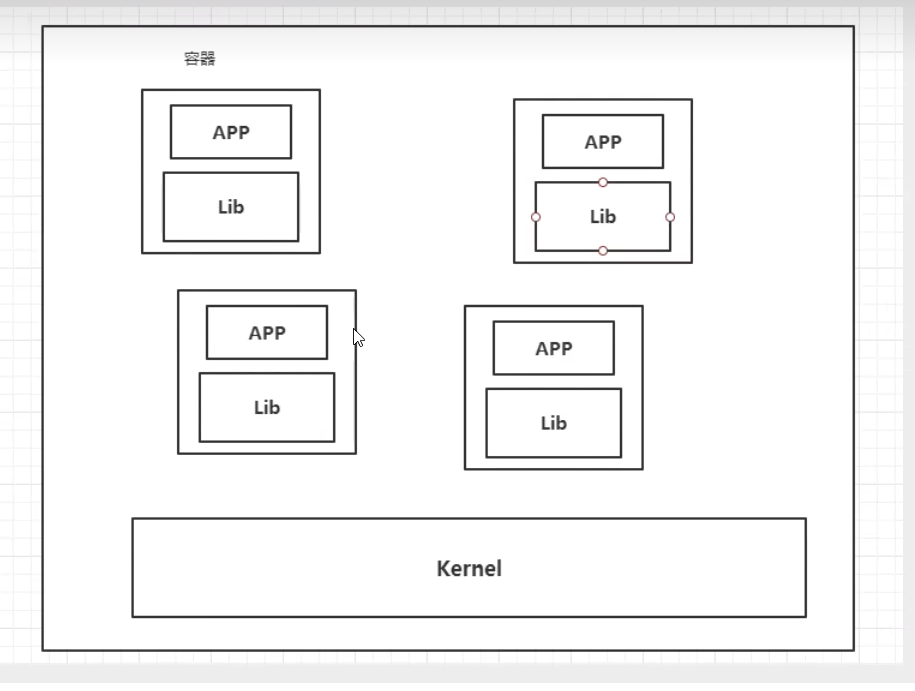

容器内得应用直接运行在宿主机中，容器是没有自己得内核得，每个容器间是互相隔离，每个容器内都有一个属于自己得文件系统

一个物理机可以运行多个容器实例。

- 比较Docker和虚拟化技术的不同
  - 传统虚拟机， 虚拟出一条硬件，运行一个完整的操作系统，然后在这个系统上安装和运行软件
  - 容器内的应用直接运行在宿主机的内部，容器是没有自己的内核的，也没有虚拟硬件，所以轻便
  - 每个容器间是相互隔离的，每个容器内都有一个属于自己的文件系统，互不影响
- 应用更快速的交互和部署
  - 传统：一堆帮助文档，安装程序
  - Docker： 打包镜像发布测试，一键运行
- 更便捷的升级和扩缩容
- 更简的系统运维
- 更高效的计算资源利用

docker version 查看是否安装成功

**卸载Docker**

```shell
# 1、卸载依赖
yum remove docker-ce docker-ce-cli containerd.io

# 2、卸载资源
rm -rf /var/lib/docker

# /var/lib/docker docker的默认工作路径！
```

### Docker阿里云镜像加速

```shell
sudo mkdir -p /etc/docker
sudo tee /etc/docker/daemon.json <<-'EOF'
{
  "registry-mirrors": ["https://20g53jxg.mirror.aliyuncs.com"]
}
EOF
sudo systemctl daemon-reload
sudo systemctl restart docker
```


Docker利用宿主机得操作系统

## Docker的常用命令

### 帮助命令

```shell
docker version  # docker版本信息
docker info     # 系统级别的信息，包括镜像和容器的数量
docker 命令 --help 
```

### 镜像命令

**docker images 查看所有本地主机上的镜像**

```shell
[root@iZ2zeg4ytp0whqtmxbsqiiZ ~]# docker images
REPOSITORY          TAG                 IMAGE ID            CREATED             SIZE
hello-world         latest              bf756fb1ae65        7 months ago        13.3kB
 
# 解释
REPOSITORY      # 镜像的仓库
TAG             # 镜像的标签
IMAGE ID        # 镜像的ID
CREATED         # 镜像的创建时间
SIZE            # 镜像的大小
 
# 可选项
--all , -a      # 列出所有镜像
--quiet , -q    # 只显示镜像的id
```

**docker search 查找镜像**

```shell
NAME                              DESCRIPTION                                     STARS               OFFICIAL         AUTOMATED
mysql                             MySQL is a widely used, open-source relation…   9822                [OK]                
mariadb                           MariaDB is a community-developed fork of MyS…   3586                [OK]                
mysql/mysql-server                Optimized MySQL Server Docker images. Create…   719                                     [OK]
 
# 可选项
--filter=STARS=3000     # 搜素出来的镜像就是STARS大于3000的
 
[root@iZ2zeg4ytp0whqtmxbsqiiZ ~]# docker search mysql --filter=STARS=3000
NAME                DESCRIPTION                                     STARS               OFFICIAL            AUTOMATED
mysql               MySQL is a widely used, open-source relation…   9822                [OK]                
mariadb             MariaDB is a community-developed fork of MyS…   3586                [OK]     
```

**docker pull 下拉镜像**

```shell
# 下载镜像，docker pull 镜像名[:tag]
[root@iZ2zeg4ytp0whqtmxbsqiiZ ~]# docker pull mysql
Using default tag: latest           # 如果不写tag，默认就是latest
latest: Pulling from library/mysql
bf5952930446: Pull complete         # 分层下载，dockerimages的核心，联合文件系统
8254623a9871: Pull complete 
938e3e06dac4: Pull complete 
ea28ebf28884: Pull complete 
f3cef38785c2: Pull complete 
894f9792565a: Pull complete 
1d8a57523420: Pull complete 
6c676912929f: Pull complete 
ff39fdb566b4: Pull complete 
fff872988aba: Pull complete 
4d34e365ae68: Pull complete 
7886ee20621e: Pull complete 
Digest: sha256:c358e72e100ab493a0304bda35e6f239db2ec8c9bb836d8a427ac34307d074ed     # 签名
Status: Downloaded newer image for mysql:latest
docker.io/library/mysql:latest      # 真实地址
 
# 等价于
docker pull mysql
docker pull docker.io/library/mysql:latest
 
# 指定版本下载
[root@iZ2zeg4ytp0whqtmxbsqiiZ ~]# docker pull mysql:5.7
5.7: Pulling from library/mysql
bf5952930446: Already exists 
8254623a9871: Already exists 
938e3e06dac4: Already exists 
ea28ebf28884: Already exists 
f3cef38785c2: Already exists 
894f9792565a: Already exists 
1d8a57523420: Already exists 
5f09bf1d31c1: Pull complete 
1b6ff254abe7: Pull complete 
74310a0bf42d: Pull complete 
d398726627fd: Pull complete 
Digest: sha256:da58f943b94721d46e87d5de208dc07302a8b13e638cd1d24285d222376d6d84
Status: Downloaded newer image for mysql:5.7
docker.io/library/mysql:5.7
 
# 查看本地镜像
[root@iZ2zeg4ytp0whqtmxbsqiiZ ~]# docker images
REPOSITORY          TAG                 IMAGE ID            CREATED             SIZE
mysql               5.7                 718a6da099d8        6 days ago          448MB
mysql               latest              0d64f46acfd1        6 days ago          544MB
hello-world         latest              bf756fb1ae65        7 months ago        13.3kB
```

**docker rmi 删除镜像**

```shell
[root@iZ2zeg4ytp0whqtmxbsqiiZ ~]# docker rmi -f IMAGE ID                        # 删除指定镜像
[root@iZ2zeg4ytp0whqtmxbsqiiZ ~]# docker rmi -f IMAGE ID1 IMAGE ID2 IMAGE ID3   # 删除多个镜像
[root@iZ2zeg4ytp0whqtmxbsqiiZ ~]#  docker rmi -f $(docker images -aq)           # 删除所有镜像
```

### 容器命令

#### 新建容器并启动

```shell
docker run [可选参数] image
 
# 参数说明
--name=“Name”   容器名字    tomcat01    tomcat02    用来区分容器
-d      后台方式运行
-it     使用交互方式运行，进入容器查看内容
-p      指定容器的端口     -p 8080:8080
    -p  ip:主机端口：容器端口
    -p  主机端口：容器端口（常用）
    -p  容器端口
    容器端口
-p      随机指定端口
 
 
# 测试，启动并进入容器
[root@iZ2zeg4ytp0whqtmxbsqiiZ ~]# docker run -it centos /bin/bash
[root@74e82b7980e7 /]# ls   # 查看容器内的centos，基础版本，很多命令是不完善的
bin  etc   lib    lost+found  mnt  proc  run   srv  tmp  var
dev  home  lib64  media       opt  root  sbin  sys  usr
 
# 从容器中退回主机
[root@77969f5dcbf9 /]# exit
exit
[root@iZ2zeg4ytp0whqtmxbsqiiZ /]# ls
bin   dev  fanfan  lib    lost+found  mnt  proc  run   srv  tmp  var
boot  etc  home    lib64  media       opt  root  sbin  sys  usr
```

#### 列出所有的运行容器

```shell
# docker ps 命令
        # 列出当前正在运行的容器
-a      # 列出正在运行的容器包括历史容器
-n=?    # 显示最近创建的容器
-q      # 只显示当前容器的编号
 
[root@iZ2zeg4ytp0whqtmxbsqiiZ /]# docker ps
CONTAINER ID        IMAGE               COMMAND             CREATED             STATUS              PORTS               NAMES
[root@iZ2zeg4ytp0whqtmxbsqiiZ /]# docker ps -a
CONTAINER ID        IMAGE               COMMAND             CREATED             STATUS                     PORTS               NAMES
77969f5dcbf9        centos              "/bin/bash"         5 minutes ago       Exited (0) 5 minutes ago                       xenodochial_bose
74e82b7980e7        centos              "/bin/bash"         16 minutes ago      Exited (0) 6 minutes ago                       silly_cori
a57250395804        bf756fb1ae65        "/hello"            7 hours ago         Exited (0) 7 hours ago                         elated_nash
392d674f4f18        bf756fb1ae65        "/hello"            8 hours ago         Exited (0) 8 hours ago                         distracted_mcnulty
571d1bc0e8e8        bf756fb1ae65        "/hello"            23 hours ago        Exited (0) 23 hours ago                        magical_burnell
 
[root@iZ2zeg4ytp0whqtmxbsqiiZ /]# docker ps -qa
77969f5dcbf9
74e82b7980e7
a57250395804
392d674f4f18
571d1bc0e8e8
```

#### 退出容器

```shell
exit            # 直接退出容器并关闭
Ctrl + P + Q    # 容器不关闭退出
```

#### 删除容器

```shell
docker rm -f 容器id                  # 删除指定容器
docker rm -f $(docker ps -aq)       # 删除所有容器
docker ps -a -q|xargs docker rm -f  # 删除所有的容器
```

#### 启动和停止容器的操作

```shell
docker start 容器id           # 启动容器
docker restart 容器id         # 重启容器
docker stop 容器id            # 停止当前正在运行的容器
docker kill 容器id            # 强制停止当前的容器
```

### 常用其它命令

#### 后台启动容器

```shell
# 命令 docker run -d 镜像名
[root@iZ2zeg4ytp0whqtmxbsqiiZ /]# docker run -d centos
 
# 问题 docker ps， 发现centos停止了
 
# 常见的坑， docker 容器使用后台运行， 就必须要有一个前台进程，docker发现没有应用，就会自动停止
# nginx， 容器启动后，发现自己没有提供服务，就会立即停止，就是没有程序了
```

#### 查看日志

```shell
docker logs -tf --tail number 容器id
 
[root@iZ2zeg4ytp0whqtmxbsqiiZ /]# docker logs -tf --tail 1 8d1621e09bff
2020-08-11T10:53:15.987702897Z [root@8d1621e09bff /]# exit      # 日志输出
 
# 自己编写一段shell脚本
[root@iZ2zeg4ytp0whqtmxbsqiiZ /]# docker run -d centos /bin/sh -c "while true;do echo xiaofan;sleep 1;done"
a0d580a21251da97bc050763cf2d5692a455c228fa2a711c3609872008e654c2
 
[root@iZ2zeg4ytp0whqtmxbsqiiZ /]# docker ps
CONTAINER ID        IMAGE               COMMAND                  CREATED             STATUS              PORTS               NAMES
a0d580a21251        centos              "/bin/sh -c 'while t…"   3 seconds ago       Up 1 second                             lucid_black
 
# 显示日志
-tf                 # 显示日志
--tail number       # 显示日志条数
[root@iZ2zeg4ytp0whqtmxbsqiiZ /]# docker logs -tf --tail 10 a0d580a21251
```

#### 查看容器中进程信息

```shell
# 命令 docker top 容器id
[root@iZ2zeg4ytp0whqtmxbsqiiZ /]# docker top df358bc06b17
UID                 PID                 PPID                C                   STIME               TTY     
root                28498               28482               0                   19:38               ?      
```

#### 查看镜像的元数据

```shell
# 命令
docker inspect 容器id
 
[root@iZ2zeg4ytp0whqtmxbsqiiZ /]# docker inspect df358bc06b17
```

#### 进入当前正在运行的容器

```shell
# 我们通常容器使用后台方式运行的， 需要进入容器，修改一些配置
 
# 命令
docker exec -it 容器id /bin/bash
 
# 测试
[root@iZ2zeg4ytp0whqtmxbsqiiZ /]# docker exec -it df358bc06b17 /bin/bash
[root@df358bc06b17 /]# ls       
bin  etc   lib    lost+found  mnt  proc  run   srv  tmp  var
dev  home  lib64  media       opt  root  sbin  sys  usr
[root@df358bc06b17 /]# ps -ef
UID        PID  PPID  C STIME TTY          TIME CMD
root         1     0  0 Aug11 pts/0    00:00:00 /bin/bash
root        29     0  0 01:06 pts/1    00:00:00 /bin/bash
root        43    29  0 01:06 pts/1    00:00:00 ps -ef
 
# 方式二
docker attach 容器id
 
# docker exec       # 进入容器后开启一个新的终端，可以在里面操作
# docker attach     # 进入容器正在执行的终端，不会启动新的进程
```

#### 从容器内拷贝到主机上

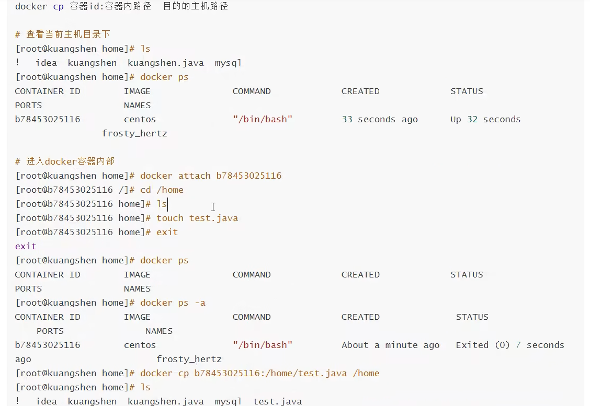


### Docker安装Nginx

```shell
# 1. 搜索镜像 search 建议去docker hub搜索，可以看到帮助文档
# 2. 下载镜像 pull
# 3. 运行测试
[root@iZ2zeg4ytp0whqtmxbsqiiZ home]# docker images
REPOSITORY          TAG                 IMAGE ID            CREATED             SIZE
centos              latest              0d120b6ccaa8        32 hours ago        215MB
nginx               latest              08393e824c32        7 days ago          132MB
 
# -d 后台运行
# -name 给容器命名
# -p 宿主机端口：容器内部端口
[root@iZ2zeg4ytp0whqtmxbsqiiZ home]# docker run -d --name nginx01 -p 3344:80 nginx  # 后台方式启动启动镜像
fe9dc33a83294b1b240b1ebb0db9cb16bda880737db2c8a5c0a512fc819850e0
[root@iZ2zeg4ytp0whqtmxbsqiiZ home]# docker ps
CONTAINER ID        IMAGE               COMMAND                  CREATED             STATUS              PORTS                  NAMES
fe9dc33a8329        nginx               "/docker-entrypoint.…"   4 seconds ago       Up 4 seconds        0.0.0.0:3344->80/tcp   nginx01
[root@iZ2zeg4ytp0whqtmxbsqiiZ home]# curl localhost:3344    # 本地访问测试
 
# 进入容器
[root@iZ2zeg4ytp0whqtmxbsqiiZ home]# docker exec -it nginx01 /bin/bash
root@fe9dc33a8329:/# whereis nginx
nginx: /usr/sbin/nginx /usr/lib/nginx /etc/nginx /usr/share/nginx
root@fe9dc33a8329:/# cd /etc/nginx/
root@fe9dc33a8329:/etc/nginx# ls
conf.d      koi-utf  mime.types  nginx.conf   uwsgi_params
fastcgi_params  koi-win  modules     scgi_params  win-utf
 
```

#### 端口暴露的概念

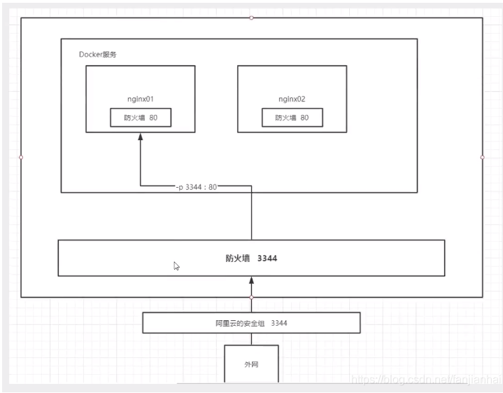

### Dorcker安装Tomcat

```shell
# 官方的使用
docker run -it --rm tomcat:9.0
 
# 我们之前的启动都是后台的，停止了容器之后， 容器还是可以查到，docker run -it --rm 一般用来测试，用完就删
 
# 下载再启动
docker pull tomcat
 
# 启动运行
docker run -d -p 3344:8080 --name tomcat01 tomcat
 
# 测试访问没有问题
 
# 进入容器
docker exec -it tomcat01 /bin/bash
 
# 发现问题：1.linux命令少了， 2. webapps下内容为空，阿里云净吸纳过默认是最小的镜像，所有不必要的都剔除了，保证最小可运行环境即可
# 保证最小可运行的环境
```

### Portainer可视化面板安装

```shell
docker run -d -p 8088:9000 --restart=always -v /var/run/docker.sock:/var/run/docker.sock --privileged=true portainer/portainer
```

## Docker镜像加载原理

分层管理系统，支持对文件系统的修改的一层层的叠加，联合文件系统 

### Docker分层理解

Docker镜像都是只读的，当容器启动时，一个新的可写层被加载到镜像的顶部

这一层就是我们通常说的容器层，容器之下的都叫镜像层！


### commit镜像

```shell
docker commit 提交容器成为一个新的版本
 
# 命令和git 原理类似
docker commit -m="提交的描述信息" -a="作者" 容器id 目标镜像名：[TAG]
 
docker commit -a="xiaofan" -m="add webapps app" d798a5946c1f tomcat007:1.0
 
```


## 容器数据卷

如果数据都在容器中，那么如果容器被删除，数据就会丢失。**需求： 数据可以持久化。**

Docker容器中产生的数据可以同步到本地，这就是卷技术！目录的挂在，将我们容器内的目录，挂在到Linux上面 ！


**容器的持久化和同步操作！ 容器间也是可以数据共享的！**

### 使用数据卷

> 方式一： 使用命令来挂载 -v

```shell
docker run -it -v 主机目录：容器内目录

# 测试
[root@lyk ~]# docker run -it -v /test/ceshi:/home centos /bin/bash 

# 查看当前正在运行的容器
[root@lyk test]# docker ps 
CONTAINER ID   IMAGE     COMMAND       CREATED         STATUS         PORTS     NAMES
539ca7c2b276   centos    "/bin/bash"   9 minutes ago   Up 9 minutes             intelligent_hawking

# 查看当前容器信息
[root@lyk test]# docker inspect 539ca7c2b276
"Mounts": [
            {
                "Type": "bind",
                "Source": "/test/ceshi",
                "Destination": "/home",
                "Mode": "",
                "RW": true,
                "Propagation": "rprivate"
            }
        ],
```

**容器内**


**服务器内**


容器内添加内容会同步到Linux内，Linux内添加内容也会同步到容器内，类似双向绑定

### 安装Mysql

> 关于数据持久化问题


```shell
# 获取镜像
docker pull mysql:5.7

# 运行容器，需要做数据挂载

[root@iZ2zeg4ytp0whqtmxbsqiiZ home]# docker run -d -p 3310:3306 -v /home/mysql/conf:/etc/mysql/conf.d -v /home/mysql/data:/var/lib/mysql -e MYSQL_ROOT_PASSWORD=123456 --name mysql01 mysql:5.7

# 启动我们的
-d      # 后台运行
-p      # 端口隐射
-v      # 卷挂载
-e      # 环境配置

```

```shell
# 安装MySQL，本地连接远程服务器的MySQL时出现了问题
# 进行密码加密
mysql> update user set password=password('123') where user='root';

# 刷新权限
mysql> flush privileges;

# 退出
mysql> quit;
```

### 具名和匿名挂载

```shell
# 匿名挂载
-v 容器内路径
docker run -d -P --name nginx01 -v /etc/nginx nginx     # -P 随机指定端口
 
# 查看所有volume的情况
[root@iZ2zeg4ytp0whqtmxbsqiiZ ~]# docker volume ls
DRIVER              VOLUME NAME
local               561b81a03506f31d45ada3f9fb7bd8d7c9b5e0f826c877221a17e45d4c80e096
local               36083fb6ca083005094cbd49572a0bffeec6daadfbc5ce772909bb00be760882
 
# 这里发现，这种情况就是匿名挂载，我们在-v 后面只写了容器内的路径，没有写容器外的路径！
 
# 具名挂载
[root@iZ2zeg4ytp0whqtmxbsqiiZ ~]# docker run -d -P --name nginx02 -v juming-nginx:/etc/nginx nginx
26da1ec7d4994c76e80134d24d82403a254a4e1d84ec65d5f286000105c3da17
[root@iZ2zeg4ytp0whqtmxbsqiiZ ~]# docker ps
CONTAINER ID        IMAGE               COMMAND                  CREATED             STATUS              PORTS                   NAMES
26da1ec7d499        nginx               "/docker-entrypoint.…"   3 seconds ago       Up 2 seconds        0.0.0.0:32769->80/tcp   nginx02
486de1da03cb        nginx               "/docker-entrypoint.…"   3 minutes ago       Up 3 minutes        0.0.0.0:32768->80/tcp   nginx01
[root@iZ2zeg4ytp0whqtmxbsqiiZ ~]# docker volume ls
DRIVER              VOLUME NAME
local               561b81a03506f31d45ada3f9fb7bd8d7c9b5e0f826c877221a17e45d4c80e096
local               36083fb6ca083005094cbd49572a0bffeec6daadfbc5ce772909bb00be760882
local               juming-nginx
 
# 通过-v 卷名：容器内的路径
# 查看一下这个卷
# docker volume inspect juming-nginx
 
[root@iZ2zeg4ytp0whqtmxbsqiiZ ~]# docker volume inspect juming-nginx
[
  {
      "CreatedAt": "2020-08-12T18:15:21+08:00",
      "Driver": "local",
      "Labels": null,
      "Mountpoint": "/var/lib/docker/volumes/juming-nginx/_data",
      "Name": "juming-nginx",
      "Options": null,
      "Scope": "local"
  }
]
```

 所有docker容器内的卷，没有指定目录的情况下都是在`/var/lib/docker/volumes/xxxxx/_data`

我们通过具名挂载可以方便的找到我们的一个卷，大多数情况下使用的是`具名挂载`

```shell
# 如何确定是具名挂载还是匿名挂载，还是指定路径挂载！
-v  容器内路径                   # 匿名挂载
-v  卷名:容器内路径               # 具名挂载
-v /主机路径:容器内路径            # 指定路径挂载
```

```shell
# 通过 -v 容器内容路径 ro rw 改变读写权限
ro  readonly    # 只读
rw  readwrite   # 可读可写
 
docker run -d -P --name nginx02 -v juming-nginx:/etc/nginx:ro nginx
docker run -d -P --name nginx02 -v juming-nginx:/etc/nginx:rw nginx
 
# ro 只要看到ro就说明这个路径只能通过宿主机来操作，容器内容无法操作
```

## Dockerfile

### Dockerfile介绍

DockerFile就是用来构建docker镜像的构建文件！命令脚本！

通过这个脚本可以生成镜像，镜像是一层一层的，脚本一个个的命令，每个命令都是一层！

构建步骤
1. 编写一个dockerFile文件
2. docker build 构建成为一个镜像
3. docker run 运行镜像
4. docker push 发布镜像（DockerHub、阿里云镜像）

```shell
# centos Dockerfile
FROM scratch
ADD centos-7-x86_64-docker.tar.xz /

LABEL \
    org.label-schema.schema-version="1.0" \
    org.label-schema.name="CentOS Base Image" \
    org.label-schema.vendor="CentOS" \
    org.label-schema.license="GPLv2" \
    org.label-schema.build-date="20201113" \
    org.opencontainers.image.title="CentOS Base Image" \
    org.opencontainers.image.vendor="CentOS" \
    org.opencontainers.image.licenses="GPL-2.0-only" \
    org.opencontainers.image.created="2020-11-13 00:00:00+00:00"

CMD ["/bin/bash"]
```


```shell
# 创建一个dockerfile文件， 名字可以随机
# 文件的内容 指定（大写） 参数
 
FROM centos
 
VOLUME ["volume01", "volume02"]
 
CMD echo "----end----"
CMD /bin/bash
 
# 这里的每一个命令都是镜像的一层！
```

### Dockerfile构建过程

**基础知识：**

1. 每个保留关键字（指令）必须大写字母
2. 执行从上到下进行
3. #表示注释
4. 每一个指令都会创建一个新的镜像层，并提交！

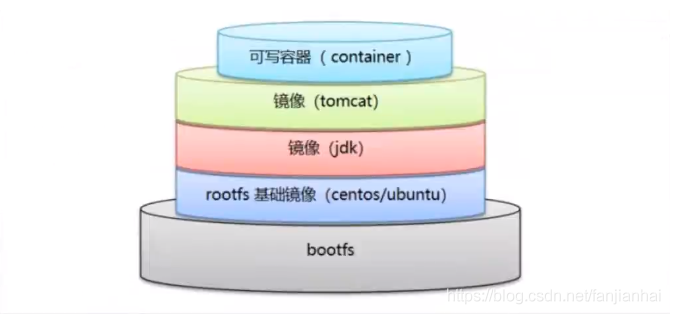


### Dockerfile命令

dockerFile是面向开发的， 我们以后要发布项目， 做镜像， 就需要编写dockefile文件， 这个文件十分简单！

Docker镜像逐渐成为企业的交互标准，必须要掌握！

步骤：开发，部署， 运维..... 缺一不可！

DockerFile： 构建文件， 定义了一切的步骤，源代码

DockerImages： 通过DockerFile构建生成的镜像， 最终发布和运行的产品！

Docker容器：容器就是镜像运行起来提供服务器


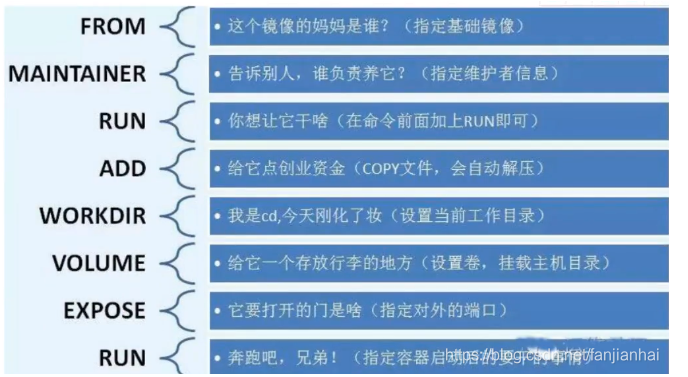

```shell
FROM            # 基础镜像，一切从这里开始构建
MAINTAINER      # 镜像是谁写的， 姓名+邮箱
RUN             # 镜像构建的时候需要运行的命令
ADD             # 步骤， tomcat镜像， 这个tomcat压缩包！添加内容
WORKDIR         # 镜像的工作目录
VOLUME          # 挂载的目录
EXPOSE          # 保留端口配置
CMD             # 指定这个容器启动的时候要运行的命令，只有最后一个会生效可被替代
ENTRYPOINT      # 指定这个容器启动的时候要运行的命令， 可以追加命令
ONBUILD         # 当构建一个被继承DockerFile 这个时候就会运行 ONBUILD 的指令，触发指令
COPY            # 类似ADD, 将我们文件拷贝到镜像中
ENV             # 构建的时候设置环境变量！
```

### 实战测试

> 创建一个自己的centos

```shell
# 1. 编写Dockerfile的文件
[root@iZ2zeg4ytp0whqtmxbsqiiZ dockerfile]# cat mydockerfile-centos 
FROM centos
MAINTAINER xiaofan<594042358@qq.com>
 
ENV MYPATH /usr/local
WORKDIR $MYPATH     # 镜像的工作目录
 
RUN yum -y install vim
RUN yum -y install net-tools
 
EXPOSE 80
 
CMD echo $MYPATH
CMD echo "---end---"
CMD /bin/bash
 
# 2. 通过这个文件构建镜像
# 命令 docker build -f dockerfile文件路径 -t 镜像名:[tag] .
 
[root@iZ2zeg4ytp0whqtmxbsqiiZ dockerfile]# docker build -f mydockerfile-centos -t mycentos:0.1 .
 
Successfully built d2d9f0ea8cb2
Successfully tagged mycentos:0.1
```


> CMD 和ENTRYPOINT区别

```shell
CMD         # 指定这个容器启动的时候要运行的命令，只有最后一个会生效可被替代
ENTRYPOINT  # 指定这个容器启动的时候要运行的命令， 可以追加命令
```

**测试CMD** 

```shell
# 1. 编写dockerfile文件
[root@iZ2zeg4ytp0whqtmxbsqiiZ dockerfile]# vim dockerfile-cmd-test 
FROM centos
CMD ["ls", "-a"]
 
# 2. 构建镜像
[root@iZ2zeg4ytp0whqtmxbsqiiZ dockerfile]# docker build -f dockerfile-cmd-test -t cmdtest .
 
# 3. run运行， 发现我们的ls -a 命令生效
[root@iZ2zeg4ytp0whqtmxbsqiiZ dockerfile]# docker run ebe6a52bb125
.
..
.dockerenv
bin
dev
etc
home
lib
lib64
 
# 想追加一个命令 -l 变成 ls -al
[root@iZ2zeg4ytp0whqtmxbsqiiZ dockerfile]# docker run ebe6a52bb125 -l
docker: Error response from daemon: OCI runtime create failed: container_linux.go:349: starting container process caused "exec: \"-l\": executable file not found in $PATH": unknown.
[root@iZ2zeg4ytp0whqtmxbsqiiZ dockerfile]# docker run ebe6a52bb125 ls -l
 
# cmd的情况下 -l替换了CMD["ls", "-a"]命令， -l不是命令，所以报错了
```

**测试ENTRYPOINT**

```shell
# 1. 编写dockerfile文件
[root@iZ2zeg4ytp0whqtmxbsqiiZ dockerfile]# vim dockerfile-entrypoint-test 
FROM centos
ENTRYPOINT ["ls", "-a"]
 
# 2. 构建文件
[root@iZ2zeg4ytp0whqtmxbsqiiZ dockerfile]# docker build -f dockerfile-entrypoint-test -t entrypoint-test .
 
# 3. run运行 发现我们的ls -a 命令同样生效
[root@iZ2zeg4ytp0whqtmxbsqiiZ dockerfile]# docker run entrypoint-test
.
..
.dockerenv
bin
dev
etc
home
lib
 
# 4. 我们的追加命令， 是直接拼接到ENTRYPOINT命令的后面的！
[root@iZ2zeg4ytp0whqtmxbsqiiZ dockerfile]# docker run entrypoint-test -l
total 56
drwxr-xr-x  1 root root 4096 Aug 13 07:52 .
drwxr-xr-x  1 root root 4096 Aug 13 07:52 ..
-rwxr-xr-x  1 root root    0 Aug 13 07:52 .dockerenv
lrwxrwxrwx  1 root root    7 May 11  2019 bin -> usr/bin
drwxr-xr-x  5 root root  340 Aug 13 07:52 dev
drwxr-xr-x  1 root root 4096 Aug 13 07:52 etc
drwxr-xr-x  2 root root 4096 May 11  2019 home
lrwxrwxrwx  1 root root    7 May 11  2019 lib -> usr/lib
lrwxrwxrwx  1 root root    9 May 11  2019 lib64 -> usr/lib64
drwx------  2 root root 4096 Aug  9 21:40 lost+found
```

### Dockerfile制作tomcat镜像

1. 准备镜像文件 tomcat压缩包，jdk的压缩包！

****

2. 编写Dockerfile文件，官方命名Dockerfile, build会自动寻找这个文件，就不需要-f指定了！

```shell
[root@iZ2zeg4ytp0whqtmxbsqiiZ tomcat]# cat Dockerfile 
FROM centos
MAINTAINER xiaofan<594042358@qq.com>
 
COPY readme.txt /usr/local/readme.txt
 
ADD jdk-8u73-linux-x64.tar.gz /usr/local/
ADD apache-tomcat-9.0.37.tar.gz /usr/local/
 
RUN yum -y install vim
 
ENV MYPATH /usr/local
WORKDIR $MYPATH
 
ENV JAVA_HOME /usr/local/jdk1.8.0_73
ENV CLASSPATH $JAVA_HOME/lib/dt.jar:$JAVA_HOME/lib/tools.jar
ENV CATALINA_HOME /usr/local/apache-tomcat-9.0.37
ENV CATALINA_BASH /usr/local/apache-tomcat-9.0.37
ENV PATH $PATH:$JAVA_HOME/bin:$CATALINA_HOME/lib:$CATALINA_HOME/bin
 
EXPOSE 8080
 
CMD /usr/local/apache-tomcat-9.0.37/bin/startup.sh && tail -F /usr/local/apache-tomcat-9.0.37/bin/logs/catalina.out
```

3. 构建镜像

```shell
# docker build -t diytomcat .
```

4. 启动镜像

```` shell
#  docker run -d -p 3344:8080 --name xiaofantomcat1 -v /home/xiaofan/build/tomcat/test:/usr/local/apache-tomcat-9.0.37/webapps/test -v /home/xiaofan/build/tomcat/tomcatlogs/:/usr/local/apache-tomcat-9.0.37/logs diytomcat
````

1. 访问测试
2. 发布项目（由于做了卷挂载， 我们直接在本地编写项目就可以发布了）

**在本地编写web.xml和index.jsp进行测试**

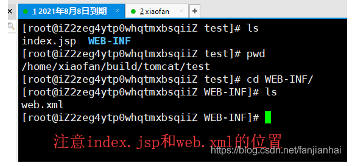

```shell
<?xml version="1.0" encoding="UTF-8"?>
<web-app version="2.4" 
    xmlns="http://java.sun.com/xml/ns/j2ee" 
    xmlns:xsi="http://www.w3.org/2001/XMLSchema-instance"
    xsi:schemaLocation="http://java.sun.com/xml/ns/j2ee 
        http://java.sun.com/xml/ns/j2ee/web-app_2_4.xsd">
        
</web-app>
```

```` shell
<%@ page language="java" contentType="text/html; charset=UTF-8"
    pageEncoding="UTF-8"%>
<!DOCTYPE html>
<html>
<head>
<meta charset="utf-8">
<title>hello. xiaofan</title>
</head>
<body>
Hello World!<br/>
<%
System.out.println("-----my test web logs------");
%>
</body>
</html>
````

发现：项目部署成功， 可以直接访问ok！

我们以后开发的步骤：需要掌握Dockerfile的编写！ 我们之后的一切都是使用docker进行来发布运行的！

> 发布镜像到Docker Hub

1. [地址](https://hub.docker.com/) 注册自己的账号！
2. 确定这个账号可以登录


1. 在我们的服务器上提交自己的镜像

```shell
# push到我们的服务器上
[root@iZ2zeg4ytp0whqtmxbsqiiZ ~]# docker push diytomcat
The push refers to repository [docker.io/library/diytomcat]
2eaca873a720: Preparing 
1b38cc4085a8: Preparing 
088ebb58d264: Preparing 
c06785a2723d: Preparing 
291f6e44771a: Preparing 
denied: requested access to the resource is denied  # 拒绝
 
# push镜像的问题？
The push refers to repository [docker.io/1314520007/diytomcat]
An image does not exist locally with the tag: 1314520007/diytomcat
 
# 解决，增加一个tag
docker tag diytomcat 1314520007/tomcat:1.0
```


### 总结


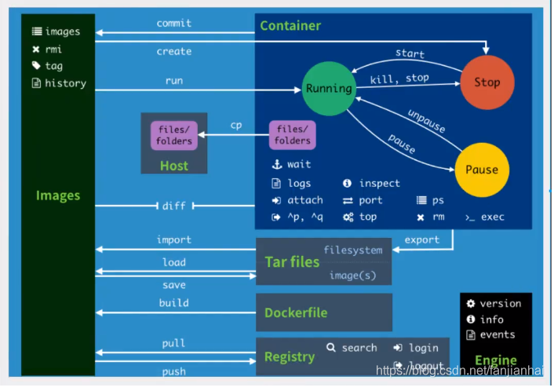

## Docker 网络

``` shell
# 本机回环地址
1: lo: <LOOPBACK,UP,LOWER_UP> mtu 65536 qdisc noqueue state UNKNOWN group default qlen 1000
    link/loopback 00:00:00:00:00:00 brd 00:00:00:00:00:00
    inet 127.0.0.1/8 scope host lo
       valid_lft forever preferred_lft forever
    inet6 ::1/128 scope host 
       valid_lft forever preferred_lft forever
# 阿里云内网地址
2: eth0: <BROADCAST,MULTICAST,UP,LOWER_UP> mtu 1500 qdisc fq_codel state UP group default qlen 1000
    link/ether 00:16:3e:06:c0:bb brd ff:ff:ff:ff:ff:ff
    altname enp0s5
    altname ens5
    inet 172.26.91.131/20 brd 172.26.95.255 scope global dynamic noprefixroute eth0
       valid_lft 314693700sec preferred_lft 314693700sec
    inet6 fe80::216:3eff:fe06:c0bb/64 scope link 
       valid_lft forever preferred_lft forever
# Docker0地址
3: docker0: <NO-CARRIER,BROADCAST,MULTICAST,UP> mtu 1500 qdisc noqueue state DOWN group default 
    link/ether 02:42:90:ce:ae:12 brd ff:ff:ff:ff:ff:ff
    inet 172.17.0.1/16 brd 172.17.255.255 scope global docker0
       valid_lft forever preferred_lft forever
    inet6 fe80::42:90ff:fece:ae12/64 scope link 
       valid_lft forever preferred_lft forever
```

代表着三个不同的网络

> 问题： docker是如何处理容器网络访问的？

```shell
 
# [root@iZ2zeg4ytp0whqtmxbsqiiZ ~]# docker run -d -P --name tomcat01 tomcat
 
# 查看容器内部的网络地址 ip addr
[root@iZ2zeg4ytp0whqtmxbsqiiZ ~]# docker exec -it tomcat01 ip addr， 发现容器启动的时候得到一个eth0@if115 ip地址，docker分配的！
1: lo: <LOOPBACK,UP,LOWER_UP> mtu 65536 qdisc noqueue state UNKNOWN group default qlen 1000
    link/loopback 00:00:00:00:00:00 brd 00:00:00:00:00:00
    inet 127.0.0.1/8 scope host lo
       valid_lft forever preferred_lft forever
114: eth0@if115: <BROADCAST,MULTICAST,UP,LOWER_UP> mtu 1500 qdisc noqueue state UP group default 
    link/ether 02:42:ac:11:00:02 brd ff:ff:ff:ff:ff:ff link-netnsid 0
    inet 172.17.0.2/16 brd 172.17.255.255 scope global eth0
       valid_lft forever preferred_lft forever
 
# 思考： linux 能不能ping通容器？
[root@iZ2zeg4ytp0whqtmxbsqiiZ ~]# ping 172.17.0.2
PING 172.17.0.2 (172.17.0.2) 56(84) bytes of data.
64 bytes from 172.17.0.2: icmp_seq=1 ttl=64 time=0.077 ms
64 bytes from 172.17.0.2: icmp_seq=2 ttl=64 time=0.069 ms
64 bytes from 172.17.0.2: icmp_seq=3 ttl=64 time=0.075 ms
 
# linux 可以 ping 通docker容器内部！
```

1. 我们每启动一个docker容器， docker就会给docker容器分配一个ip， 我们只要安装了docker，就会有一个网卡 docker0桥接模式，使用的技术是veth-pair技术！

再次测试ip addr

****

再启动一个容器测试，发现又多了一对网卡 


```shell
# 我们发现这个容器带来网卡，都是一对对的
# veth-pair 就是一对的虚拟设备接口，他们都是成对出现的，一端连着协议，一端彼此相连
# 正因为有这个特性，veth-pair充当一个桥梁， 连接各种虚拟网络设备
# OpenStac， Docker容器之间的链接，OVS的链接， 都是使用veth-pair技术
```

 我们测试一下tomcat01和tomcat02之间是否可以ping通！


结论：容器与容器之间是可以相互ping通的！

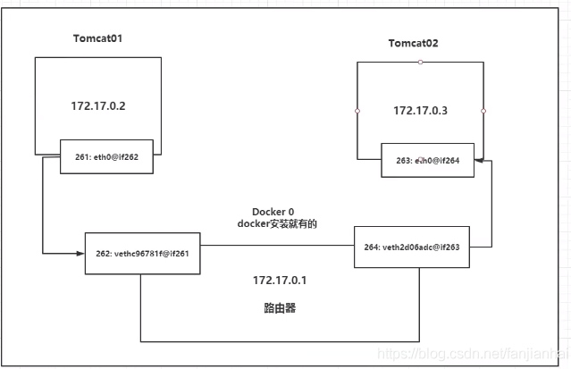

结论：tomcat01和tomcat02是共用的一个路由器，docker0

所有容器不指定网络的情况下，都是docker0路由的，doucker会给我们的容器分配一个默认的可用IP

Docker使用的是Linux的桥接，宿主机中是一个Docker容器的网桥docker0.

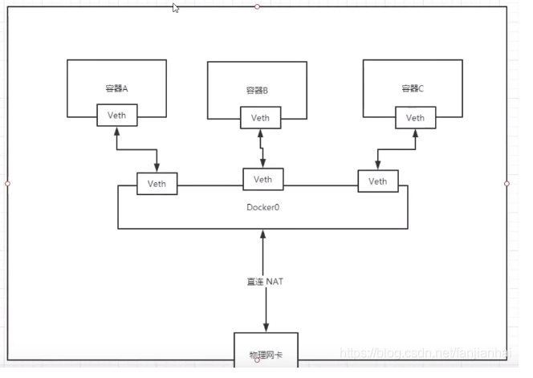

Docker中的所有的网络接口都是虚拟的，虚拟的转发效率高！（内网传递文件！）

只要容器删除，对应的网桥一对就没有了！

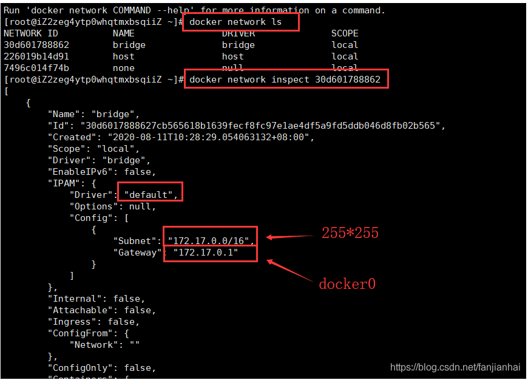

### link

```shell
[root@iZ2zeg4ytp0whqtmxbsqiiZ ~]# docker exec -it tomcat02 ping tomcat01
ping: tomcat01: Name or service not known
 
# 如何可以解决呢？
# 通过--link既可以解决网络连通问题
[root@iZ2zeg4ytp0whqtmxbsqiiZ ~]# docker run -d -P  --name tomcat03 --link tomcat02 tomcat
3a2bcaba804c5980d94d168457c436fbd139820be2ee77246888f1744e6bb473
[root@iZ2zeg4ytp0whqtmxbsqiiZ ~]# docker ps
CONTAINER ID        IMAGE               COMMAND             CREATED             STATUS              PORTS                     NAMES
3a2bcaba804c        tomcat              "catalina.sh run"   4 seconds ago       Up 3 seconds        0.0.0.0:32772->8080/tcp   tomcat03
f22ed47ed1be        tomcat              "catalina.sh run"   57 minutes ago      Up 57 minutes       0.0.0.0:32771->8080/tcp   tomcat02
9d97f93401a0        tomcat              "catalina.sh run"   About an hour ago   Up About an hour    0.0.0.0:32770->8080/tcp   tomcat01
[root@iZ2zeg4ytp0whqtmxbsqiiZ ~]# docker exec -it tomcat03 ping tomcat02
PING tomcat02 (172.17.0.3) 56(84) bytes of data.
64 bytes from tomcat02 (172.17.0.3): icmp_seq=1 ttl=64 time=0.129 ms
64 bytes from tomcat02 (172.17.0.3): icmp_seq=2 ttl=64 time=0.100 ms
64 bytes from tomcat02 (172.17.0.3): icmp_seq=3 ttl=64 time=0.110 ms
64 bytes from tomcat02 (172.17.0.3): icmp_seq=4 ttl=64 time=0.107 ms
 
# 反向可以ping通吗？
[root@iZ2zeg4ytp0whqtmxbsqiiZ ~]# docker exec -it tomcat02 ping tomcat03
ping: tomcat03: Name or service not known
 
```

探究：inspect！

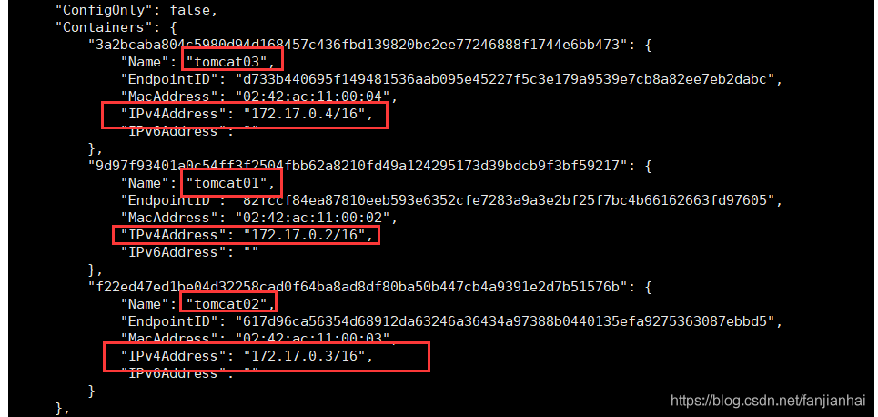

其实这个tomcat03就是在本地配置了tomcat02的配置？

```shell
[root@iZ2zeg4ytp0whqtmxbsqiiZ ~]# docker exec -it tomcat03 cat /etc/hosts
127.0.0.1   localhost
::1 localhost ip6-localhost ip6-loopback
fe00::0 ip6-localnet
ff00::0 ip6-mcastprefix
ff02::1 ip6-allnodes
ff02::2 ip6-allrouters
172.17.0.3  tomcat02 f22ed47ed1be
172.17.0.4  3a2bcaba804c
```

本质探究：--link 就是我们在hosts配置中增加了一个172.17.0.3 tomcat02 f22ed47ed1be

我们现在玩Docker已经不建议使用--link了！

自定义网络！不使用Docker0！

Docker0的问题：它不支持容器名链接访问！

### 自定义网络

```shell
# 查看所有docker网络
# docker network ls
```

**网络模式**

bridge： 桥接模式，桥接 docker 默认，自己创建的也是用brdge模式

none： 不配置网络

host： 和宿主机共享网络

container：容器网络连通！（用的少， 局限很大）

```shell
# 我们直接启动的命令默认有一个 --net bridge，而这个就是我们的docker0
docker run -d -P --name tomcat01 tomcat
docker run -d -P --name tomcat01 --net bridge tomcat
 
# docker0特点，默认，容器名不能访问， --link可以打通连接！
# 我们可以自定义一个网络！
# --driver bridge
# --subnet 192.168.0.0/16 可以支持255*255个网络 192.168.0.2 ~ 192.168.255.254
# --gateway 192.168.0.1
[root@iZ2zeg4ytp0whqtmxbsqiiZ ~]# docker network create --driver bridge --subnet 192.168.0.0/16 --gateway 192.168.0.1 mynet
26a5afdf4805d7ee0a660b82244929a4226470d99a179355558dca35a2b983ec
[root@iZ2zeg4ytp0whqtmxbsqiiZ ~]# docker network ls
NETWORK ID          NAME                DRIVER              SCOPE
30d601788862        bridge              bridge              local
226019b14d91        host                host                local
26a5afdf4805        mynet               bridge              local
7496c014f74b        none                null                local
```

创建的网络就ok了

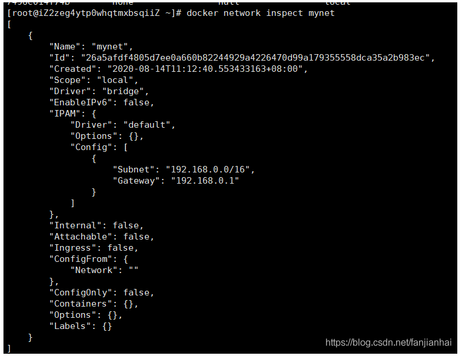

在自己创建的网络里面启动两个容器

```shell
[root@iZ2zeg4ytp0whqtmxbsqiiZ ~]# docker run -d -P --name tomcat-net-01 --net mynet tomcat
0e85ebe6279fd23379d39b27b5f47c1e18f23ba7838637802973bf6449e22f5c
[root@iZ2zeg4ytp0whqtmxbsqiiZ ~]# docker run -d -P --name tomcat-net-02 --net mynet tomcat
c6e462809ccdcebb51a4078b1ac8fdec33f1112e9e416406b606d0c9fb6f21b5
[root@iZ2zeg4ytp0whqtmxbsqiiZ ~]# docker network inspect mynet
[
    {
        "Name": "mynet",
        "Id": "26a5afdf4805d7ee0a660b82244929a4226470d99a179355558dca35a2b983ec",
        "Created": "2020-08-14T11:12:40.553433163+08:00",
        "Scope": "local",
        "Driver": "bridge",
        "EnableIPv6": false,
        "IPAM": {
            "Driver": "default",
            "Options": {},
            "Config": [
                {
                    "Subnet": "192.168.0.0/16",
                    "Gateway": "192.168.0.1"
                }
            ]
        },
        "Internal": false,
        "Attachable": false,
        "Ingress": false,
        "ConfigFrom": {
            "Network": ""
        },
        "ConfigOnly": false,
        "Containers": {
            "0e85ebe6279fd23379d39b27b5f47c1e18f23ba7838637802973bf6449e22f5c": {
                "Name": "tomcat-net-01",
                "EndpointID": "576ce5c0f5860a5aab5e487a805da9d72f41a409c460f983c0bd341dd75d83ac",
                "MacAddress": "02:42:c0:a8:00:02",
                "IPv4Address": "192.168.0.2/16",
                "IPv6Address": ""
            },
            "c6e462809ccdcebb51a4078b1ac8fdec33f1112e9e416406b606d0c9fb6f21b5": {
                "Name": "tomcat-net-02",
                "EndpointID": "81ecbc4fe26e49855fe374f2d7c00d517b11107cc91a174d383ff6be37d25a30",
                "MacAddress": "02:42:c0:a8:00:03",
                "IPv4Address": "192.168.0.3/16",
                "IPv6Address": ""
            }
        },
        "Options": {},
        "Labels": {}
    }
]
 
# 再次拼连接
[root@iZ2zeg4ytp0whqtmxbsqiiZ ~]# docker exec -it tomcat-net-01 ping 192.168.0.3
PING 192.168.0.3 (192.168.0.3) 56(84) bytes of data.
64 bytes from 192.168.0.3: icmp_seq=1 ttl=64 time=0.113 ms
64 bytes from 192.168.0.3: icmp_seq=2 ttl=64 time=0.093 ms
^C
--- 192.168.0.3 ping statistics ---
2 packets transmitted, 2 received, 0% packet loss, time 999ms
rtt min/avg/max/mdev = 0.093/0.103/0.113/0.010 ms
# 现在不使用 --link也可以ping名字了！
[root@iZ2zeg4ytp0whqtmxbsqiiZ ~]# docker exec -it tomcat-net-01 ping tomcat-net-02
PING tomcat-net-02 (192.168.0.3) 56(84) bytes of data.
64 bytes from tomcat-net-02.mynet (192.168.0.3): icmp_seq=1 ttl=64 time=0.068 ms
64 bytes from tomcat-net-02.mynet (192.168.0.3): icmp_seq=2 ttl=64 time=0.096 ms
64 bytes from tomcat-net-02.mynet (192.168.0.3): icmp_seq=3 ttl=64 time=0.094 ms
 
```

我们自定义的网络docker都已经帮我们维护好了对应的关系，推荐我们平时这样使用网络

好处：

redis - 不同的集群使用不同的网络，保证集群时安全和健康的

mysql - 不同的集群使用不同的网络，保证集群时安全和健康的

### 网络连通

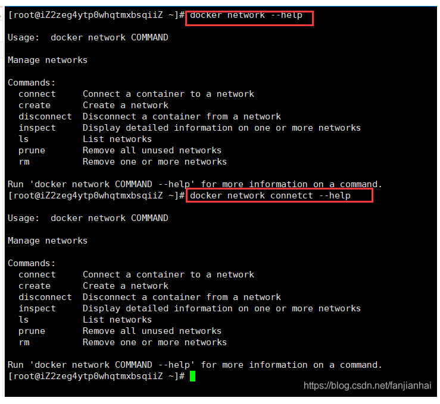

测试打通tomcat01 和mynet

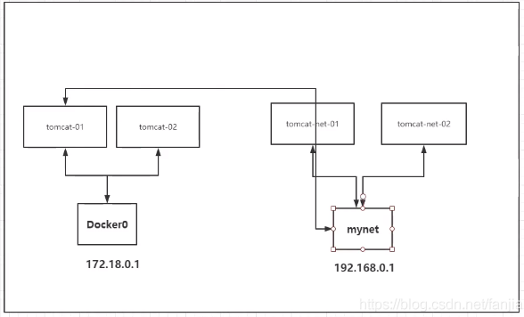

```shell
[root@iZ2zeg4ytp0whqtmxbsqiiZ ~]# docker network connect  mynet tomcat01
 
# 连通之后就是讲tomcat01 放到了mynet网路下
# 一个容器两个ip地址：
# 阿里云服务器，公网ip，私网ip
```

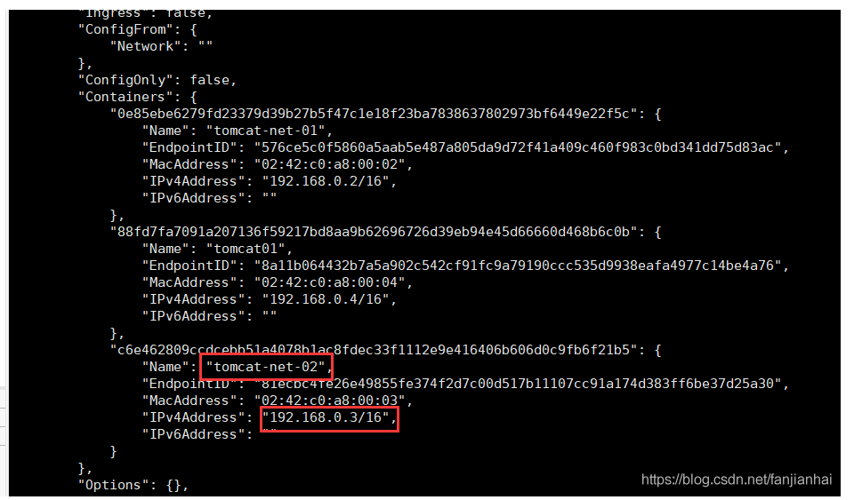


```shell
# 连通ok
[root@iZ2zeg4ytp0whqtmxbsqiiZ ~]# docker exec -it tomcat01 ping tomcat-net-01
PING tomcat-net-01 (192.168.0.2) 56(84) bytes of data.
64 bytes from tomcat-net-01.mynet (192.168.0.2): icmp_seq=1 ttl=64 time=0.100 ms
64 bytes from tomcat-net-01.mynet (192.168.0.2): icmp_seq=2 ttl=64 time=0.085 ms
^C
--- tomcat-net-01 ping statistics ---
2 packets transmitted, 2 received, 0% packet loss, time 1000ms
rtt min/avg/max/mdev = 0.085/0.092/0.100/0.012 ms
# 依旧无法连通，没有connect
[root@iZ2zeg4ytp0whqtmxbsqiiZ ~]# docker exec -it tomcat02 ping tomcat-net-01
ping: tomcat-net-01: Name or service not known
 
```

## Docker compose

**docker.compose.yml 是对一个个容器进行管理**

 docker建议我们每一个容器中只运行一个服务,因为docker容器本身占用资源极少,所以最好是将每个服务单独的分割开来但是这样我们又面临了一个问题？

如果我需要同时部署好多个服务,难道要每个服务单独写Dockerfile然后在构建镜像,构建容器,这样累都累死了,所以docker官方给我们提供了docker-compose多服务部署的工具

例如要实现一个Web微服务项目，除了Web服务容器本身，往往还需要再加上后端的数据库mysql服务容器redis服务器，注册中心eureka，甚至还包括负载均衡容器等等。。。。。。

 Compose允许用户通过一个单独的docker-compose.yml模板文件（YAML 格式）来定义一组相关联的应用容器为一个项目（project）。

 可以很容易地用一个配置文件定义一个多容器的应用，然后使用一条指令安装这个应用的所有依赖，完成构建。Docker-Compose 解决了容器与容器之间如何管理编排的问题。

```shell
# docker-compose 安装
[root@lyk ~]# curl -L "https://github.com/docker/compose/releases/download/1.29.2/docker-compose-$(uname -s)-$(uname -m)" -o /usr/local/bin/docker-compose
  % Total    % Received % Xferd  Average Speed   Time    Time     Time  Current
                                 Dload  Upload   Total   Spent    Left  Speed
  0     0    0     0    0     0      0      0 --:--:-- --:--:-- --:--:--     0
100 12.1M  100 12.1M    0     0  4506k      0  0:00:02  0:00:02 --:--:-- 6945k
[root@lyk ~]# chmod +x /usr/local/bin/docker-compose
[root@lyk ~]# docker-compose --version
docker-compose version 1.29.2, build 5becea4c
[root@lyk ~]# 

# docker-compose 卸载
sudo rm /usr/local/bin/docker-compose
```

### compose 核心概念

文件： 

- docker-compose.yml

两要素：

- 服务： 一个个应用容器实例，比如订单微服务、库存微服务、mysql容器、nginx容器或者redis容器
- 工程：由一组关联的应用容器组成的一个完整业务单元，在docker-compose.yml文件中定义

### compose常用命令 

```shell
Compose常用命令

docker-compose -h                           # 查看帮助

docker-compose up                           # 启动所有docker-compose服务

docker-compose up -d                        # 启动所有docker-compose服务并后台运行

docker-compose down                         # 停止并删除容器、网络、卷、镜像。

docker-compose exec  yml里面的服务id                 # 进入容器实例内部  docker-compose exec docker-compose.yml文件中写的服务id /bin/bash

docker-compose ps                      # 展示当前docker-compose编排过的运行的所有容器

docker-compose top                     # 展示当前docker-compose编排过的容器进程

docker-compose logs  yml里面的服务id     # 查看容器输出日志

docker-compose config     # 检查配置

docker-compose config -q  # 检查配置，有问题才有输出

docker-compose restart   # 重启服务

docker-compose start     # 启动服务

docker-compose stop      # 停止服务
```

# Nginx [参考](https://blog.csdn.net/qq_45408390/article/details/119457559)

架构：没有什么是加一层解决不了的

`Nginx`是一个拥有高性能（响应更快、并发更高）HTTP和反向代理服务器，其特点是`占用内存少`，`并发能力强`，并且在现实中，nginx的并发能力要比在同类型的网页服务器中表现要好

`Nginx`专为`性能优化`而开发，最重要的要求便是`性能`，且十分注重效率，有报告nginx能支持高达50000个并发连接数

`Nginx`是一个安装非常简单、配置文件非常简洁（还能够支持perll语法）、bug非常少的服务。Nginx启动特别容易，并且可以做到7*24不间断运行，即使运行数个月也不需要重新启动。还能在不间断服务的情况下进行软件版本的升级

代理客户端的就是正向代理，代理服务端的就是反向代理。

**Nginx提供的负载均衡策略有2种：内置策略和扩展策略。内置策略为轮询，加权轮询，Ip hash。扩展策略，就天马行空，只有你想不到的没有他做不到的。**

- iphash对客户端请求的ip进行hash操作，然后根据hash结果将同一个客户端ip的请求分发给同一台服务器进行处理，可以解决session不共享的问题。
- 加权轮询，因为可能不同服务器性能不一样，能接收的请求数量不同
- 轮询
- 动静分离，在我们的软件开发中，有些请求是需要后台处理的，有些请求是不需要经过后台处理的（如：css、html、jpg、js等等文件），这些不需要经过后台处理的文件称为静态文件。让动态网站里的动态网页根据一定规则把不变的资源和经常变的资源区分开来，动静资源做好了拆分以后，我们就可以根据静态资源的特点将其做缓存操作。提高资源响应的速度

## Nginx 常用命令 

```shell
cd /usr/local/nginx/sbin/
./nginx  启动
./nginx -s stop  停止
./nginx -s quit  安全退出
./nginx -s reload  重新加载配置文件
ps aux|grep nginx  查看nginx进程
```


```shell
# 开启
service firewalld start
# 重启
service firewalld restart
# 关闭
service firewalld stop
# 查看防火墙规则
firewall-cmd --list-all
# 查询端口是否开放
firewall-cmd --query-port=8080/tcp
# 开放80端口
firewall-cmd --permanent --add-port=80/tcp
# 移除端口
firewall-cmd --permanent --remove-port=8080/tcp
#重启防火墙(修改配置后要重启防火墙)
firewall-cmd --reload
# 参数解释
1、firwall-cmd：是Linux提供的操作firewall的一个工具；
2、--permanent：表示设置为持久；
3、--add-port：标识添加的端口；
```


```shell
# 负载均衡
upstream lb{
    server 127.0.0.1:8080 weight=1;
    server 127.0.0.1:8081 weight=1;
}
location / {
    proxy_pass http://lb;
}
```


# 数据库

## MongoDB

非关系型数据库（mongodb）没有关系型数据库（mysql）安全性高，（从内存存储到硬盘）

mongodb也能处理高并发

mongodb不需要暴露对象

mongo以管理员身份运行

